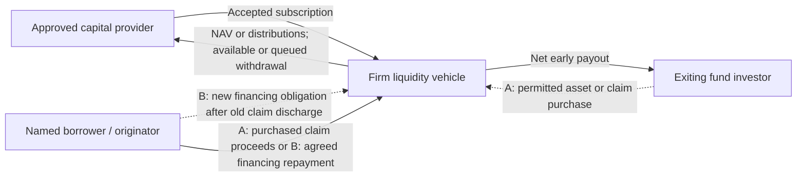
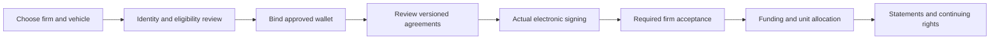

# Lockgate product blueprint · discussion draft 0.1

**Purpose:** validate the complete product before changing the app. This is a review draft,
not an approved specification, investment offering or authorization to implement or deploy.

Open the [interactive blueprint](http://127.0.0.1:5197/docs/product-blueprint/index.html).
It uses the existing local app server and adds no production app routes.

Current entry and build order: [wallet first, investment firms first](journey-specs/entry-and-build-order.md).
Completed wallet profiles open their dashboard; new profiles choose a role after connection.
The top-bar Demo sheet and five funded TEST firm vaults are specified, not implemented.
Entry cards use **Get Started** for exit investors/capital providers and **Talk to us**
for originating platforms/investment firms. Institutional onboarding is team-led;
invited users complete assigned tasks online before governed activation.

Review [KYC-first identity, enquiries and the co-funding proposal](journey-specs/identity-enquiries-and-syndication.md).
01/04 begin with Start KYC and ten preverified TEST profiles; 01 enforces holding-owner
matching, while 04 needs no existing holding. 02/03 now have an enquiry and branded
acknowledgement review; no enquiry or email is actually submitted by the prototype.

Explore the [four-persona screen walkthrough](http://127.0.0.1:5197/docs/product-blueprint/preview/index.html)
and the [complete journey contracts](journey-specs/README.md). The walkthrough is a local
design review using example records. Its controls do not connect a wallet, execute legal
documents, reserve a firm’s cash or submit transactions. The future executable demo must
prove those actions independently.
Its task-choice-before-wallet arrival is superseded by the linked wallet-first contract.

The draft has four public journeys, a money/ownership lifecycle, KYC and agreement gates,
a searchable screen/action inventory, open decisions, acceptance scenarios and separate demo candidates.
You can expand a step, mark it reviewed and write a question. Notes stay in this browser;
**Export review** downloads JSON. “Reviewed” records reading, not approval.
**Print** expands the full blueprint; use the export separately to retain notes.
The document's rendered and interaction checks are recorded in [VERIFICATION.md](VERIFICATION.md).

## Start the discussion here

1. **Audience and investment structure:** who may invest, which firm/vehicle accepts them,
   and what legal rights their individual shares represent. A licensed firm’s involvement
   alone does not settle retail eligibility, distribution permissions or Lockgate’s role.
2. **Money, losses and pricing:** who earns fees, what gets repaid first, who bears losses,
   how NAV changes, and who owns later recoveries. No intrinsic USDG yield or fixed return is assumed.
3. **Provider withdrawals:** available cash versus deployed capital; FIFO or pro-rata batches;
   valuation timing, partial fills, cancellation and preservation of existing claims.
4. **Approval and activation:** who verifies clients/firms, signs and accepts documents,
   approves an originator and decides an integration is ready.
5. **Demo scope:** choose a complete executable story after the product is settled.
   Existing owner-funded financing cannot substitute for the proposed provider journey.

Each has a stable decision ID in the interactive artifact. Proposed mechanics remain editable.

## The four people

| Person | Why they arrive | Their workspace |
|---|---|---|
| Exit investor | Already holds an investment elsewhere and comes here for an earlier payout | Matched positions, competing payout offers, agreements, payout and receipts |
| Originating fund/platform | Wants its fund supported for earlier exits | Application, integration, reserve, liability, settlement and reporting |
| Investment firm | Underwrites and manages liquidity through its approved structure | Verification, mandate, proposals, receivables, provider administration and withdrawals |
| Capital provider | Invests through the firm and accepts the disclosed liquidity/credit risks | Eligibility, agreements, subscription, personal interests, income/losses and withdrawal status |

Lockgate operations is an internal role. A user-selected persona changes navigation;
contract authority, eligibility and ownership need independent proof.

## First arrival and ongoing use

The proposed public entry is useful without a wallet: understandable product purpose,
source-backed analytics, standalone terms and an obvious Connect wallet action. Four task choices follow authenticated profile lookup. It should explain
what connecting a wallet unlocks and keep the selected fund/task through connection.
Do not force a visitor into onboarding or a preselected workspace on arrival.

Returning verified/authorized users resume the relevant work. A disconnected or empty wallet
gets a clear next action; an RPC error is not represented as zero holdings. Public terms stay
standalone. Onboarding is a focused flow and enters the relevant workspace only when its
necessary conditions are complete. A local plan/export does not become an application.

For all four personas, the full journey defines what is seen, the action, permission,
confirmation, and failure/recovery at each step. It also covers records, changed wallets,
expired verification, complaints and wind-down.

## Money and rights

This is the proposed provider model, not a deployed provider-capital architecture.
Two conditional exit routes are defined. **A purchases** permitted existing fund units or
an assignable loan claim. **B finances** an agreed early settlement: the old investor claim
is discharged and a named borrower owes a separately documented new financing obligation.
Token versus loan does not determine the route. Neither route has legal clearance.
The current on-chain financing path pays the investor directly and records platform debt;
it does not implement the proposed purchase route or confirm external legal claim discharge.
Commercial settlement details depend on the authoritative adapter and counterparties.
The originator's reserve is collateral, separate from provider equity. The provider owns
the interest defined in the chosen vehicle; the manager has operational authority.
A quote moves no funds and does not automatically reserve capacity.

For example, purchasing a $10,000 claim for $9,800 creates a possible $200 gross spread
if the whole claim is collected. Financing a $9,800 discounted settlement produces whatever
repayment and fees the new agreement specifies; the investor’s $200 concession is not
automatically income for the financing vehicle. Neither example promises a return.

The underwriting and financing design needs a named borrower, repayment source,
collection rights, exposure limits, reserve terms and servicing obligations.
Code-enforced repayment order does not itself establish legal creditor priority.
Kasu is an example prospective originator, not a confirmed integrated partner.

Candidate withdrawal fairness: unfilled shares remain exposed to returns/losses until
their settlement valuation; settled portions become funded claims whose cash cannot
be lent again. This is a discussion proposal, with priority and detailed rules unresolved.

## Onboarding before investment funding

KYC, eligibility for an offering, wallet control, agreement execution and subscription
acceptance are different records. The firm can request more information, reject,
expire or suspend new activity. Existing ownership is preserved and handled under
the agreed terms and applicable restrictions.

The legal vehicle, document package, signatories, formalities, custody, recordkeeping
and service providers remain decisions. Singapore electronic-signature guidance
supports designing an online signing process; it does not clear this investment product.
The interactive draft links the official references near the relevant claims.

For the demo, selectable **TEST identity profiles** exercise approved, pending, rejected
and expired states. They bind to the selected test wallet and cannot grant production
eligibility. Test agreements still need actual signing/evidence; wallet transactions
need actual signatures, receipts and reconciled balances in the stated environment.
Acquiring an originating-fund position is a conditional test setup here. Distribution of
new real fund subscriptions through Lockgate is a separate scope and legal decision;
an existing investor does not need a new subscription merely to exit.

## What exists versus what needs building

The inspected application checkpoint is `f16c4d4a60914860b5b2386374710b1b998ff7c7`
on `feat/reui-onboarding-local`. Current contracts/app support fund positions, redemption,
early exits, issuer controls, owner-funded partner liquidity and a separate institutional facility.

Important gaps:

- There are currently no live supported originating funds/platforms or registered commercial
  fund integrations. Named prospects must not appear as supported funds. Four or five test
  originators can demonstrate the intended breadth without claiming real partnerships.
- Partner-vault deposit/withdraw is owner-only, with aggregate shares and no independent
  provider ledger. A provider model needs accounting and enforceable rights before a new button.
- Commercial applications, KYC/KYB, agreement delivery/signing, subscription acceptance,
  client allocation, full statements and provider withdrawals are proposed.
- The institutional facility lends to Lockgate's own book; it is not investment through
  the firm's partner vault. The old public `OpenCreditVault` is explicitly superseded/undeployed.
- At Sepolia block **315543348**, the configured Paxos USDG rejected the mock faucet call,
  the default platform quote reported **window due**, and partner vaults were unfunded with
  inactive mandates. Those are dated observations, not claims of current readiness.
- An external faucet plus gas/share acquisition and a usable fund is not yet a verified
  self-service flow. Merely displaying a TEST profile does not produce balances or permissions.
- Existing history queries are bounded. Complete statements require reliable indexing,
  commercial records and reconciliation rather than presenting recent events as full history.

Statuses in the blueprint refer to implementation inspection or documented historical evidence.
They do not represent a new final-source end-to-end run. Provider features must not inherit
the success status of an owner-funded vault or an old fork recording.

## Acceptance and review boundary

The draft covers wallet/network changes, missing funds, stale reads/quotes, unauthorized
actions, rejected signing, unknown receipt reconciliation, expired eligibility, incomplete
agreements/acceptance, duplicate subscriptions, partial withdrawals and loss/recovery.

[Verification](VERIFICATION.md) separates working review controls from the future
financial demo. Run `node docs/product-blueprint/verify-preview.mjs` from `app/`
with the local server running to repeat the artifact checks.

Implementation is a later task, after product decisions. Final proof will identify the
source, environment, actor, signature, transaction, receipt, reconciled accounting and
rendered result for all four journeys. Local/fork, public read and public write claims stay distinct.

Five distinct actor wallets are the minimum isolation fixture: exit investor, originator,
manager and two capital providers. An internal operator uses separate authority where needed.
The demo catalogue uses five fictional TEST originators, each with explicit ownership and
route restrictions; it must not present Kasu or other prospects as integrated partners.

Founder conversations are demand evidence whose exact scope and provenance should be
recorded; they do not substitute for signed integrations or commitments of capital.
Mainnet readiness includes legal/regulatory permission, approved partner/instrument
agreements, working adapters, production identity/signing/servicing, independent security
review, funded capacity and operational reconciliation. Audits are one gate, not the sole
reason mainnet is unavailable. Demo and launch claims remain separate.

This task changed documentation only. No app/contract changes, public transactions,
merges or deployments are part of this draft. The existing dev server remains in use.

## Files and maintenance

| File | Owns |
|---|---|
| [meta.js](meta.js) | Confirmed directions, gaps, historical changes and shared decisions |
| [personas.js](personas.js) | Four complete journeys and ongoing use |
| [exit-investor.js](exit-investor.js) | Early-exit journey with purchase and borrower-financed settlement |
| [journey-specs/README.md](journey-specs/README.md) | Per-persona contracts, cross-party handoffs and decision gates |
| [preview/index.html](preview/index.html) | Local screen walkthrough and reviewer-only scenario controls |
| [features.js](features.js) | Screens/actions, permissions, status and acceptance checks |
| [experience.js](experience.js) | Public arrival, role layouts, shared UI behavior and official UX references |
| [economics.js](economics.js) | Money, rights, valuation, fees, loss and withdrawal decisions |
| [compliance.js](compliance.js) | KYC/KYB, agreements, subscription and TEST profile boundaries |
| [acceptance.js](acceptance.js) | Release gates, user/failure scenarios and demo candidates |
| [sections.js](sections.js) | Read-only visual rendering |
| [review.js](review.js) | Browser-local notes, filtering, export and printing |

The JavaScript modules are the written source of the interactive draft. Update them when
we resolve a decision, with provenance. Do not silently turn open proposals into confirmed rules.
