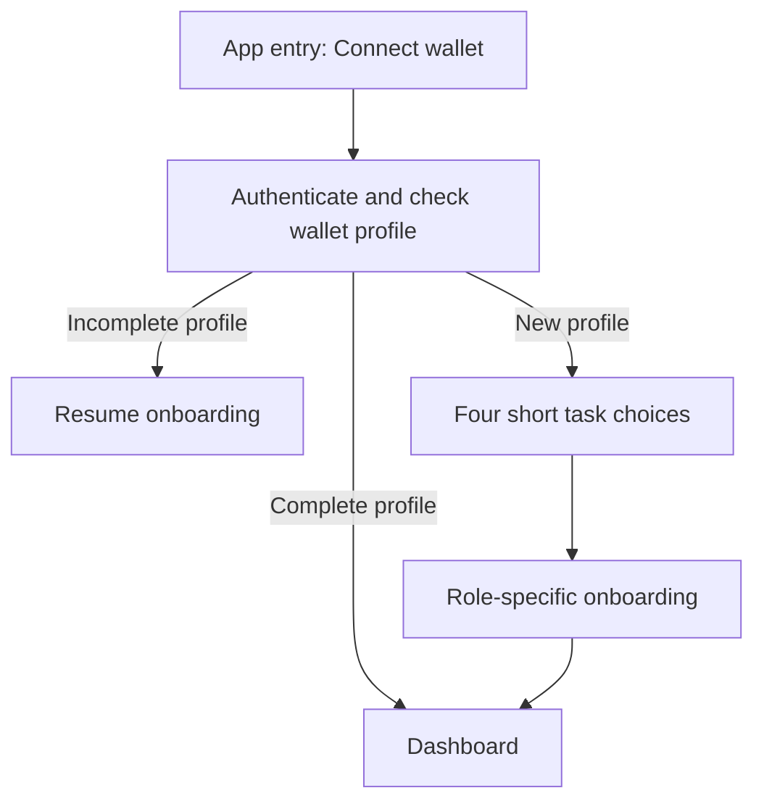

# Wallet-first entry and firm-first build order

Current user direction · 4 October 2026 · planning only.
This replaces the previous task-choice-before-wallet arrival. The earlier visual
walkthrough must be revised before it is treated as the current entry design.

**Job:** enter the right workspace with minimal onboarding, then perform the task.
**Outcome:** an authenticated returning wallet reaches its dashboard; a new wallet
chooses a role and completes only necessary steps.
**Consequence:** connection and role selection grant no licence, identity approval
or spending authority. Demo actions later submit actual test transactions.

## Entry

- One compact heading and primary action. No four-path choice before connection.
- Profile lookup follows wallet authentication before private data is returned.
  Show Checking your profile; errors offer Retry, never pretend a profile is absent.
- A completed profile opens its last authorized workspace. Multiple roles remain
  switchable; selection cannot grant a role. Expired permission gates the affected
  action while preserving existing records and rights.
- Incomplete onboarding resumes from its saved step. Account changes recheck the
  profile. Chain changes recheck deployment/permissions without creating a new identity.
- Public information/standalone terms may remain readable; app actions use this entry.
- Keep full explanations in terms, agreements and reviewer documentation, outside
  the onboarding introduction. Required information still appears before consent.

## Exit investor

After the connected new user chooses Exit an investment, immediately check approved
originator adapters for supported tokenized positions, debentures and registered claims.
Show found positions, available amount and the next action; do not first ask them to
pick a fund or read a long explanation. Verify identity/eligibility and ownership
matching before accepting an offer or signing an exit.

| Result | Minimal visible state |
|---|---|
| Reading | Finding your positions… |
| Matched | Your positions, one concise row per position |
| Empty | **No supported positions found for this wallet.** |
| Read failed | Couldn't check your positions. · Retry |
| Offchain account required | Link your platform account |
| Position found but unavailable | Position remains visible with its actual restriction |

No match does not mean the wallet owns no assets. Offchain debentures require an
authenticated originator account/record link; address-only scanning cannot discover
all private holdings. Empty holdings prevent an exit, not erase a completed profile.
Nontransferable positions require approved settlement/discharge rather than a prohibited
token transfer. Minting a token alone does not establish those rights.

## Top-bar Demo sheet

Arbitrum Sepolia only. Demo opens a focused sheet with context-relevant actions:
**Get test gas**, **Get test USDG**, **Mint test position**, **Check setup**.
Show only supported actions and the selected instrument/amount before authorization.
Do not claim Paxos USDG is publicly mintable; its actual funding route must be verified.

The test issuer/distributor must have bounded issuance permission and bind the mint
to the connected wallet, registered originator, instrument, quantity and TEST record.
Minted debenture/nontransferable holdings need a supported discharge/settlement adapter.
Judge wallets must not gain issuer, registry or firm permissions through this sheet.

Preserve submitted hashes through reload/account changes. Pending, reverted and unknown
receipts have separate states. Enable continuation only after a confirmed receipt and
fresh authoritative holdings read. Closing the sheet cannot cancel a submitted transaction.
The current review preview implements none of these financial actions.

## Build sequence

1. Thin shared wallet authentication, profile lookup, completion/resume and role routing.
2. **Investment firm first:** entity/representative → scoped authority review → legal
   agreements/acceptance → vehicle and mandate → approvals, funding and readiness.
3. Implement vehicle accounting/permissions and minimal approved originator adapters.
   Owner capital, provider interests, reserves and fixed withdrawal claims are separate.
4. Seed **five fictional TEST firms and five distinct USDG vaults** through that same
   onboarding/activation path. Reconcile each vault's real funding, active mandate,
   eligible origins/instruments/routes, signer roles, risk headroom and cash floor.
5. Add the transaction-backed Demo sheet and issue supported test positions.
6. Complete originating-platform onboarding/integration and investor exits against
   the funded firms. Ordinary originator redemption remains outside this onboarding.
7. Complete capital-provider subscriptions, personal interests and withdrawals. If
   providers supply initial demo capital, this accounting journey precedes vault funding.

Five firms: Meridian Test Management, Northstar Test Partners, Harbor Test Credit,
Summit Test Capital and Willow Test Investments; each has its own TEST vehicle/vault.
Names are fixtures, not actual licensed entities or partnerships. Normal demo fixtures
start funded/ready; exception tests separately prove paused, unfunded and capped states.

Before financial implementation: approve initial capital ownership/funding, TEST
profile reviewers, supported instrument interfaces and integration activation authority.
Definitions are written now; deployments, minting and funding remain later work.

Checks to add to [demo acceptance](demo-acceptance.md): connection before task choice;
completed/incomplete/new profile routing; immediate matched/empty/error discovery;
five independently ready vaults; transaction-backed mint and receipt recovery;
unsupported chain and unauthorized mint rejection. Existing `J-*` tests remain unexecuted.

Rules: `rule/one-primary-action`, `rule/no-redundant-entry`,
`rule/cover-reachable-states`, `rule/empty-state-action`,
`rule/name-object-scope-consequence`, `rule/irreversible-action-safeguard`.
Wallet-first gating is an explicit user decision; these rules do not prescribe it.
