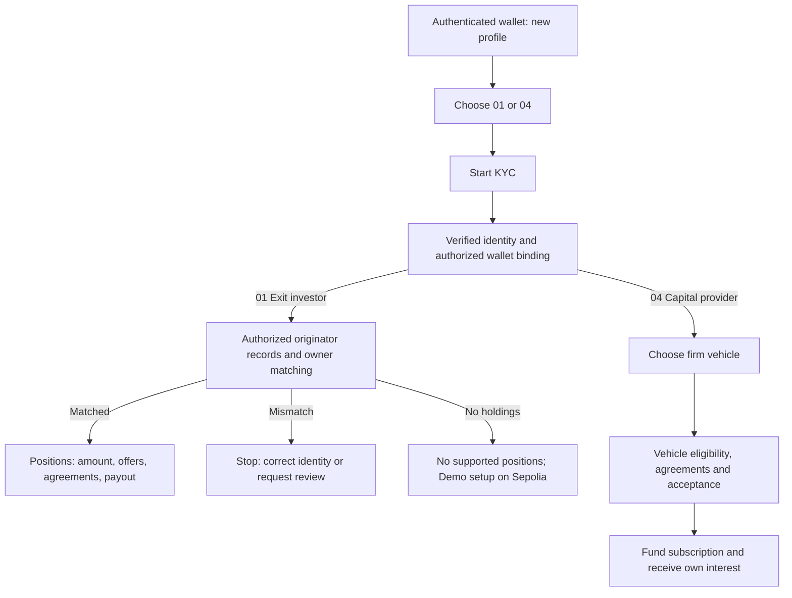

# Identity first, managed enquiries, separate vehicles

Revision 5 · 4 October 2026. Product review only; no production identity decisions,
enquiry delivery, financial execution or deployment occurs in this artifact.

Use the [local screen review](http://127.0.0.1:5197/docs/product-blueprint/preview/)
and [visual co-funding proposal](http://127.0.0.1:5197/docs/product-blueprint/index.html#capital-syndication).

## 01 and 04: KYC first

The first onboarding action is **Start KYC**. Production uses an authenticated
verification service and the approved controller/privacy policy. The demo selector
contains exactly ten fictional preverified TEST identities; it cannot grant actual
identity verification, legal eligibility or contract permissions.

| Reference | Profile | 01 fixture | 04 meaning |
|---|---|---|---|
| TEST-IDENTITY-001 | Alex Morgan | Matched Alder holding | Identity verified; vehicle decides eligibility |
| TEST-IDENTITY-002 | Priya Menon | Matched Birch holding | Same |
| TEST-IDENTITY-003 | Lucas Chen | Matched Cedar holding | Same |
| TEST-IDENTITY-004 | Sofia Reyes | Matched Dune holding | Same |
| TEST-IDENTITY-005 | Daniel Okafor | Matched Alder holding | Same |
| TEST-IDENTITY-006 | Hana Kim | Matched Birch holding | Same |
| TEST-IDENTITY-007 | Amara Wilson | Matched Cedar holding | Same |
| TEST-IDENTITY-008 | Mateo Silva | Matched Dune holding | Same |
| TEST-IDENTITY-009 | Nisha Rao | Verified identity; owner mismatch | No old holding required; vehicle decides eligibility |
| TEST-IDENTITY-010 | Elias Haddad | Verified identity; no holdings | No old holding required; vehicle decides eligibility |

The review fixtures bind a selected identity to a declared TEST wallet. In the
future executable demo, that binding must use the actual authenticated connected
wallet; synthetic fixture wallet references cannot prove browser-wallet ownership.

For 01, compare trusted subject, originator account, authorized wallet and holding
references under the integration's mapping/attestation policy. Do not compare names
or expose another owner's private balances, agreements or identity when this fails.
Correct message: **We couldn’t verify this position belongs to your approved identity.**
Offer change identity or scoped review; block offers, signing and payout. No holding,
failed records lookup, unsupported integration and ownership mismatch remain distinct.
Offchain records require authenticated originator linkage and lawful data access.

For 04, verified identity is followed by eligibility for the selected vehicle. The
provider need not already own a supported fund position. Country, investor category,
source-of-funds requirements and reviewer approval are separate product-policy gates.
Profile/account changes invalidate unsigned dependent reviews while preserving
submitted records under their original identity and authority.

## 02 and 03: enquiry before institutional onboarding

**Talk to us → concise form → review → actual received enquiry → acknowledgement.**

Collect representative name, work email, organization, jurisdiction, role, and one
short originator instrument/records summary or firm vehicle/mandate summary. Keep
identity documents out of the public enquiry form. Explain the enquiry privacy scope.
Validate at the server boundary, preserve safe drafts/errors, and keep the two roles
clear. A submitted contact request is neither a signed application nor approval.

Future service requirements:

- Persist a durable enquiry ID before claiming receipt; reject malformed input and
  make retried submission idempotent. Use validated recipient addresses.
- Queue transactional acknowledgement after persistence. Delivery failure must not
  create a second enquiry or falsely claim the message arrived in the inbox.
- Send branded HTML plus text alternative from a verified Lockgate sending domain.
  Escape submitted content, include reference and correct role, and support monitored
  replies. Do not invent approval, partnership status or a promised response time.
- Receipt email: thank the representative, confirm what enquiry was received, and
  explain that the team will contact them regarding scope and next steps.
- Show saved, acknowledgement queued, send failed and submitted-under-review as
  distinct service states. Apply agreed retention, access and anti-abuse controls.

The local review deliberately stops at a labelled **unsent** acknowledgement preview.
No real backend or mail-delivery service was configured or tested in this task.

## Proposed capital architecture

**Recommendation:** a capital provider chooses a separate firm-managed vehicle.
Firms may co-fund an approved deal. Do not silently replace individual subscriptions
with one common tokenized vault or give firms unrestricted access to each other's cash.

Example: accepted net exit payout **$1,000,000**. Meridian contributes $400,000,
Northstar $350,000 and Harbor $250,000. Summit and Willow decline under their mandates.
Each contribution is reserved against its own vehicle; documents define the actual
creditor/holder or agent, deal rights, collections, costs, losses and recovery.

Route A requires divisible permitted assignment/transfer or a separately approved
holder/agency participation structure. Route B requires approved participation in
the named borrower's new financing debt and old-claim discharge. Financing the payout
does not by itself establish rights to the originator asset, and the investor's
discount does not automatically become every firm's lending income.

The risk engine coordinates only approved mandates: originators, instruments/routes,
related-party exposure, absolute and percentage caps, dated valuation, available cash,
reservations, pricing/expiry and authorized execution. Onchain and authoritative
offchain boundaries must enforce those rules independently of the engine's suggestion.

Recommend **all-or-nothing accepted payout** for the first design. Reserve the full
amount, allocate precision/fees deterministically, require all consents and only then
settle. Offchain legs remain conditional and reconciled, not falsely described as
atomic. Never perform an unconsented partial payout or release reservations while
a submitted payment's outcome is unknown. A partial-fill product needs separate consent.

A shared token is a new product proposal with its own issuer, governing mandate,
custody/administration, eligibility/distribution, NAV, cross-vehicle concentrations,
loss allocation, withdrawal rights and wind-down. It is not a software shortcut.

Open decisions: legal interest acquired by providers; authorized deal holder/agency;
all-or-nothing versus explicit partial-fill consent; valuation/fee allocation; legal
permissions in each country. No structure is represented as legally cleared.

Sources: [MAS tokenisation guide](https://www.mas.gov.sg/-/media/mas/sectors/guidance/guide-on-the-tokenisation-of-capital-markets-products.pdf)
requires classification by economic substance and activities. [Maple protocol actors](https://docs.maple.finance/technical-resources/protocol-overview/protocol-actors)
is an adjacent separate-pool/manager pattern, not evidence that Lockgate syndication
or retail distribution is approved. Both were checked 4 October 2026.
