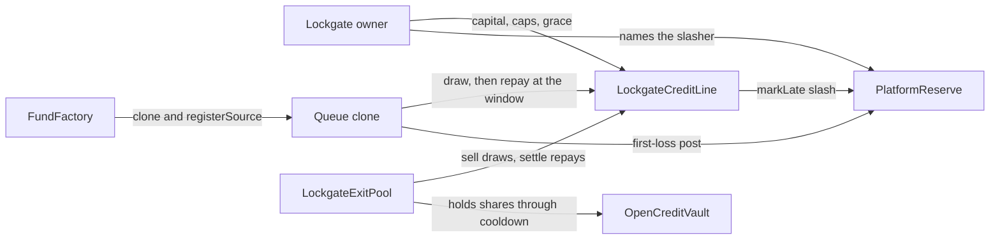
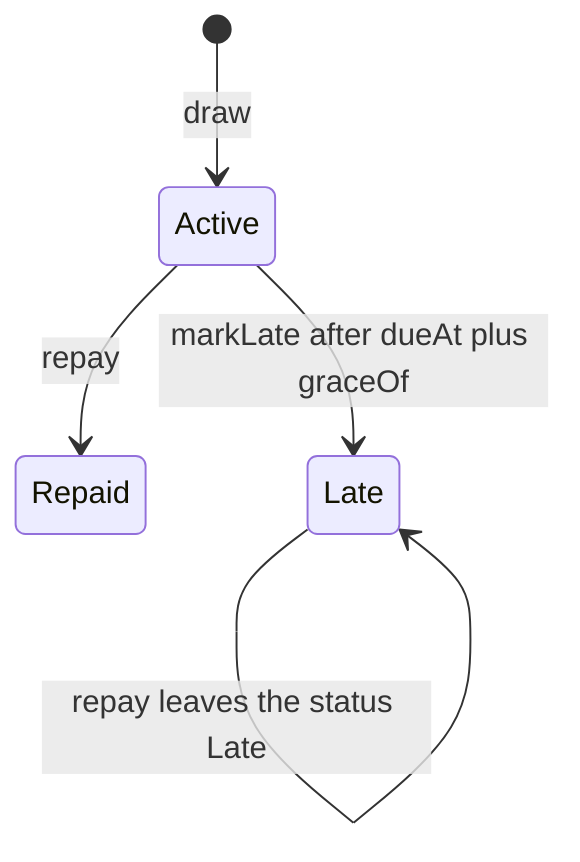
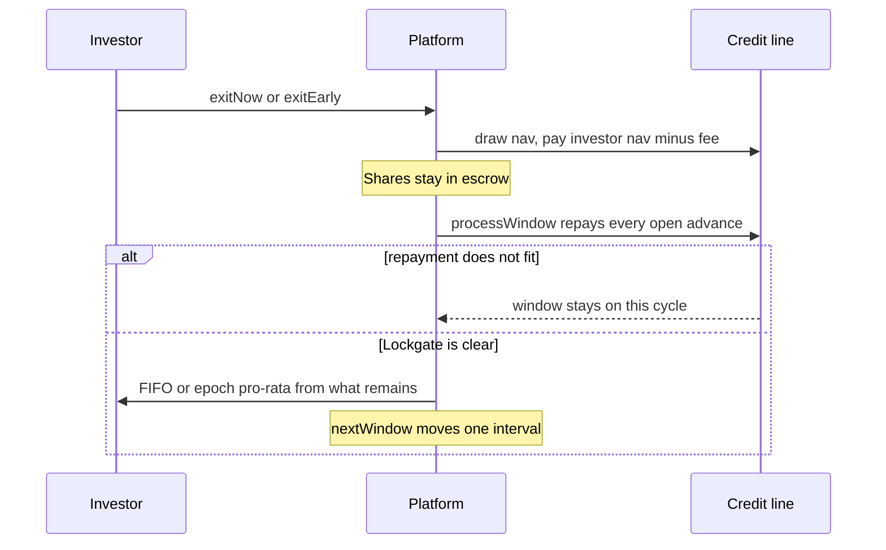
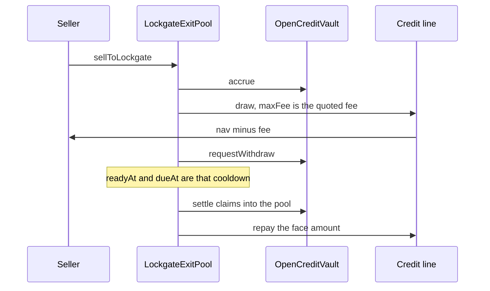

# Lockgate core contracts

## SUMMARY

Stage-1 contracts cover both doors in `lockgate/SPEC.md`: the restricted-fund credit line (weekly, epoch, and quarterly queues) and the open token (`OpenCreditVault` plus `LockgateExitPool`). MockUSDG, the 6-decimal adapter, pricing guardrails, and the first-loss reserve sit underneath. Gate: `FOUNDRY_PROFILE=core forge test` from this directory.

## PROGRESS

- 2026-10-02: Slither 0.11.6 on the core profile reported 121 results. The factory constructor now rejects a zero adapter, credit line, or reserve. `createDemoFund` uses `forceApprove`. The other 116 results are recorded as false positives in `../docs/SECURITY-NOTES-contracts.md`.
- 2026-10-02: Developer notes below: how to run the core suite, the decisions that the code will not relax, and the advance, window, and door-2 diagrams. An open advance keeps its reserve floor if `setSourceTerms` lowers the live rate. The floor follows the live rate again when that source's exposure hits 0.
- 2026-10-02: Security review of the stage-1 book. Grace is stored on the advance. A registrar cannot rewrite an open source. Utilization and concentration round up. Settlement walks at most 128 open requests. `push` rejects a short delivery. Notes are in `../docs/SECURITY-NOTES-contracts.md`.
- 2026-10-02: The factory constructor other sessions call is the seven-argument form. `PricingMath` is unchanged: 600 seconds is 99 bps, and 599 or 596 seconds is 98. A later Anvil block prices the seconds left in that block.
- 2026-10-02: Door 2 is in `src/core`. The open vault accrues 9% a year on MockUSDG. The exit pool pays `nav − fee` and `settle` claims the cooldown and repays the line. Core fuzz is 512 runs. Invariants run 64 times at depth 40. Added failure-path coverage for caps, windows, escrow dust, and factory config.
- 2026-10-02: Published `src/interfaces`, `INTERFACES.md`, and the core contracts. Accepted G7's book views `eligibleOutstanding` and `lateOutstanding` (owed-nav units). On-chain pricing refuses a fee above the max. The engine clamps. Token fee here is ceil. The engine's is half-up. Both are recorded in `INTERFACE-REQUESTS.md`. EIP-712 stays `AdvanceProposalLib` (`LockgateAdvance` / `1`).

## Run

From this directory. Foundry 1.7.1 has no `--profile` flag. `FOUNDRY_PROFILE=core` selects `[profile.core]` in `foundry.toml` (`src/core`, `test/core`, fuzz 512, invariants 64 × depth 40). Libraries are already in `lib` (`forge-std` 1.11.0, OpenZeppelin 5.3.0). Leave them there.

```bash
FOUNDRY_PROFILE=core forge test --offline
```

One regression:

```bash
FOUNDRY_PROFILE=core forge test --offline --match-contract SecurityTest --match-test test_openExposureKeepsTheReserveFloor
```

Solc is 0.8.28, the optimizer runs 200 times, `via_ir` is on, and the EVM is Cancun. A handler revert does not fail an invariant (`fail_on_revert = false`). `via_ir` caches `block.timestamp` for the whole test function. After `vm.warp`, pass a literal or a value you already stored. `vm.prank` and `vm.expectRevert` bind the next external call, including a call hidden in an argument. `expectRevert(bytes4)` does not match a custom error that carries arguments. Use `abi.encodeWithSelector`.

Do not add another source file named `MockUSDG.sol`. Forge names the artifact from the filename, and `src/core/MockUSDG.sol` is the token the Anvil flows deploy. The reentering test token is `test/partner/mocks/ReenterUSDG.sol`.

Slither 0.11.6, from this directory:

```bash
FOUNDRY_PROFILE=core slither . --exclude-dependencies
```

The triage is in `../docs/SECURITY-NOTES-contracts.md`.

`src/partner`, `src/facility`, `engine`, `harness`, `sim`, and `e2e` are other sessions. A failure there is not a core failure. The review notes are `../docs/SECURITY-NOTES-contracts.md`.

## Decisions

- One credit line serves both doors. A registered source calls `draw`. The payee receives `navValue - fee`. The source owes `navValue`. The fee is earned only as recovery passes the principal. `outstanding` is unpaid principal. `exposure` is unpaid nav.
- `graceOf(id)` is the grace stored at draw. `grace()` is what the next draw stores. `markLate` waits until `dueAt + graceOf(id)`. Repay on an `Active` advance sets `Repaid`. Repay on a `Late` advance leaves it `Late`. A full slash still marks the advance `Late`.
- `reserveFloorBps` is the highest reserve rate that still applies. `requiredReserve` and the next draw use the higher of that floor and the live `reserveBpsOf`. Lowering the live rate does not release first-loss cash while exposure is open. When exposure hits 0, the floor becomes the live rate.
- The on-chain bps quote is half-up. The token fee is ceil. A quote above `maxFeeBps` (1500) is refused, not clamped. The engine clamps, and its token fee is half-up. `PricingMath` stays on the constructor curve: 600 seconds is 99 bps. 599 or 596 seconds is 98. Do not flatten that so a stale view matches a later block.
- Stage 1 does not verify `AdvanceProposalLib` and does not check a peg. The issuer's `setNav` is the NAV. A future `navUpdatedAt` is refused. Age past `maxNavAge` is stale. Peg checks stay in the engine and the facility.
- `processWindow` repays every open advance, in request order, before it pays investors. If the next repayment does not fit, the window does not roll. Weekly and quarterly then pay whole queued requests FIFO and stop at the first shortfall. Epoch pays pro-rata of the cash it snapshotted, and uses FIFO when cash covers the queue. A quarterly gate also freezes `processWindow`. A weekly gate does not.
- The open list holds at most `MAX_OPEN` (128) queued plus advanced requests. Request 129 reverts `QueueFull`. Settlement does not walk paid history.
- `UsdgTransfers.pull` and `push` revert unless the recipient balance rises by the full amount.
- The factory clones locked implementations. It does not embed platform bytecode. EIP-170 caps deployed bytecode at 24576 bytes (<https://eips.ethereum.org/EIPS/eip-170>). EIP-3860 caps init code at 49152 bytes (<https://eips.ethereum.org/EIPS/eip-3860>). Measured on 2026-10-02 with `FOUNDRY_PROFILE=core forge inspect` (solc 0.8.28, optimizer 200, via IR): factory init code 5763 bytes, deployed runtime 4729. Direct `new` with a real token still initializes in the constructor. A zero-token constructor locks `initialize` on that copy.
- `createPlatform` registers the caller as issuer with the caller's limit and reserve bps, including 0, once the factory is a registrar. That is the sandbox path. Door 2 registers the exit pool at reserve bps 0 on purpose.

## Who holds which contract



The issuer address on a clone calls `setNav`, `setGated`, and `setAllowlist`. The factory names that issuer as the reserve admin. The reserve owner cannot withdraw platform funds.

## Advance



`graceOf` on an unknown id is 0. A draw made while `grace` is 0 also stores 0. Read `getAdvance` before you treat 0 as "slash at `dueAt`".

## Window



## Door 2



A later `setCooldown` does not move `readyAt` or `dueAt`. On MockUSDG the vault must be a minter and `mintYield` is true. Real USDG uses `mintYield = false`. A 5-minute cooldown is 49 bps on the default curve. The arithmetic is in `INTERFACES.md`.

## Layout

| Path | What |
| --- | --- |
| `src/interfaces` | Surfaces other sessions compile against |
| `src/core` | Stage-1 contracts |
| `test/core` | Unit, fuzz, queue scenarios, solvency |
| `INTERFACES.md` | Behavior, reason strings, deploy order |
| `INTERFACE-REQUESTS.md` | Append-only. G6 decides |
| `lib` | forge-std 1.11.0, OpenZeppelin 5.3.0 |

`src/partner`, `src/facility`, `engine`, `harness`, `sim`, and `e2e` are other sessions. Do not treat a failure there as a core failure.

## Test

Use the command in [Run](#run). Handlers call the public book and the weekly queue only. A deterministic draw, withdraw, slash, and repay walk sits beside the solvency invariant. Stage-1 accounts token units. Peg checks stay in the engine and the facility.

## Money, in one pass

A registered platform draws. The payee receives `navValue - fee`. The platform owes `navValue`. When its window runs, cash repays Lockgate before any investor in the queue. If that repayment does not fit, the window does not roll and the queue is not paid. After `dueAt + graceOf(id)`, anyone may mark the advance late. `graceOf(id)` is the grace stored at draw. The reserve is slashed into the line, up to the unpaid amount. The platform posted that reserve. The owner of the reserve cannot take it back below the required floor.

Demo pricing is about 1% on a 10-minute window because `timeScale` 4320 treats that wait as 30 days on a 12% base APR (99 bps, half-up). A 90-day window needs `timeScale` 1 or the fee is above the 1500 bps max and the draw is refused. Details and the 99 bps arithmetic are in `INTERFACES.md`.

Sepolia USDG used by the adapter: `0xFFC95faa3d63Cde504a05B567C600B78C0b41892`, 6 decimals, named Global Dollar on the token page fetched 2026-10-02 (<https://sepolia.arbiscan.io/token/0xFFC95faa3d63Cde504a05B567C600B78C0b41892>). The adapter does not hold tokens. Swap mocks for that token by deploying a second adapter with `isMock = false`. `createDemoFund` mints only on a mock adapter.

Door 2 uses the same credit line with `reserveBps` 0. `OpenCreditVault` is an 18-decimal token. A 5-minute cooldown is the demo default from `lockgate/SPEC.md`. On MockUSDG the vault must be a minter, and a full year of the 9% APR (`900` bps, ACT/365) mints `9%` of assets. `sellToLockgate` accrues, pays the seller, and queues the withdrawal. `settle` is anyone, after `readyAt`. Real USDG does not auto-mint yield (`mintYield = false`).

`FundFactory` clones locked implementations. It does not embed platform bytecode. EIP-170 caps deployed bytecode at 24576 bytes (<https://eips.ethereum.org/EIPS/eip-170>). EIP-3860 caps init code at 49152 bytes (<https://eips.ethereum.org/EIPS/eip-3860>). Measured on 2026-10-02 with `FOUNDRY_PROFILE=core forge inspect` (solc 0.8.28, optimizer 200, via IR): factory init code 5763 bytes, deployed runtime 4729. The constructor takes the three implementation addresses after the reserve. Deploy order is in `INTERFACES.md`.
