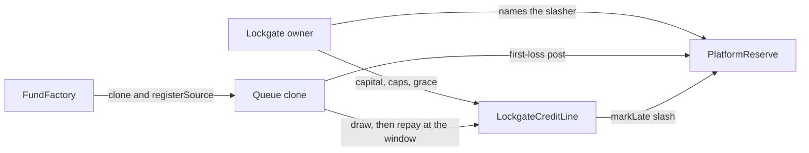
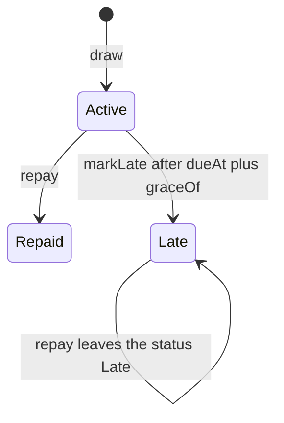
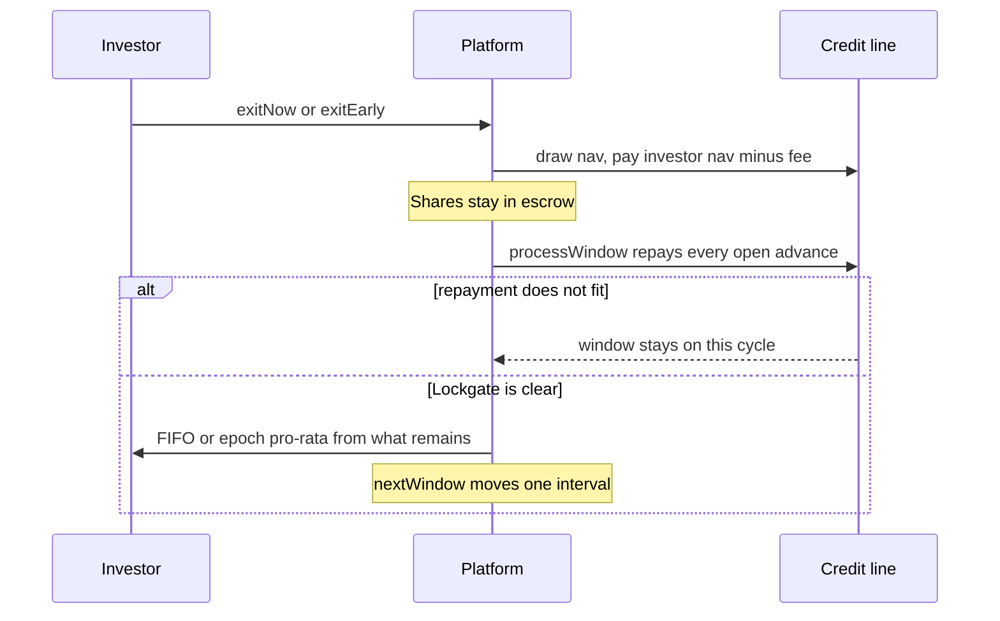

# Lockgate core contracts

## SUMMARY

Stage-1 contracts cover the restricted-fund credit line (weekly, epoch, and quarterly queues) from `lockgate/SPEC.md`. Door 2 (`OpenCreditVault` plus `LockgateExitPool`) is removed: not deployed, superseded, kept only for its unit tests. MockUSDG, the 6-decimal adapter, pricing guardrails, and the first-loss reserve sit underneath. Gate: `FOUNDRY_PROFILE=core forge test` from this directory.

## PROGRESS

- 2026-10-02: Caller views. `totalExposure()` (`0x79f883da`), `accountedAssets()` (`0xd4347f25`), and `accountedEquity()` (`0x744274cc`) are on `ILockgateCreditLine`. `requestCount()` (`0x5badbe4c`) is on `IIssuerFund`. Each was already a public getter. Selectors are unchanged. `test/core/CallerViews.t.sol` reads them through the interfaces. Partner `gated()` and `navUpdatedAt()` already match `ICreditSource`. `IPartnerVault.payoutTo(address)` is declared on the partner interface at `0x63aec9af`. Core leaves that function there. This pass adds no event. Core profile: 30 suites, 152 passed, 0 failed, 0 skipped, in 500.42ms (2.65s CPU). Solc 0.8.28 compiled 102 files in 69.89s. The three core invariants each stayed at 64 runs, depth 40, 2560 calls, 0 reverts. The invariant directory was not re-run. Sizes were not remeasured. Sixty-two Solidity files under `src/core`, `src/interfaces`, and `test/core` are under 300 lines, 8022 lines in total. The longest are `PlatformBase.sol` at 298 and `PricingDiffFuzz.t.sol` at 296.
- 2026-10-02: Repayment-order fuzz in `test/core/RepayOrderFuzz.t.sol`. A window pays a prefix of open advances and stops at the first face that does not fit. Faces 30e6, 25e6, and 5e6 against cash 35e6 repay only the 30e6 face. The 5e6 face stays `Active`. `--fuzz-runs 10000` on that contract: 3 passed, 0 failed, in 2.44s (4.88s CPU). Solc 0.8.28 compiled 69 files in 11.69s. Core profile at fuzz 512: 29 suites, 150 passed, 0 failed, 0 skipped, in 515.60ms (2.26s CPU). Solc 0.8.28 compiled 101 files in 71.45s. The three core invariants each stayed at 64 runs, depth 40, 2560 calls, 0 reverts. The invariant directory was not re-run.
- 2026-10-02: Final re-run of this tree. Core profile: 28 suites, 147 passed, 0 failed, 0 skipped, in 521.98ms (1.88s CPU). Solc 0.8.28 compiled 100 files in 65.38s. The three core invariants each stayed at 64 runs, depth 40, 2560 calls, 0 reverts. Invariant directory: 15 suites, 49 passed, 0 failed, 0 skipped. Solc 0.8.28 compiled 127 files in 29.05s. Tests finished in 594.52ms (1.52s CPU). `invariant_fundsAreConserved` is 32 runs, depth 20, 640 calls, 0 reverts. `invariant_solvencyFeeBoundsAndRepayFirst` and `invariant_cashStaysWithThePartner` are each 64 runs, depth 40, 2560 calls, 0 reverts. Sizes stay the epoch-preview compile: `EpochQueuePlatform` runtime 14905, init 21093. Sixty Solidity files under `src/core`, `src/interfaces`, and `test/core` are under 300 lines. The longest is `PlatformBase.sol` at 298. Those trees have no `console` output. Known gaps and trust assumptions are in [Handoff](#handoff).
- 2026-10-02: Epoch `previewSettlement` counts the same floors `_payProRata` pays. A slice that burns no shares adds nothing. Two claims of 3 against cash 5 preview as payable 4 and shortfall 2. Each holder receives 2. Cash left is 1, both stay queued at nav 1, and the next epoch pays 0. Two 1-share claims at nav 2 against cash 2 preview as payable 0 and shortfall 4. The window still rolls. Weekly and quarterly previews stay FIFO. Core profile: 28 suites, 147 passed, 0 failed, 0 skipped, in 491.42ms (1.64s CPU). Solc 0.8.28 compiled 100 files in 70.61s. The three core invariants each stayed at 64 runs, depth 40, 2560 calls, 0 reverts. Invariant directory: 15 suites, 49 passed, 0 failed, 0 skipped. Solc 0.8.28 compiled 127 files in 33.13s. Tests finished in 603.10ms (1.46s CPU). `forge build --sizes` compiled 100 files in 70.65s. Largest runtime is `EpochQueuePlatform` at 14905, init 21093. `PlatformBase` and `WeeklyCyclePlatform` stay 14635/20823. `QuarterlyWindowPlatform` stays 14663/20851. `LockgateCreditLine` stays 12465/13373. `PlatformReserve` stays 3423/3865. Factory stays 4952/5825. `PlatformBase.sol` is 298 lines. Sixty Solidity files under `src/core`, `src/interfaces`, and `test/core` are under 300 lines. Those trees have no `console` output.
- 2026-10-02: Removed the unread `requestCycle` mapping and the write in `_queue`. A zero owner reverts `OwnableInvalidOwner` from `Ownable` before the constructor body, so `OpenCreditVault`, `LockgateExitPool`, and `MockUSDG` check the other zero arguments. A zero asset, vault, or line reverts `ZeroAddress`. No custom error in `src/core` is unused. `Insolvent`, the final `BadParam()`, the pricing panics, and the utilization cap stay. Core profile: 28 suites, 147 passed, 0 failed, 0 skipped, in 484.84ms (1.56s CPU). Solc 0.8.28 compiled 100 files in 63.79s. The three core invariants each stayed at 64 runs, depth 40, 2560 calls, 0 reverts. Invariant directory: 15 suites, 49 passed, 0 failed, 0 skipped. Solc 0.8.28 compiled 127 files in 27.97s. Tests finished in 584.22ms (1.34s CPU). `forge build --sizes` compiled 100 files in 63.62s. Largest runtime is `EpochQueuePlatform` at 14672. `PlatformBase` and `WeeklyCyclePlatform` are 14635. `QuarterlyWindowPlatform` is 14663. `LockgateCreditLine` stays 12465/13373. `PlatformReserve` stays 3423/3865. Factory stays 4952/5825. `PlatformBase.sol` is 297 lines.
- 2026-10-02: Verification re-run. Core profile: 28 suites, 147 passed, 0 failed, 0 skipped, in 498.79ms (1.38s CPU). Solc 0.8.28 compiled 100 files in 64.46s. The three core invariants each stayed at 64 runs, depth 40, 2560 calls, 0 reverts. Invariant directory: 15 suites, 49 passed, 0 failed, 0 skipped. Solc 0.8.28 compiled 127 files in 28.44s. Tests finished in 586.97ms (1.42s CPU). `forge build --sizes` compiled 100 files in 64.39s. Largest runtime is still `EpochQueuePlatform` at 14741. `LockgateCreditLine` is runtime 12465 and init 13373. `PlatformReserve` is runtime 3423 and init 3865. The other deployable rows match the earlier table. Sixty Solidity files under `src/core`, `src/interfaces`, and `test/core` are under 300 lines. Those trees have no `console` output. Commands are in [How to verify core](#how-to-verify-core).
- 2026-10-02: Rounding pins. Outstanding 5000 and capital 5001 is utilization 4999 under a 5000 cap, and a principal of 1 reverts `UtilizationCap`. A cap of 5001 draws that unit and the view is 5000. Capital 0 with the same outstanding reports 10000 and the quote is `"capital"`. An epoch with two claims of 3 and cash 5 pays 2 to each holder, leaves 1, and pays 0 on the next epoch. A 366-day line quote is fee 0 and bps 0 while `feeBps` returns 1500. `FOUNDRY_PROFILE=core forge test --offline` compiled 100 files in 63.60s and passed 28 suites, 147 tests, 0 failed, 0 skipped, in 525.57ms (1.47s CPU). The three core invariants each stayed at 64 runs, depth 40, 2560 calls, 0 reverts.
- 2026-10-02: Handoff counts are current. Core profile: 28 suites, 144 passed, 0 failed, 0 skipped, in 488.73ms (1.76s CPU). The three core invariants on that run each stayed at 64 runs, depth 40, 2560 calls, 0 reverts. Invariant directory: 15 suites, 49 passed, 0 failed, 0 skipped. Solc 0.8.28 compiled 127 files in 27.81s. Tests finished in 620.24ms (1.75s CPU).
- 2026-10-02: Every `revert` in `src/core` names a custom error, and a core test expects that error. `PlatformReserve.withdraw` above the posted balance reverts `OverBalance(uint256 amount, uint256 balance)` before the floor check. A zero owner on the line, reserve, pricing engine, factory, vault, exit pool, and mock token reverts `OwnableInvalidOwner`. `registerSource` while paused reverts `EnforcedPause`. A fresh clone with initial shares and a zero holder reverts `BadConfig`. A 1-unit vault deposit reverts `ZeroAmount` once 321 years of 9% push nav above 1e18. `OpenCreditVault.Insolvent` stays in the contract: after accrue, `shares * nav / 1e18` cannot exceed `assets`, so no honest call reaches it. `PricingMath` still panics `0x12` on a zero denominator and `0x11` on overflow. `FOUNDRY_PROFILE=core forge test --offline` passed 28 suites, 144 tests, 0 failed, 0 skipped, in 488.73ms (1.76s CPU). Compilation was skipped. The compile of that tree, before the last vault test, was 100 files in 61.93s.
- 2026-10-02: Every public and external function in `src/core` has NatSpec. The notice sits on the interface, and an implementation that inherits it uses `@inheritdoc`. `requestWithdraw` reverts `Insolvent` when the burned shares' nav exceeds assets. `PlatformBase.sol` is 298 lines. `FOUNDRY_PROFILE=core forge test --offline` compiled 99 files in 59.43s and passed 27 suites, 135 tests, 0 failed, 0 skipped, in 448.90ms (1.45s CPU).
- 2026-10-02: `forge clean` removed `out/` and `cache/`. `FOUNDRY_PROFILE=core forge build --offline` compiled 99 files in 61.05s. The following `forge test --offline` skipped compilation and passed 27 suites, 135 tests, 0 failed, 0 skipped, in 573.85ms (1.76s CPU). No test reads a stale artifact.
- 2026-10-02: `test_grantRevokeAndRenounceLeaveRepayAndCashReachable` grants and revokes a registrar and a slasher, clears the reserve admin, and renounces the reserve owner. A stranger still repays the 100e6 face. The line owner withdraws 500,000e6 plus the 990,000 fee. The source withdraws its 20e6 reserve. `renounceOwnership` on the line reverts `RenounceDisabled`. Core profile: 27 suites, 135 passed, 0 failed, 0 skipped. Solc 0.8.28 finished in 58.82s. Tests finished in 408.31ms (1.49s CPU).
- 2026-10-02: Re-ran the core profile and `test/invariant` from this directory. Core profile: 26 suites, 134 passed, 0 failed, 0 skipped. Compilation skipped. Tests finished in 520.95ms (1.76s CPU). The three core invariants each stayed at 64 runs, 2560 calls, 0 reverts. Invariant directory: 15 suites, 49 passed, 0 failed, 0 skipped. Solc 0.8.28 compiled 127 files in 27.01s. Tests finished in 584.05ms (1.43s CPU).
- 2026-10-02: Cash one unit past the first open remaining repays only that advance. The extra unit stays in platform cash, the line pulls 100e6, and the queued holder is unpaid. `test_firstAdvanceClearsAndTheNextShortfallHoldsTheWindow` After a 100e6 draw the owner can withdraw the line's whole token balance, 500,000e6 minus 99,010,000, while `earnedFees` is 0. One more unit reverts `CapitalShort`. `test_ownerWithdrawsIdleWhileTheFeeIsUnrealized` Core profile: 26 suites, 134 passed, 0 failed.
- 2026-10-02: Glossary and the text flow for roles, advances, reserves, and repayment are in [Glossary](#glossary).
- 2026-10-02: Vacuous checks tightened. The two monotone fuzzes now stay inside the open quote, through 9128 seconds, and assert every run. A refused quote in `testFuzz_openQuoteStaysInsideTheBand` must name `gated`, `stale nav`, `tenor`, or `fee above max`. The short repay expects `ERC20InsufficientBalance`. `halfUp` and `feeFromBps` overflow tests expect panic `0x12` or `0x11`. The solvency invariant rebuilds exposure from `remainingOf` instead of `capital + outstanding >= outstanding`. Core profile stays 26 suites, 130 passed, 0 failed.
- 2026-10-02: `test_pauseAndResumeLeaveTheOpenBook` draws 100e6 and 40e6, marks the 40e6 advance late, pauses, waits another day past grace, and unpauses. Eligible stays 100e6, late stays 25e6, exposure stays 125e6, required reserve stays 9,375,000, and the open advance stays `Active`. Core profile after that test: 26 suites, 130 passed, 0 failed.
- 2026-10-02: High-fuzz core pass from this directory. `FOUNDRY_PROFILE=core FOUNDRY_FUZZ_RUNS=10000 FOUNDRY_INVARIANT_RUNS=256 FOUNDRY_INVARIANT_DEPTH=80 forge test --offline --fuzz-runs 10000` passed 26 suites and 129 tests, with 0 failed and 0 skipped. Fuzz runs were 10000. `invariant_bookAndReserveBalance` and `invariant_queueEscrowAndBook` ran 256 times at depth 80 (20480 calls, 0 reverts). `invariant_reserveMatchesAdvances` stayed at 64 runs, depth 40, 2560 calls, 0 reverts, because `test/core/AdvanceReserveInvariant.t.sol` pins those values. Every `.sol` file under `src/core`, `src/interfaces`, and `test/core` is under 300 lines. `src/core` and `src/interfaces` have no `console` or `console2` output. The separate `test/invariant` count remains the earlier 15 suites, 49 passed.
- 2026-10-02: `test/core/QueueReserve.t.sol` locks a weekly queue that pays late or never. A 1-unit cash balance leaves the 7,500,000 reserve in place and holds the investor. After grace the slash takes that reserve and `requiredReserve` is 6,937,500 against a 0 balance. Later cash repays the 92,500,000 shortfall, realizes the 990,000 fee, drops the requirement to 0, and only then pays the queue. Core profile after that file: 26 suites, 129 passed, 0 failed.
- 2026-10-02: Final verification from this directory. `FOUNDRY_PROFILE=core forge build --offline` compiled clean. Core profile: 25 suites, 127 passed, 0 failed. Invariant suite: 15 suites, 49 passed, 0 failed. `forge build --sizes` matched the table in `AUDIT.md`. Largest runtime is still `EpochQueuePlatform` at 14741 bytes. Factory runtime is still 4952. Every `.sol` file under `src/core`, `src/interfaces`, and `test/core` is under 300 lines. `PlatformBase.sol` is 297. G7 and G8 call sites match the current selectors. The re-check is in `INTERFACES.md` and `INTERFACE-REQUESTS.md`.
- 2026-10-02: Access and event pass. A registrar cannot register a source the owner has deregistered. An owner update of a live source emits `SourceUpdated` only. `postReserve` emits `ReservePosted` for the payer. `initialize` emits `Configured`. An issuer ban blocks the next deposit and still lets that holder queue a redeem. A second `lockSlasherSet` reverts `SlashersLocked`. Tests are in `test/core/AccessEvents.t.sol`.
- 2026-10-02: The audit package is [AUDIT.md](AUDIT.md). Shipping sizes are from `forge build --sizes`. The largest runtime is `EpochQueuePlatform` at 14741 bytes, measured again after the access edits. Coverage used `--ir-minimum` and reports 94.34% of lines (816/865). That run failed `test_factoryFitsBothSizeLimits` because the coverage compiler measured factory runtime 29467. The shipping factory runtime is 4952.
- 2026-10-02: There is no upgrade function. `setParams` after an open advance leaves that advance's stored fee, principal, due date, and grace in place. The next draw uses the new curve. `test_paramChangeLeavesTheOpenAdvance`
- 2026-10-02: Handoff is in [Handoff](#handoff). After `QueueReserve.t.sol` the core profile is 26 suites, 129 passed, 0 failed. The invariant suite on the prior verification was 15 suites, 49 passed, 0 failed. Every `.sol` file under `src/core`, `src/interfaces`, and `test/core` is under 300 lines. `PlatformBase.sol` is 297. `PricingDiffFuzz.t.sol` is 296. `QueueReserve.t.sol` is 173. `Security.t.sol` is 219.
- 2026-10-02: `test/core/ThreatGaps.t.sol` locks the holes in that threat model. A draw one second past 366 days reverts `Tenor` and leaves the book unchanged. A stranger cannot mint shares, move issuer controls, or cancel someone else's redeem. A fresh clone rejects a zero config field. `exitEarly` with no reserve reverts `NotAvailable("reserve")`. Pause still accepts owner capital and still blocks `withdrawCapital`.
- 2026-10-02: `SECURITY-NOTES.md` has a threat model for each core contract: attacker, asset, entry point, mitigation, and the test that locks it. `PlatformConfig` is a struct with no functions.
- 2026-10-02: Stage-3 book edges are in `test/core/Stage3Edges.t.sol`. Repaying one advance leaves the others open, and a pull that is short by 1 rolls back. Three advances keep their own due dates. A reserve that covers one draw and not the next leaves the shortfall late. Pause blocks a new draw and still allows mark-late, repay, and a reserve top-up.
- 2026-10-02: Event topics, error names, and the selectors the engine and the harness match are in `INTERFACES.md`. `test/core/InterfaceNames.t.sol` locks them. The names already matched, so the contracts are unchanged.
- 2026-10-02: Pricing fuzz compares each quote with the engine's split product and checks zero, dust, max-uint, and rounding direction. `halfUp` multiplies in 512 bits, so a quotient that fits is returned. `feeFromBps` still reverts when the rounded fee does not fit.
- 2026-10-02: Trust assumptions, privileged roles, the pause and initialize locks, and the known limits are in `SECURITY-NOTES.md`. Each claim names a test under `test/core`.
- 2026-10-02: Gas for the nine main flows is in `snapshots/core.json` (the call) and `.gas-snapshot` (the whole test). `invariant_reserveMatchesAdvances` rebuilds exposure, fees, and the reserve floor from the advances. 64 runs, depth 40, 0 handler reverts.
- 2026-10-02: Slither 0.11.6 on the core profile reported 121 results. The factory constructor now rejects a zero adapter, credit line, or reserve. `createDemoFund` uses `forceApprove`. The other 116 results are recorded as false positives in `../docs/SECURITY-NOTES-contracts.md`.
- 2026-10-02: Developer notes below: how to run the core suite, the decisions that the code will not relax, and the advance, window, and door-2 diagrams. An open advance keeps its reserve floor if `setSourceTerms` lowers the live rate. The floor follows the live rate again when that source's exposure hits 0.
- 2026-10-02: Security review of the stage-1 book. Grace is stored on the advance. A registrar cannot rewrite an open source. Utilization and concentration round up. Settlement walks at most 128 open requests. `push` rejects a short delivery. Notes are in `../docs/SECURITY-NOTES-contracts.md`.
- 2026-10-02: The factory constructor other sessions call is the seven-argument form. `PricingMath` is unchanged: 600 seconds is 99 bps, and 599 or 596 seconds is 98. A later Anvil block prices the seconds left in that block.
- 2026-10-02 (superseded: door 2 is no longer deployed): Door 2 is in `src/core`. The open vault accrues 9% a year on MockUSDG. The exit pool pays `nav − fee` and `settle` claims the cooldown and repays the line. Core fuzz is 512 runs. Invariants run 64 times at depth 40. Added failure-path coverage for caps, windows, escrow dust, and factory config.
- 2026-10-02: Published `src/interfaces`, `INTERFACES.md`, and the core contracts. Accepted G7's book views `eligibleOutstanding` and `lateOutstanding` (owed-nav units). On-chain pricing refuses a fee above the max. The engine clamps. Token fee here is ceil. The engine's is half-up. Both are recorded in `INTERFACE-REQUESTS.md`. EIP-712 stays `AdvanceProposalLib` (`LockgateAdvance` / `1`).

## Handoff

Written 2026-10-02. Nothing here is committed. `git log -1` is `9665484` `feat(contracts): triage the core Slither run`. The repo has no remote. Do not push.

Current counts, from this directory, with a private `--out` and `--cache-path`, after `CallerViews.t.sol`. Core profile `FOUNDRY_PROFILE=core forge test --offline`: 30 suites, 152 passed, 0 failed, 0 skipped, in 500.42ms (2.65s CPU). Solc 0.8.28 compiled 102 files in 69.89s. On that run the three core invariants each stayed at 64 runs, depth 40, 2560 calls, 0 reverts: `invariant_bookAndReserveBalance`, `invariant_queueEscrowAndBook`, `invariant_reserveMatchesAdvances`. The invariant directory was not re-run on this pass. Its last measurement, `FOUNDRY_PROFILE` unset and `FOUNDRY_TEST=test/invariant`, is 15 suites, 49 passed, 0 failed, 0 skipped. Solc 0.8.28 compiled 127 files in 29.05s. Tests finished in 594.52ms (1.52s CPU). `invariant_fundsAreConserved` is 32 runs, depth 20, 640 calls, 0 reverts. `invariant_solvencyFeeBoundsAndRepayFirst` and `invariant_cashStaysWithThePartner` are each 64 runs, depth 40, 2560 calls, 0 reverts. Sizes were not remeasured. The epoch-preview table still stands: 100 files in 70.65s, largest runtime `EpochQueuePlatform` 14905, init 21093. The repayment-order pass before this one was 29 suites, 150 passed, in 515.60ms (2.26s CPU), compiled in 71.45s. The epoch-preview tests were 28 suites, 147 passed, in 491.42ms (1.64s CPU), compiled in 70.61s. Its invariant directory compiled 127 files in 33.13s and finished in 603.10ms (1.46s CPU). The dead-storage pass was 28 suites, 147 passed, in 484.84ms (1.56s CPU), compiled in 63.79s. Its invariant directory compiled 127 files in 27.97s and finished in 584.22ms (1.34s CPU). The verification before that removal was 28 suites, 147 passed, in 498.79ms (1.38s CPU), compiled in 64.46s. Its invariant directory compiled 127 files in 28.44s and finished in 586.97ms (1.42s CPU). The rounding pass was 28 suites, 147 passed, in 525.57ms (1.47s CPU), compiled in 63.60s. The revert-path run was 28 suites, 144 passed, in 488.73ms (1.76s CPU). Its invariant directory compiled 127 files in 27.81s and finished in 620.24ms (1.75s CPU).

`halfUp` in `PricingMath.sol` now multiplies in 512 bits. A 600-second quote is still 99 bps. `docs/SECURITY-NOTES-contracts.md` still says `PricingMath` is unchanged. That sentence is the 99 bps result. The wider multiply is the later edit.

Uncommitted, and part of this work: `PricingMath.sol`, `CreditLineAdmin.sol`, `PlatformBase.sol`, `EpochQueuePlatform.sol`, `PlatformShare.sol`, `PlatformStore.sol`, `PlatformReserve.sol`, `ILockgateCreditLine.sol` (`ReservePosted`, plus `totalExposure`, `accountedAssets`, and `accountedEquity`), `IIssuerFund.sol` (`requestCount`), `IQueueAdapter.sol` (preview notice), `IPricingEngine.sol` (NatSpec only), `INTERFACES.md`, `INTERFACE-REQUESTS.md`, `README.md`, `SECURITY-NOTES.md`, `AUDIT.md`, `snapshots/core.json`, `.gas-snapshot`, and `test/core` files `AccessEvents.t.sol`, `AdvanceReserveInvariant.t.sol`, `CreditLine.t.sol`, `CreditLineEdges.t.sol`, `DoorTwo.t.sol`, `FailurePaths.t.sol`, `GasFlows.t.sol`, `InterfaceNames.t.sol`, `PricingDiffFuzz.t.sol`, `Queues.t.sol`, `RevertPaths.t.sol`, `Roles.t.sol`, `Stage3Edges.t.sol`, `ThreatGaps.t.sol`, `QueueReserve.t.sol`, `RepayOrderFuzz.t.sol`, `CallerViews.t.sol`. `IPlatformReserve.sol` names `OverBalance`. `docs/SECURITY-NOTES-contracts.md` has a two-line pointer at `SECURITY-NOTES.md`. `test/core/OpenHoles.t.sol` is also untracked. This handoff did not edit it.

### Tests

These commands were run from this directory on 2026-10-02. The first row is the caller-view pass. The next two rows are the repayment-order pass: the core profile at fuzz 512, then the 10000-run campaign on `RepayOrderFuzzTest`. The next two rows are the final re-run before that file: core profile, then the invariant directory. The next three rows are the epoch-preview pass: core profile, invariant directory, then sizes. The next three rows are the dead-storage pass. The next three rows are the verification before `requestCycle` was removed. The next core-profile row is the rounding pass, then the revert-path suite. Nothing failed. The later invariant-directory rows are the revert-path tree and the run before `Roles.t.sol`. The high-fuzz row is the tree before `test_pauseAndResumeLeaveTheOpenBook`.

| Command | Result |
| --- | --- |
| `FOUNDRY_PROFILE=core forge test --offline` | 30 suites, 152 passed, 0 failed, 0 skipped. Fuzz 512. Caller views. Solc 0.8.28 compiled 102 files in 69.89s. Tests finished in 500.42ms (2.65s CPU). |
| `FOUNDRY_PROFILE=core forge test --offline` | 29 suites, 150 passed, 0 failed, 0 skipped. Fuzz 512. Repayment-order fuzz. Solc 0.8.28 compiled 101 files in 71.45s. Tests finished in 515.60ms (2.26s CPU). |
| `FOUNDRY_PROFILE=core forge test --offline --match-contract RepayOrderFuzzTest --fuzz-runs 10000` | 1 suite, 3 passed, 0 failed, 0 skipped. Fuzz runs 10000. Solc 0.8.28 compiled 69 files in 11.69s. Tests finished in 2.44s (4.88s CPU). |
| `FOUNDRY_PROFILE=core forge test --offline` | 28 suites, 147 passed, 0 failed, 0 skipped. Fuzz 512. Final re-run. Solc 0.8.28 compiled 100 files in 65.38s. Tests finished in 521.98ms (1.88s CPU). |
| `FOUNDRY_TEST=test/invariant forge test --offline` | 15 suites, 49 passed, 0 failed, 0 skipped. Final re-run. Solc 0.8.28 compiled 127 files in 29.05s. Tests finished in 594.52ms (1.52s CPU). |
| `FOUNDRY_PROFILE=core forge test --offline` | 28 suites, 147 passed, 0 failed, 0 skipped. Fuzz 512. Epoch preview matches pro-rata floors. Solc 0.8.28 compiled 100 files in 70.61s. Tests finished in 491.42ms (1.64s CPU). |
| `FOUNDRY_TEST=test/invariant forge test --offline` | 15 suites, 49 passed, 0 failed, 0 skipped. Epoch preview. Solc 0.8.28 compiled 127 files in 33.13s. Tests finished in 603.10ms (1.46s CPU). |
| `FOUNDRY_PROFILE=core forge build --sizes --offline` | Epoch preview. Solc 0.8.28 compiled 100 files in 70.65s. Largest runtime `EpochQueuePlatform` 14905, init 21093. `PlatformBase` and `WeeklyCyclePlatform` 14635/20823. `QuarterlyWindowPlatform` 14663/20851. `LockgateCreditLine` runtime 12465, init 13373. `PlatformReserve` runtime 3423, init 3865. Factory runtime 4952, init 5825. |
| `FOUNDRY_PROFILE=core forge test --offline` | 28 suites, 147 passed, 0 failed, 0 skipped. Fuzz 512. Dead storage removed. Solc 0.8.28 compiled 100 files in 63.79s. Tests finished in 484.84ms (1.56s CPU). |
| `FOUNDRY_TEST=test/invariant forge test --offline` | 15 suites, 49 passed, 0 failed, 0 skipped. Dead storage removed. Solc 0.8.28 compiled 127 files in 27.97s. Tests finished in 584.22ms (1.34s CPU). |
| `FOUNDRY_PROFILE=core forge build --sizes --offline` | Dead storage removed. Solc 0.8.28 compiled 100 files in 63.62s. Largest runtime `EpochQueuePlatform` 14672. `PlatformBase` and `WeeklyCyclePlatform` 14635/20823. `QuarterlyWindowPlatform` 14663/20851. `LockgateCreditLine` runtime 12465, init 13373. `PlatformReserve` runtime 3423, init 3865. Factory runtime 4952, init 5825. |
| `FOUNDRY_PROFILE=core forge test --offline` | 28 suites, 147 passed, 0 failed, 0 skipped. Fuzz 512. Verification. Solc 0.8.28 compiled 100 files in 64.46s. Tests finished in 498.79ms (1.38s CPU). |
| `FOUNDRY_TEST=test/invariant forge test --offline` | 15 suites, 49 passed, 0 failed, 0 skipped. Verification, before `requestCycle` was removed. Solc 0.8.28 compiled 127 files in 28.44s. Tests finished in 586.97ms (1.42s CPU). |
| `FOUNDRY_PROFILE=core forge build --sizes --offline` | Verification. Solc 0.8.28 compiled 100 files in 64.39s. Largest runtime `EpochQueuePlatform` 14741. `LockgateCreditLine` runtime 12465, init 13373. `PlatformReserve` runtime 3423, init 3865. Factory runtime 4952, init 5825. |
| `FOUNDRY_PROFILE=core forge test --offline` | 28 suites, 147 passed, 0 failed, 0 skipped. Fuzz 512. Rounding pins. Solc 0.8.28 compiled 100 files in 63.60s. Tests finished in 525.57ms (1.47s CPU). |
| `FOUNDRY_PROFILE=core forge test --offline` | 28 suites, 144 passed, 0 failed, 0 skipped. Fuzz 512. Revert paths. Compilation skipped. Tests finished in 488.73ms (1.76s CPU). The compile of that tree, before the last vault test, was 100 files in 61.93s. |
| `FOUNDRY_PROFILE=core forge test --offline` | 27 suites, 135 passed, 0 failed, 0 skipped. Fuzz 512. NatSpec only. Solc 0.8.28 compiled 99 files in 59.43s. Tests finished in 448.90ms (1.45s CPU). |
| `forge clean`, then `FOUNDRY_PROFILE=core forge build --offline` | `out/` and `cache/` were removed first. Solc 0.8.28 compiled 99 files in 61.05s. Exit 0. |
| `FOUNDRY_PROFILE=core forge test --offline` | 27 suites, 135 passed, 0 failed, 0 skipped. Fuzz 512. Ran on that clean build. Compilation skipped. Tests finished in 573.85ms (1.76s CPU). |
| `FOUNDRY_PROFILE=core FOUNDRY_FUZZ_RUNS=10000 FOUNDRY_INVARIANT_RUNS=256 FOUNDRY_INVARIANT_DEPTH=80 forge test --offline --fuzz-runs 10000` | 26 suites, 129 passed, 0 failed, 0 skipped. Fuzz runs 10000. Solc 0.8.28 compiled 98 files in 55.28s. Tests finished in 2.40s (10.38s CPU). That run is the tree before `test_pauseAndResumeLeaveTheOpenBook`. |
| `FOUNDRY_TEST=test/invariant forge test --offline` | 15 suites, 49 passed, 0 failed, 0 skipped. Revert-path tree. Solc 0.8.28 compiled 127 files in 27.81s. Tests finished in 620.24ms (1.75s CPU). |
| `FOUNDRY_TEST=test/invariant forge test --offline` | 15 suites, 49 passed, 0 failed, 0 skipped. Earlier re-run, before `Roles.t.sol`. Solc 0.8.28 compiled 127 files in 27.01s. Tests finished in 584.05ms (1.43s CPU). |
| `FOUNDRY_PROFILE=core forge build --sizes --offline` | Earlier table. Largest runtime `EpochQueuePlatform` 14741. `LockgateCreditLine` was 12515/13423. `PlatformReserve` was 3393/3835. Factory runtime 4952, init 5825. |

Coverage is a different compiler. The numbers, the `--ir-minimum` caveat, and the one failed size assertion are in [AUDIT.md](AUDIT.md).

On this shipping-profile run the three core invariants each ran 64 times at depth 40 (2560 calls, 0 reverts): `invariant_bookAndReserveBalance`, `invariant_queueEscrowAndBook`, `invariant_reserveMatchesAdvances`.

The high-fuzz command raised fuzz to 10000 runs. `invariant_bookAndReserveBalance` and `invariant_queueEscrowAndBook` ran 256 times at depth 80 (20480 calls, 0 reverts). `invariant_reserveMatchesAdvances` stayed at 64 runs, depth 40, 2560 calls, 0 reverts. `test/core/AdvanceReserveInvariant.t.sol` pins `default.invariant.runs = 64` and `depth = 40`, and that pin wins over the environment variables. The pin stays.

The first `test/invariant` row is this final re-run: 15 suites, 49 passed, 0 failed, 0 skipped, in 594.52ms (1.52s CPU). `QueueReserve.t.sol` lives under `test/core`, so it sits outside that suite. The three invariants there are `invariant_fundsAreConserved` (32 runs, depth 20, 640 calls, 0 reverts), `invariant_solvencyFeeBoundsAndRepayFirst` (64 runs, depth 40, 2560 calls, 0 reverts), and `invariant_cashStaysWithThePartner` (64 runs, depth 40, 2560 calls, 0 reverts). The next `test/invariant` row is the epoch-preview pass, the same 15 suites and 49 tests in 603.10ms. The dead-storage row is 584.22ms. The later rows are the verification before `requestCycle` was removed (586.97ms), the revert-path tree, and the count from before `Roles.t.sol`.

### Line limit

Every `.sol` file under `src/core`, `src/interfaces`, and `test/core` is under 300 lines. This pass counted 62 files, 8022 lines. The longest are `src/core/PlatformBase.sol` at 298 and `test/core/PricingDiffFuzz.t.sol` at 296. `test/core/RevertPaths.t.sol` is 289. `test/core/Stage3Edges.t.sol` is 288. `src/core/CreditLineAdmin.sol` is 279. `RepayOrderFuzz.t.sol` is 157. `QueueReserve.t.sol` is 173. `src/core`, `src/interfaces`, and `test/core` have no `console` or `console2` output. The `rg` search prints nothing.

### Known gaps

The full list, each tied to a test, is in `SECURITY-NOTES.md`. These stay open:

- `draw` does not check an `AdvanceProposal` signature. The digest test is `test_typehashAndDigestMatchCast`.
- `setParams`, `setNav`, and `setGrace` have no delay. `setParams` does not rewrite an open advance. `test_paramChangeLeavesTheOpenAdvance` `test_graceIsFixedAtDraw`
- `feeFromBps` rounds up, and since 2026-10-02 the engine's token fee rounds up too. Do not retune either clock. A 600-second quote stays 99 bps.
- `requestWithdraw` still contains `Insolvent`. After accrual, `shares * nav / 1e18` cannot exceed `assets` while the caller holds at most the supply, so no honest call reaches it. Dust rounds to 0 and reverts `ZeroAmount`. A full 100e6 redeem still succeeds. `test_vaultClaimWaitsAndFullRedeemFits`
- `PricingMath.halfUp` and `feeFromBps` still panic. A zero denominator is panic `0x12`. A product that does not fit is panic `0x11`. `test_halfUpRevertsOnZeroDenominator` `test_halfUpRevertsWhenTheRoundedQuotientDoesNotFit` `test_feeFromBpsRevertsWhenCeilDoesNotFit`
- The credit line's final `BadParam()` runs only for a quote code outside 1–15. Codes 1–15 each revert their own error.
- The 10000-run fuzz is the tree before `test_pauseAndResumeLeaveTheOpenBook`: 26 suites, 129 passed. Coverage is 94.34% of lines (816/865) from `--ir-minimum`, and that run failed the factory size assertion at runtime 29467. The shipping factory runtime in the size table is 4952.
- A slash can leave the posted reserve under `requiredReserve`. `invariant_reserveMatchesAdvances` allows that. `test_missedWindowSlashesReserveAndHoldsTheQueue` pins required reserve at 6,937,500 against a 0 balance.
- A 1-unit cash balance leaves a weekly window unsettled and holds the queued investor. Cash that later fills the shortfall is pulled in full, dust included, before that investor is paid. One roll leaves the next quote `"window due"`. `test_lateCashRepaysTheLineThenPaysTheQueue`
- `processWindow` repays a prefix of the open advances and stops at the first face that does not fit. A later smaller face stays open. Faces 30e6, 25e6, and 5e6 against cash 35e6 repay only the 30e6 face. Cash left is 5e6, the cycle stays 1, and the 5e6 advance stays `Active`. `test_laterSmallerAdvanceDoesNotJumpTheShortfall` `testFuzz_windowRepaysAPrefixAndDoesNotSkip` `testFuzz_aLaterFitDoesNotJumpAShortfall`
- `createPlatform` and `createDemoFund` are `onlyOwner` (owner is Lockgate), so every limit and reserve bps the factory registers is Lockgate-set. They post no cash. `repay` is permissionless.
- The utilization view floors. The draw gate rounds up. Outstanding 5000 and capital 5001 is view 4999 under a 5000 cap, and a principal of 1 reverts `UtilizationCap`. A cap of 5001 draws that unit and the view is 5000. Capital 0 with that outstanding reports 10000, and the quote is `"capital"`. `test_utilizationViewFloorsWhileTheNextUnitCeilsOver` `test_zeroCapitalReportsFullUtilizationAndQuotesCapital`
- Epoch pro-rata floors can leave a unit the next epoch still cannot pay. Two claims of 3 against cash 5 preview as payable 4 and shortfall 2. Each holder receives 2. Cash left is 1, both stay queued at nav 1, and the next epoch pays 0. Two 1-share claims at nav 2 against cash 2 preview as payable 0 and shortfall 4. The window rolls and the dust stays queued. `test_epochProRataLeavesOneUnitAndBothStayQueued` `test_epochDustRollsAndQuarterlyUngatePays`
- `withdrawCapital` can take the line's remaining token balance after a draw, while `earnedFees` is still 0. On a 100e6 advance that balance is 500,000e6 minus the 99,010,000 principal. One more unit reverts `CapitalShort`, and the next draw quotes `"capital"`. A later repay of the face realizes the 990,000 fee. `test_ownerWithdrawsIdleWhileTheFeeIsUnrealized`
- Pause blocks `draw`, `withdrawCapital`, and `registerSource`. It does not block `repay`, `markLate`, `postReserve`, or an owner `depositCapital`. Pause and unpause leave an open book in place. `test_pauseAndResumeLeaveTheOpenBook` keeps eligible at 100e6, late at 25e6, and the open advance `Active` across a further day past grace.
- `IPartnerVault.payoutTo(address)` is declared on the partner interface at selector `0x63aec9af`. Core leaves that function on `src/partner/interfaces/IPartnerVault.sol`. The engine reads the partner vault. The earlier ask is closed in `INTERFACE-REQUESTS.md`.

### Trust assumptions

The full model, each claim tied to a test, is in `SECURITY-NOTES.md`. This book assumes the following.

- You trust the credit-line owner with capital, caps, grace, registrars, and pause. `renounceOwnership` on the line reverts `RenounceDisabled`. A stranger still repays a 100e6 face after a registrar and a slasher are granted and revoked. `test_grantRevokeAndRenounceLeaveRepayAndCashReachable`
- You trust the factory once the owner has enabled it as a registrar. Only the owner can call it. `createPlatform` stores the limit and reserve bps the owner passes, takes the issuer as an argument (a zero issuer reverts `ZeroAddress`), and leaves the fund's token balance and reserve balance at 0. `test_createPlatformDoesNotSeedCash`
- You trust a registered source's reported face. A 100e6 stub draw pays the investor 99,010,000 and books exposure of 100e6. The fee stays unearned until repayment. `test_drawPaysNetAndOwesFace`
- You trust the source's nav timestamp and window. A future timestamp, a stale nav, a due window, and a gate each refuse the draw. `test_quoteAndDrawGuards`
- You trust the sandbox issuer with the live nav and the gate. A queued request keeps the nav stored at request time. `setNav(0)` reverts `ZeroAmount`. `test_gateBlocksRedeemNotDepositAndNavDoesNotRewriteTheQueue`
- You trust the reserve admin the platform named. The reserve owner cannot withdraw that balance. A slash pays the named slasher. `test_postWithdrawFloorAndSlashTarget`
- You trust the named slasher. After `lockSlasherSet`, another `setSlasher` reverts `SlashersLocked`. Anyone may `post` reserve. `test_lockSlashersAndCreditLineOnce` `test_postReservePassesThroughCreditLine`
- You trust the pricing owner with the live curve. A stranger's `setParams` reverts `OwnableUnauthorizedAccount`. A 600-second quote stays 99 bps. `test_setParamsGuards` `test_demoWaitIsAboutOnePercent`
- MockUSDG is a test token. The adapter requires 6 decimals. The Sepolia USDG address `0xFFC95faa3d63Cde504a05B567C600B78C0b41892` cannot carry the mock flag. `test_mintAuth` `test_canonicalSepoliaCannotBeMock`
- Stage 1 takes no `AdvanceProposal` on `draw`. There is no USDG peg on this book. Staleness is the source timestamp: 7 days still quotes, and 7 days plus 1 second returns `"stale nav"`. `test_typehashAndDigestMatchCast` `test_refusesAboveMaxAndStaleBoundary`
- `draw` and an open-vault `deposit` revert `ReentrancyGuardReentrantCall` on a callback. A short token delivery cannot fund the reserve or leave the line. `test_drawReentrancyReverts` `test_depositReentrancyReverts` `test_feeOnTransferCannotFundReserve` `test_pushRejectsAShortDelivery`

## Run

From this directory. Foundry 1.7.1 has no `--profile` flag. `FOUNDRY_PROFILE=core` selects `[profile.core]` in `foundry.toml` (`src/core`, `test/core`, fuzz 512, invariants 64 × depth 40). Libraries are already in `lib` (`forge-std` 1.11.0, OpenZeppelin 5.3.0). Leave them there.

```bash
FOUNDRY_PROFILE=core forge test --offline
```

One regression:

```bash
FOUNDRY_PROFILE=core forge test --offline --match-contract SecurityTest --match-test test_openExposureKeepsTheReserveFloor
```

Solc is 0.8.28, the optimizer runs 200 times, `via_ir` is on, and the EVM is Cancun. A handler revert does not fail an invariant (`fail_on_revert = false`). `via_ir` caches `block.timestamp` for the whole test function. After `vm.warp`, pass a literal or a value you already stored. `vm.prank` and `vm.expectRevert` bind the next external call, including a call hidden in an argument. `expectRevert(bytes4)` does not match a custom error that carries arguments. Use `abi.encodeWithSelector`.

Do not add another source file named `MockUSDG.sol`. Forge names the artifact from the filename, and `src/core/MockUSDG.sol` is the token the Anvil flows deploy. The reentering test token is `test/partner/mocks/ReenterUSDG.sol`.

Slither 0.11.6, from this directory:

```bash
FOUNDRY_PROFILE=core slither . --exclude-dependencies
```

The triage is in `../docs/SECURITY-NOTES-contracts.md`.

## How to verify core

Run these from this directory. Foundry 1.7.1 has no `--profile` flag. `FOUNDRY_PROFILE=core` selects `[profile.core]`. Unset that variable, and set `FOUNDRY_TEST=test/invariant`, for the invariant directory. The `--out` and `--cache-path` below keep the run off the shared `out/` and `cache/`. Do not `forge clean` those shared directories.

```bash
FOUNDRY_PROFILE=core forge test --offline --out /tmp/lockgate-g6-final-core-out --cache-path /tmp/lockgate-g6-final-core-cache
env -u FOUNDRY_PROFILE FOUNDRY_TEST=test/invariant forge test --offline --out /tmp/lockgate-g6-final-inv-out --cache-path /tmp/lockgate-g6-final-inv-cache
find src/core src/interfaces test/core -name '*.sol' -print0 | xargs -0 wc -l
rg -n 'console2?|import .console' src/core src/interfaces test/core
```

On 2026-10-02 the core profile, re-run after `CallerViews.t.sol`, compiled 102 files in 69.89s and passed 30 suites, 152 tests, 0 failed, 0 skipped, in 500.42ms (2.65s CPU). The repayment-order pass before that compiled 101 files in 71.45s and passed 29 suites, 150 tests, in 515.60ms (2.26s CPU). `RepayOrderFuzzTest` at `--fuzz-runs 10000` passed 3 tests in 2.44s (4.88s CPU). The invariant directory was last compiled in 29.05s and passed 15 suites, 49 tests, 0 failed, 0 skipped, in 594.52ms (1.52s CPU). This pass did not re-run it. The line count is 62 files, 8022 lines. The longest are `src/core/PlatformBase.sol` at 298 and `test/core/PricingDiffFuzz.t.sol` at 296. The `rg` search prints nothing. Sizes were not remeasured. The epoch-preview table still stands: `forge build --sizes` compiled 100 files in 70.65s, and `EpochQueuePlatform` is runtime 14905, init 21093. The table is in [AUDIT.md](AUDIT.md). The epoch-preview tests compiled in 70.61s and passed 147 tests in 491.42ms. The dead-storage pass compiled the core profile in 63.79s (147 tests, 484.84ms) and measured `EpochQueuePlatform` at 14672.

## Gas

`snapshots/core.json` is the gas of the call itself, from `vm.snapshotGasLastCall`. `.gas-snapshot` is the whole `GasFlowsTest` function, including the fixture work inside that test. Check both from this directory:

```bash
FOUNDRY_PROFILE=core forge test --offline --match-contract GasFlowsTest --gas-snapshot-check true
FOUNDRY_PROFILE=core forge snapshot --offline --check --match-contract GasFlowsTest --snap .gas-snapshot
```

| Call | Gas |
| --- | ---: |
| `postReserve` | 79895 |
| `withdrawReserve` | 34962 |
| `draw` | 353411 |
| `repay` | 60560 |
| `markLate` | 72225 |
| `exitNow` | 723254 |
| `processWindow` | 79085 |
| `sellToLockgate` | 786318 |
| `settle` | 97583 |

`draw` is 100e6 on a stub with 7,500,000 reserve posted. `exitNow` and `processWindow` are one 10,000e6 weekly exit that the deposited cash then repays. Solc 0.8.28, optimizer 200, via IR.

`src/partner`, `src/facility`, `engine`, `harness`, `sim`, and `e2e` are other sessions. A failure there is not a core failure. The trust model is `SECURITY-NOTES.md`. The findings list and the Slither triage are `../docs/SECURITY-NOTES-contracts.md`.

## Decisions

- One credit line serves the platforms. A registered source calls `draw`. The payee receives `navValue - fee`. The source owes `navValue`. The fee is earned only as recovery passes the principal. `outstanding` is unpaid principal. `exposure` is unpaid nav.
- `graceOf(id)` is the grace stored at draw. `grace()` is what the next draw stores. `markLate` waits until `dueAt + graceOf(id)`. Repay on an `Active` advance sets `Repaid`. Repay on a `Late` advance leaves it `Late`. A full slash still marks the advance `Late`.
- `reserveFloorBps` is the highest reserve rate that still applies. `requiredReserve` and the next draw use the higher of that floor and the live `reserveBpsOf`. Lowering the live rate does not release first-loss cash while exposure is open. When exposure hits 0, the floor becomes the live rate.
- The on-chain bps quote is half-up. The token fee is ceil. A quote above `maxFeeBps` (1500) is refused, not clamped. Since 2026-10-02 the engine also refuses above max (block `max-fee`) and rounds its fee up. `PricingMath` stays on the constructor curve: 600 seconds is 99 bps. 599 or 596 seconds is 98. Do not flatten that so a stale view matches a later block.
- Stage 1 does not verify `AdvanceProposalLib` and does not check a peg. The issuer's `setNav` is the NAV. A future `navUpdatedAt` is refused. Age past `maxNavAge` is stale. Peg checks stay in the engine and the facility.
- `processWindow` repays every open advance, in request order, before it pays investors. An advance whose remaining fits is repaid even when the next one does not. Cash one unit above that first remaining stays in the platform. The line pulls only the first remaining. If the next repayment does not fit, the window does not roll. Weekly and quarterly then pay whole queued requests FIFO and stop at the first shortfall. Epoch pays pro-rata of the cash it snapshotted, and uses FIFO when cash covers the queue. The preview counts the same floors, and a slice that burns no shares adds nothing. Two claims of 3 against cash 5 each receive 2. The preview payable is 4 and the shortfall is 2. One unit stays in cash, both requests stay queued, and the next epoch pays 0. A quarterly gate also freezes `processWindow`. A weekly gate does not.
- The open list holds at most `MAX_OPEN` (128) queued plus advanced requests. Request 129 reverts `QueueFull`. Settlement does not walk paid history.
- `UsdgTransfers.pull` and `push` revert unless the recipient balance rises by the full amount.
- The factory clones locked implementations. It does not embed platform bytecode. EIP-170 caps deployed bytecode at 24576 bytes (<https://eips.ethereum.org/EIPS/eip-170>). EIP-3860 caps init code at 49152 bytes (<https://eips.ethereum.org/EIPS/eip-3860>). Measured on 2026-10-02 with `FOUNDRY_PROFILE=core forge build --sizes` (solc 0.8.28, optimizer 200, via IR): factory init code 5825 bytes, deployed runtime 4952. The full table is in `AUDIT.md`. Direct `new` with a real token still initializes in the constructor. A zero-token constructor locks `initialize` on that copy.
- `createPlatform(uint8,string,uint64,uint256,address,uint256,uint16)` is `onlyOwner`. It registers the given issuer with the owner's limit and reserve bps once the factory is a registrar. A non-owner call reverts `OwnableUnauthorizedAccount`. The issuer can still set NAV on its own platform, bounded by that limit and reserve. Regression: `test/core/FactoryDrain.t.sol`. Door 2 is no longer registered.

## Glossary

Short names for the stage-1 book. The diagrams below use the same words.

| Term | What the code stores |
| --- | --- |
| Owner | Credit-line owner. Deposits and withdraws line capital, sets grace, caps, and source terms, pauses, and names registrars. Reserve owner names the credit line once and names slashers. That owner cannot withdraw a platform's reserve. |
| Registrar | May `registerSource` on a source that is still unlisted. The factory is a registrar. After the owner deregisters a source, only the owner can register it again. |
| Issuer | The address on the clone. Calls `setNav`, `setGated`, and `setAllowlist`. The factory names that address as the reserve admin. |
| Source | Whoever calls `draw`. A queue clone. The source owes the face. `repay` pulls from the source. |
| Payee | The `to` argument of `draw`. Receives `navValue - fee` from line capital. On a queue exit, that is the holder. |
| Anyone | May `repay`, `markLate`, `processWindow`, `settle`, `depositCash`, and `post` or `postReserve`. |
| Face | `navValue`. Principal plus fee. This is what `remainingOf` starts at. |
| Principal | `navValue - fee`. What the payee receives. `outstanding` is principal not yet recovered. |
| Fee | Stored on the advance at draw. Recovery of exactly the principal earns 0 and leaves the fee outstanding. The next unit earns 1. `test_feeStartsOnTheUnitPastPrincipal` |
| Exposure | Unpaid face for one source. `totalExposure` is the sum. `eligibleOutstanding` is unpaid face on `Active` advances. `lateOutstanding` is unpaid face on `Late` advances. |
| `graceOf(id)` | Grace copied onto the advance at draw. `grace()` is what the next draw copies. |
| `dueAt` | The source's `nextWindow()` at draw. |
| Reserve balance | USDG in `PlatformReserve` credited to that source. `post` pulls from the caller. `postReserve` pulls into the line, then into the reserve. The platform or its admin withdraws any surplus above `requiredReserve`. |
| `requiredReserve` | 0 when exposure is 0. Otherwise `ceil(exposure * active bps / 10000)`. The active bps is the higher of `reserveBpsOf` and `reserveFloorBps`. |
| Reserve floor | Stays at the higher rate while exposure is open. When exposure hits 0, the floor becomes the live rate. |
| Slash | A slasher, the credit line, takes `min(balance, amount)` into itself. The balance can sit under `requiredReserve` after that. |
| Platform cash | USDG held by the queue. `deposit` mints shares. `depositCash` does not. `processWindow` spends this cash. |

## Flow

```text
owner deposits line capital
issuer (or anyone) posts first-loss reserve for the source

holder exitNow, or seller sellToLockgate
        |
        v
source draw(nav, payee)                         paused: quote "paused", draw reverts
        |  reserve must cover the new exposure
        v
payee gets nav - fee from line capital
advance Active, source owes nav, dueAt = nextWindow, graceOf stored

processWindow, once block.timestamp >= nextWindow     quarterly gate: WindowGated
        |
        +-- platform cash < some open remaining
        |       that repay does not run
        |       cycle stays, queue stays, advance stays
        |
        +-- cash covers the first open remaining and not the next
        |       that first advance is repaid and its fee is realized
        |       one leftover unit stays in platform cash
        |       the line pulls only the first remaining
        |       the short one stays Active, the cycle stays, the queue stays
        |       test_firstAdvanceClearsAndTheNextShortfallHoldsTheWindow
        |
        +-- cash covers every open remaining
                repay each one in full from the source
                Active becomes Repaid, fee is realized
                then pay queued holders from what is left
                nextWindow moves one interval

nobody repaid by dueAt + graceOf(id)
        |
        v
markLate, anyone, including while paused
        slash min(reserve, remaining) into the line
        status Late, unpaid face moves to lateOutstanding
        requiredReserve follows the shortfall
        a later repay pulls the rest from the source
        status stays Late
```

A 1-unit cash balance does not repay a full advance. Cash that later fills the shortfall is pulled in full, including that dust, before a queued holder is paid. One roll moves `nextWindow` by one interval. `test_lateCashRepaysTheLineThenPaysTheQueue`

## Who holds which contract



The issuer address on a clone calls `setNav`, `setGated`, and `setAllowlist`. The factory names that issuer as the reserve admin. The reserve owner cannot withdraw platform funds.

## Advance



`graceOf` on an unknown id is 0. A draw made while `grace` is 0 also stores 0. Read `getAdvance` before you treat 0 as "slash at `dueAt`".

## Window



## Door 2

Removed: not deployed, superseded. See the Money section.

## Layout

| Path | What |
| --- | --- |
| `src/interfaces` | Surfaces other sessions compile against |
| `src/core` | Stage-1 contracts |
| `test/core` | Unit, fuzz, queue scenarios, solvency |
| `INTERFACES.md` | Behavior, reason strings, deploy order |
| `SECURITY-NOTES.md` | Trust model, pause, limits, and the per-contract threat model |
| `AUDIT.md` | Scope, shipping sizes, dependency versions, tests, coverage, known issues |
| `INTERFACE-REQUESTS.md` | Append-only. G6 decides |
| `lib` | forge-std 1.11.0, OpenZeppelin 5.3.0 |

`src/partner`, `src/facility`, `engine`, `harness`, `sim`, and `e2e` are other sessions. Do not treat a failure there as a core failure.

## Test

Use the command in [Run](#run). Handlers call the public book and the weekly queue only. A deterministic draw, withdraw, slash, and repay walk sits beside the solvency invariant. Stage-1 accounts token units. Peg checks stay in the engine and the facility.

## Money, in one pass

A registered platform draws. The payee receives `navValue - fee`. The platform owes `navValue`. When its window runs, cash repays Lockgate before any investor in the queue. If that repayment does not fit, the window does not roll and the queue is not paid. After `dueAt + graceOf(id)`, anyone may mark the advance late. `graceOf(id)` is the grace stored at draw. The reserve is slashed into the line, up to the unpaid amount. The platform posted that reserve. The owner of the reserve cannot take it back below the required floor.

Demo pricing is about 1% on a 10-minute window because `timeScale` 4320 treats that wait as 30 days on a 12% base APR (99 bps). A 90-day window needs `timeScale` 1 or the fee is above the 1500 bps max and the draw is refused. Details and the 99 bps arithmetic are in `INTERFACES.md`.

Sepolia USDG used by the adapter: `0xFFC95faa3d63Cde504a05B567C600B78C0b41892`, 6 decimals, named Global Dollar on the token page fetched 2026-10-02 (<https://sepolia.arbiscan.io/token/0xFFC95faa3d63Cde504a05B567C600B78C0b41892>). The adapter does not hold tokens. Swap mocks for that token by deploying a second adapter with `isMock = false`. `createDemoFund` mints only on a mock adapter.

Door 2 is removed: not deployed, superseded. It moves investor positions, which contradicts "investor positions never move" (`briefs/grok/PRODUCT.md`). The `.sol` sources carry `@custom:status NOT DEPLOYED, SUPERSEDED` and stay only for their unit tests.

`FundFactory` clones locked implementations. It does not embed platform bytecode. EIP-170 caps deployed bytecode at 24576 bytes (<https://eips.ethereum.org/EIPS/eip-170>). EIP-3860 caps init code at 49152 bytes (<https://eips.ethereum.org/EIPS/eip-3860>). Measured on 2026-10-02 with `FOUNDRY_PROFILE=core forge build --sizes` (solc 0.8.28, optimizer 200, via IR): factory init code 5825 bytes, deployed runtime 4952. The full table is in `AUDIT.md`. The constructor takes the three implementation addresses after the reserve. Deploy order is in `INTERFACES.md`.
