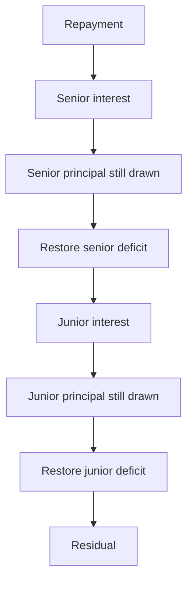

# Credit facility

## SUMMARY

Stage 3 lends against Lockgate's own receivables, not a partner vault. Institutions deposit into a senior or junior tranche. Shares do not transfer. At most 50 approved lenders. The governor and the borrower are different addresses. The governor can tighten covenants immediately. Looser terms, a new book, or a new peg oracle wait two days. Cancelling a scheduled change emits `TermsCancelled`. The governor cannot seize deposits. `poke` and `recognizeLoss` are non-reentrant.

## PROGRESS

- 2026-10-02: Senior/junior accounting, borrowing base, sticky recovery, derived loss, and the repayment waterfall are implemented. Tests cover the default path, interest order, the 51st lender, depeg, and the book timelock. A partner vault balance is unchanged by these flows.
- 2026-10-02: Gap review. Construction reverts when the governor and the borrower are the same address. `cancelTerms` emits `TermsCancelled` and reverts when nothing is pending. `poke` and `recognizeLoss` use the reentrancy guard. New tests cover that guard's neighbours: loss before recovery, a residual sweep while senior is still drawn, a book that cannot be read, a revoked lender that does not free the 50-person cap, fee-on-transfer deposits, accrual fuzz, loss order, and a solvency invariant.
- 2026-10-02: Security review. `recognizeLoss` writes down `drawn` above eligible receivables, not above the advance-rate borrowing base. `executeTerms` accrues at the old rate first. Junior deposits revert once recovery has started. Notes are in `docs/SECURITY-NOTES-partner.md`.

## Waterfall

Recovery is sticky. Entering it cancels unpaid junior interest and uses junior's idle cash to pay down senior drawn. That reclass does not move tokens. Junior deposits revert in recovery. `recognizeLoss` takes no amount from the caller. The loss is the draw that still exceeds eligible receivables after that subordination. An unreadable book counts as zero cover. The advance rate stops new draws; it does not by itself forgive principal. Junior principal is written down first, then senior. A later repayment restores the senior deficit before junior principal and before anything can be swept. `executeTerms` accrues the open period at the old rate, then stores the new one.

## Borrowing base

`borrowingBase = advanceRateBps * book.eligibleOutstanding() / 10_000`. The book is `IReceivablesBook`. `CreditLineBook` is the adapter for Lockgate's own credit line once that line exposes `eligibleOutstanding()` and `lateOutstanding()`. A failed book read or a depegged oracle is a breach. Draws stop. `poke` is permissionless and does not reverse itself when the peg returns.

Identity, checked in tests: `cash + drawn = senior principal + junior principal + interest cash + residual + locked`. Interest uses a 365-day year. Dust that does not divide across shares stays in `residual`.
