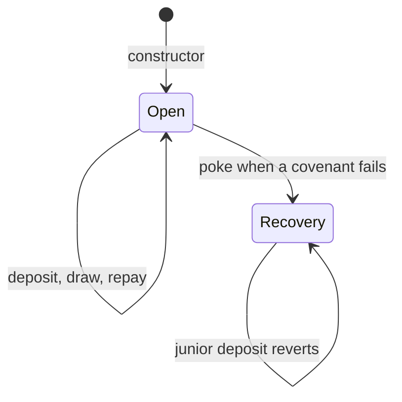
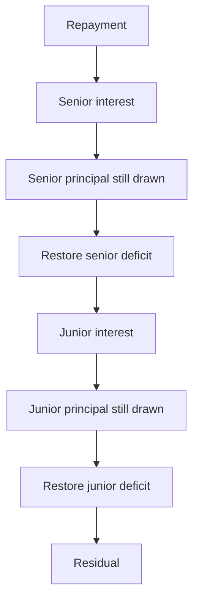

# Credit facility

## SUMMARY

Stage 3 lends against Lockgate's own receivables, not a partner vault. Institutions deposit into a senior or junior tranche. Shares do not transfer. At most 50 approved lenders. The governor and the borrower are different addresses. The governor can tighten covenants immediately. Looser terms, a new book, or a new peg oracle wait two days. Cancelling a scheduled change emits `TermsCancelled`. The governor cannot seize deposits. `poke` and `recognizeLoss` are non-reentrant. A draw fills senior cash before junior cash. A repayment pays that senior slice before the junior slice.

## PROGRESS

- 2026-10-02: Senior/junior accounting, borrowing base, sticky recovery, derived loss, and the repayment waterfall are implemented. Tests cover the default path, interest order, the 51st lender, depeg, and the book timelock. A partner vault balance is unchanged by these flows.
- 2026-10-02: Gap review. Construction reverts when the governor and the borrower are the same address. `cancelTerms` emits `TermsCancelled` and reverts when nothing is pending. `poke` and `recognizeLoss` use the reentrancy guard. New tests cover that guard's neighbours: loss before recovery, a residual sweep while senior is still drawn, a book that cannot be read, a revoked lender that does not free the 50-person cap, fee-on-transfer deposits, accrual fuzz, loss order, and a solvency invariant.
- 2026-10-02: Security review. `recognizeLoss` writes down `drawn` above eligible receivables, not above the advance-rate borrowing base. `executeTerms` accrues at the old rate first. Junior deposits revert once recovery has started. Notes are in `docs/SECURITY-NOTES-partner.md`.
- 2026-10-02: Developer notes for how to run this suite, the decisions below, and the recovery state diagram.
- 2026-10-02: Repayment-order fuzz checks the seven-bucket waterfall. The solvency invariant flags a repayment that reaches residual while an earlier bucket is still open.
- 2026-10-02: Negative tests reject a stranger and the borrower on governor calls. A revoked lender can redeem, and a re-approval does not free a cap slot. A reentrant draw pays once. One unit of interest across three shares stays in residual and does not round up to the lender.
- 2026-10-02: `CreditLineBook` calls `ILockgateCreditLine`. A facility draw is capped by that book's eligible outstanding. Marking the line late stops the next draw. A partner vault is not a borrowing base.
- 2026-10-02: A pending governor emits `GovernorTransferStarted`. `GovernorSet` is the governor who accepted. Scheduled and executed terms carry the rate, late cap, junior floor, and both APRs. A zero draw reverts `BadParam`. Event tests cover deposits, draws, interest, recovery, and the two-day timelock.
- 2026-10-02: The partner lifecycle draws this facility against the stage-1 book, recognises the loss when that book goes late, and redeems the senior cash that is left. Junior principal is zero and cannot redeem.
- 2026-10-02: Pulls and pushes revert `BadParam` unless the token balance matches cash and the counterparty moves by the full amount. A fee-on-transfer draw, redemption, interest payment, or residual sweep moves nothing. A false return reverts `SafeERC20FailedOperation`. A deficit blocks cash movement until the balance is restored. `bookSurplus` turns a surplus into residual. A hook on deposit and draw cannot take a second payment.
- 2026-10-02: Handoff is in [Handoff](#handoff). The partner suite and the shared gaps are in `contracts/src/partner/README.md`.
- 2026-10-02: Thirty-two repayments of 1e6 leave the other senior's redemption of 1e6, and the next repayment, within 25,000 gas of a facility with none of those repayments. Both calls stay under 300,000 gas. That lender receives 1e6 and keeps 199,999e6 shares. Drawn ends at 199,967e6. The first senior's shares stay 200,000e6. Suite: 12 suites, 43 passed, 0 failed, 0 skipped.
- 2026-10-02: `LossSymmetry.t.sol` draws, repays part, and recognizes the unpaid draw. The deficit sum equals that unpaid amount, cash stays put, and a later repayment restores senior before junior. While drawn is above senior principal, `subordinate` leaves the books unchanged, so a 1-unit repayment pulls 1 unit. A draw of 500e6 against senior 100e6 and junior 1,000e6 recognizes a loss of 500e6 once. Suite: 13 suites, 46 passed, 0 failed, 0 skipped. Fuzz 256. `invariant_solventCashAndCap` was 40 runs, 1000 calls, 0 reverts. Solc 0.8.28 compiled 103 files.
- 2026-10-02: Draws fill `seniorDrawn` up to senior principal, then junior. A repayment pays `seniorDrawn` before the junior slice. In recovery, junior idle pays `seniorDrawn` once, and `seniorDrawn` falls so a later call shifts nothing. A draw of 500e6 against senior 100e6 and junior 1,000e6 leaves senior unable to redeem 1 and junior unable to redeem 600e6 + 1. After a 100e6 repayment, senior redeems 100e6 and junior still cannot redeem 600e6 + 1. The next unit raises junior idle by 1. `poke` on that book shifts 100e6, and `recognizeLoss` then returns 400e6. Interest on a book with `seniorDrawn` of 40e6 and a junior slice of 160e6 accrues 3,200,000 senior and 19,200,000 junior over 365 days at 800 and 1,200 bps. Suite: 13 suites, 48 passed, 0 failed, 0 skipped. Fuzz 256. `invariant_solventCashAndCap` was 40 runs, 1000 calls, 0 reverts. Solc 0.8.28 compiled 103 files for the 47-pass run, then 1 file for this 48-pass run.

## Handoff

Written 2026-10-02. Uncommitted, on `9665484`. Sizes, the partner suite, and the shared gaps are in `contracts/src/partner/README.md`.

Final facility count, remeasured on 2026-10-02 after `seniorDrawn` and `test_mixedDrawAccruesOnTheStoredSlices`: 13 suites, 48 passed, 0 failed, 0 skipped. Fuzz 256. `invariant_solventCashAndCap`: 40 runs, 1000 calls, 0 reverts. Solc 0.8.28 compiled 103 files for the 47-pass run in that private cache, then 1 file for this 48-pass run. The print before `Grief.t.sol` was 11 suites and 42 passed. The print after `Grief.t.sol` was 12 suites and 43 passed. The print after `LossSymmetry.t.sol` and the early subordinate guard was 13 suites and 46 passed.

### Residual risks

- A surplus books as residual. It leaves senior deficit in place. `sweepResidual` waits until `drawn`, senior deficit, and senior interest are clear.
- A token deficit cannot be booked. Cash movement stays blocked until the balance is restored.
- The lender cap counts every address ever seen. Revoking a lender does not free a slot. The cap is 50.
- A draw fills `seniorDrawn` up to senior principal, then junior. A repayment pays `seniorDrawn` before the junior slice, so the idle that appears is senior's first. `seniorDrawn` falls, and the next unit pays the junior slice. `LossSymmetry.t.sol` draws 500e6 against senior 100e6 and junior 1,000e6. Senior cannot redeem 1 until a 100e6 repayment, and junior cannot redeem 600e6 + 1 on either side of that payment.
- `markLate` and `writeOff` on a partner vault do not read the token balance. The full list is in the partner handoff.

## Run the tests

Run this from `lockgate/repo/contracts`. The libraries are already in `contracts/lib`. `--offline` keeps Forge off the network.

```bash
FOUNDRY_SRC=src/facility FOUNDRY_TEST=test/facility forge test --offline
```

This Foundry build has no `--profile` flag. Set `FOUNDRY_SRC` and `FOUNDRY_TEST` as above. Do not expect `FOUNDRY_PROFILE` to switch trees.

One regression:

```bash
FOUNDRY_SRC=src/facility FOUNDRY_TEST=test/facility forge test --offline --match-contract FacilitySecurityTest --match-test test_advanceRateCutDoesNotForgiveTheDraw
```

Solc is 0.8.28, the optimizer runs 200 times, `via_ir` is on, and the EVM is Cancun. Fuzz runs 256 times. The solvency invariant runs 40 times at depth 25. A handler revert does not fail that run. `via_ir` caches `block.timestamp` inside one test function. Warp to `accounting().lastAccrual`, to a stored `eta`, or to a literal such as `2 days + 1`. Compute `new` and view calls before `vm.prank` or `vm.expectRevert`.

The cash token in these tests is `test/partner/mocks/ReenterUSDG.sol` (contract name `MockUSDG`). Do not add a second file named `MockUSDG.sol`. That filename collides with `src/core/MockUSDG.sol`, which is the token Anvil deploys.

## Decisions

- The governor and the borrower are different addresses. Construction reverts when they match. The governor approves lenders, tightens terms, and schedules looser ones. The borrower is the only address that can `draw`. Anyone can `repay`, `poke`, and `recognizeLoss`.
- Shares do not transfer. `MAX_LENDERS` is 50 and counts addresses ever approved. Revoking a lender does not free a seat.
- `borrowingBase = advanceRateBps * eligibleOutstanding() / 10_000`. A draw above `availableDraw` reverts. Cutting the advance rate stops new draws. It does not forgive principal that is already out.
- `recognizeLoss` runs only in recovery. The loss is `drawn - eligibleOutstanding()` when the book returns a full word. A short, reverting, or missing book covers 0. Junior principal is written down first, then senior. The caller supplies no amount and receives no tokens.
- Recovery is sticky. `poke` enters it when a covenant fails and does not leave when the peg returns. Entering it cancels unpaid junior interest. Junior idle pays `seniorDrawn`, including when total `drawn` is larger than senior principal. The reclass moves no tokens. `seniorDrawn` falls by that shift, so a later `subordinate` moves nothing. `recognizeLoss` then writes the remaining draw to junior before senior. A junior `deposit` reverts with `SeniorFirst` once `recovery` is true. In recovery, a junior `redeem` reverts `SeniorFirst` while `seniorDrawn` or senior interest due is still open. Senior deposits still add cash.
- Tighten of the advance rate, the late cap, or the junior floor applies in the same transaction. `scheduleTerms`, a new book, and a new oracle wait `CHANGE_DELAY` (2 days). `executeTerms` accrues the open period at the old APR, then stores the new terms.
- Interest is `floor(floor(principal * aprBps / 10_000) * dt / 365 days)`. Senior interest accrues on `seniorDrawn`. Junior interest accrues on `drawn - seniorDrawn`. An index that does not divide evenly across shares leaves the dust in `residual`. The governor sweeps residual only when `drawn`, senior deficit, and senior interest are clear.
- The cash identity checked by the invariant is `cash + drawn = senior principal + junior principal + senior interest cash + junior interest cash + residual + locked`. `seniorDrawn` sits inside `drawn` and is not a separate term. The token balance must equal `cash`. A pull or a push reverts `BadParam` unless it does, and a push also reverts when the recipient receives a different amount. `bookSurplus` adds a surplus to cash and residual, not to principal. A deficit cannot be booked. The governor still sweeps residual only when `drawn`, senior deficit, and senior interest are clear.

## Recovery



There is no exit from recovery in this contract. Pointing at a new book waits two days, and the book already set can report a lower `eligibleOutstanding`.

## Waterfall



A repayment reduces `seniorDrawn` when it pays senior principal that is still out, then reduces the junior slice of `drawn`. It does not reduce `seniorPrincipal` on that path, so lenders can redeem the idle that payment frees. Paying `seniorDrawn` is what frees a senior redemption.

## Borrowing base

The book is `IReceivablesBook`. `CreditLineBook` adapts Lockgate's own credit line once that line exposes `eligibleOutstanding()` and `lateOutstanding()`. Do not point it at a partner vault.

A failed book read or a depegged oracle is a breach. Draws stop. `poke` is permissionless. The peg check uses the same raw-word decode as the partner vault: a short return or a timestamp above `uint64` is a breach, and address zero disables the check.

## What a passing run checks

`contracts/test/facility/` checks the waterfall, the 51st lender, a depeg, the two-day timelock, an unreadable book, fee-on-transfer deposits, and that `tightenAdvanceRate(0)` does not write the draw down to zero while eligible receivables still cover it.
