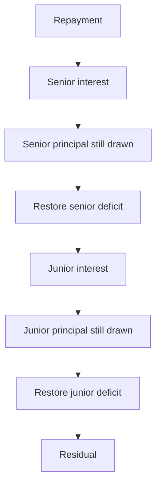

# Credit facility

## SUMMARY

Stage 3 lends against Lockgate's own receivables, not a partner vault. Institutions deposit into a senior or junior tranche. Shares do not transfer. At most 50 approved lenders. The governor can tighten covenants immediately. Looser terms, a new book, or a new peg oracle wait two days. The governor cannot seize deposits.

## PROGRESS

- 2026-10-02: Senior/junior accounting, borrowing base, sticky recovery, derived loss, and the repayment waterfall are implemented. Tests cover the default path, interest order, the 51st lender, depeg, and the book timelock. A partner vault balance is unchanged by these flows.

## Waterfall

Recovery is sticky. Entering it cancels unpaid junior interest and uses junior's idle cash to pay down senior drawn. That reclass does not move tokens. `recognizeLoss` takes no amount from the caller. The loss is `drawn - borrowingBase` after that subordination. Junior principal is written down first, then senior. A later repayment restores the senior deficit before junior principal and before anything can be swept.

## Borrowing base

`borrowingBase = advanceRateBps * book.eligibleOutstanding() / 10_000`. The book is `IReceivablesBook`. `CreditLineBook` is the adapter for Lockgate's own credit line once that line exposes `eligibleOutstanding()` and `lateOutstanding()`. A failed book read or a depegged oracle is a breach. Draws stop. `poke` is permissionless and does not reverse itself when the peg returns.

Identity, checked in tests: `cash + drawn = senior principal + junior principal + interest cash + residual + locked`. Interest uses a 365-day year. Dust that does not divide across shares stays in `residual`.
