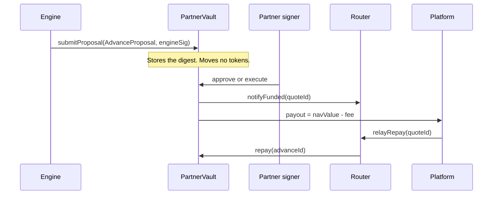

# Partner vaults

## SUMMARY

One vault per licensed partner. The partner deploys it, owns it, and holds every key. Lockgate's engine may propose an advance. It cannot pause, upgrade, withdraw, or move the partner's USDG. The partner, their signer, their ERC-1271 wallet, or a module they deployed must authorise the same digest. The fee stays in the vault. Lockgate's technology fee is billed off-chain and is not taken from these funds.

## PROGRESS

- 2026-10-02: Vault, mandate, EIP-712 advance, auto-approve module, timelocked UUPS upgrade, and router are implemented and covered by permission, mandate, replay, reentrancy, fuzz, and invariant tests.
- Digest matches `AdvanceProposalLib` / `engine/src/proposal/partner.ts` (domain `LockgateAdvance`, version `1`). `submitProposal` records that digest and moves no tokens.

## Flow



`quoteId` is the repayment key. The router stores it on the advance as `exitRef`. The router has no owner, no sweep, and no upgrade. `relayRepay` pulls the owed amount from the caller and forwards that same amount to the vault that funded the exit.

## EIP-712

Type string, verbatim:

```text
AdvanceProposal(address platform,address recipient,uint256 requestId,uint256 navValue,uint256 fee,uint256 payout,uint16 feeBps,uint64 dueAt,uint64 expiresAt,uint256 nonce,bytes32 quoteId)
```

Domain: name `LockgateAdvance`, version `1`, chain id, verifying contract = the vault. The vault address is not a struct field. `payout + fee` must equal `navValue`. `navValue` is what the platform owes back. Exposure and concentration use that owed nav, not the cash that left.

## Mandate

The partner sets approved platforms, per-platform limit, reserve bps, minimum fee, max tenor, concentration, and expiry. A recipient is the platform, or a payout address the partner set for that platform. Pause blocks new advances only. Repay, mark late, deposit, and withdraw still run. Upgrades wait at least one day. The delay can only increase. The partner is the only address that can schedule or execute an upgrade.

## Tests

`contracts/test/partner/`. Lockgate, with no module and without the partner's signature, cannot deposit, withdraw, change the mandate, upgrade, or receive an advance. Run this tree with `FOUNDRY_SRC=src/partner FOUNDRY_TEST=test/partner`.
