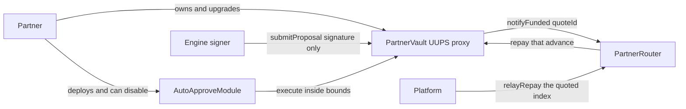
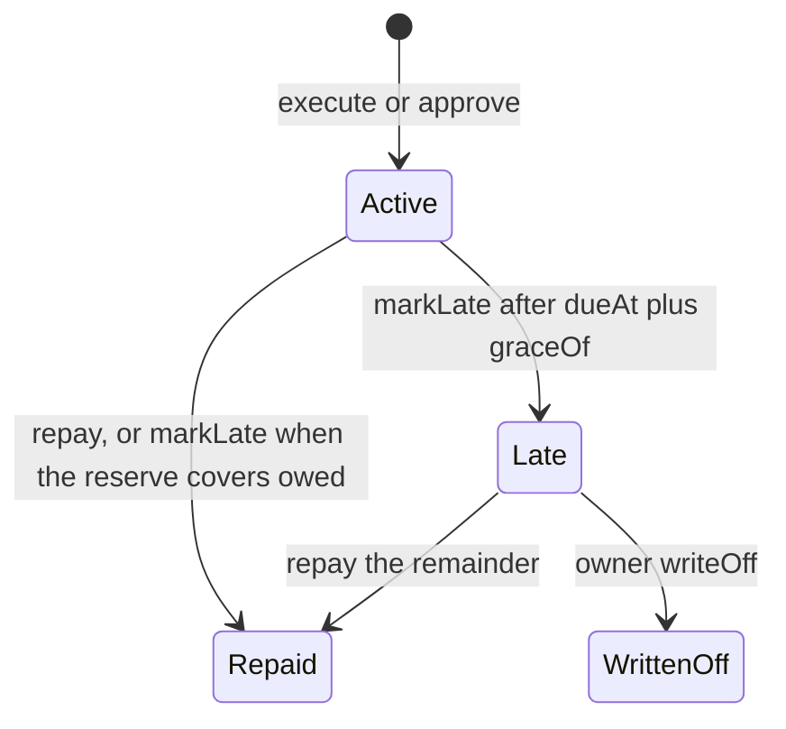
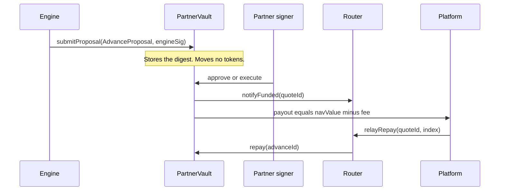

# Partner vaults

## SUMMARY

One vault per licensed partner. The partner deploys it, owns it, and holds every key. Lockgate's engine may propose an advance. It cannot pause, upgrade, withdraw, or move the partner's USDG. The partner, their signer, their ERC-1271 wallet, or a module they deployed must authorise the same digest. The fee stays in the vault. Lockgate's technology fee is billed off-chain and is not taken from these funds.

Who you trust, and which test shows it, is in `contracts/src/partner/SECURITY-NOTES.md`.

## PROGRESS

- 2026-10-02: Vault, mandate, EIP-712 advance, auto-approve module, timelocked UUPS upgrade, and router are implemented and covered by permission, mandate, replay, reentrancy, fuzz, and invariant tests.
- Digest matches `AdvanceProposalLib` / `engine/src/proposal/partner.ts` (domain `LockgateAdvance`, version `1`). `submitProposal` records that digest and moves no tokens.
- 2026-10-02: Gap review. `IPartnerVault.submitProposal` now returns the digest the engine already reads. `AutoApproveModule` stores `Bounds.allowlistEnabled` on construction and on `setBounds`. Failure paths cover a second submit, a filed-hash mismatch, a zero expiry, a zero concentration cap, the payout desk, early mark-late, a second repay, fee-on-transfer pulls, the auto-approve allowlist and daily window, the upgrade timelock, and two-step ownership. Router failures cover an unknown vault, a mismatched notify, a duplicate notify, an empty repay, and a zero quote. Fuzz covers pure router selection and mandate boundaries. The vault invariant also calls mark-late, write-off, skim, and reserve moves.
- 2026-10-02: Security review. `quote` isolates a vault that reverts, burns the probe gas, or reports an absurd `maxNav`. A bad oracle or gate returns `StaleOracle` or `Gated` instead of reverting. Grace is stored when the advance is funded. The auto-approve module rejects a fee above `maxFeeBps`. Notes are in `docs/SECURITY-NOTES-partner.md`.
- 2026-10-02: Developer notes for how to run this suite, the decisions below, and the advance state diagram. `graceOf(id)` returns the grace stored on that advance.
- 2026-10-02: Mandate fuzz walks every reject reason in check order. The vault invariant also checks exposure, reserve, fee-before-principal, and that a paused or underpriced execute does not fund.
- 2026-10-02: Negative tests reject a stranger and the partner on the platform reserve, a revoked signer, a revoked platform, and an expired mandate. The open advance still repays. A cleared auto-approve module and a stranger cannot register. A fee one unit under the floor and a reserve withdrawal under the ceil move no cash. A reentrant withdraw pays once.
- 2026-10-02: Integration tests deploy the stage-1 credit line and G6 `MockUSDG` beside a partner vault. Shared selectors match. `submitProposal` is called through `IAdvanceProposal`. A 99 bp stage-1 quote is below the vault fee floor and moves no cash. A partner execute leaves the line's eligible book unchanged.
- 2026-10-02: `executeUpgrade` emits `UpgradeExecuted`. A zero or oversized reserve withdrawal reverts `BadParam`; a stranger still reverts `Unauthorized`. A zero module owner change reverts `ZeroAddress`. Event tests cover cash, funding, router repayment, mark-late, write-off, and the upgrade.
- 2026-10-02: One lifecycle walks onboard, mandate, advance, repay, loss, and wind-down across the stage-1 line, the partner vault, and the facility. Balances are checked at each step. The repaid advance leaves its fee in the vault. The late advance is written off. Senior redeems the cash that remains. Junior principal is zero.
- 2026-10-02: Vault state lives in the ERC-7201 slot `lockgate.storage.PartnerVault`. The implementation is initializer-locked. A second `initialize` reverts, and a reverted initialize leaves the proxy unlocked. `upgradeToAndCall` reverts for a stranger, for an unscheduled implementation, and when the upgrade call tries to initialize again. A completed upgrade keeps the owner, the asset, and idle cash. The router and the auto-approve module are ordinary contracts.
- 2026-10-02: The partner suite passed at 10,000 fuzz runs and 256 invariant runs: 72 tests, 0 failures. Trust assumptions and privileged roles, each named to a test, are in `contracts/src/partner/SECURITY-NOTES.md`.
- 2026-10-02: Deployed code fits EIP-170 (24576 bytes) and init code fits EIP-3860 (49152 bytes). PartnerVault runtime is 21272 bytes. Call gas is in `contracts/snapshots/partner.json`. The whole test is in `contracts/snapshots/partner.gas-snapshot`.
- 2026-10-02: Fee-on-transfer, a transfer that returns false, a rebase, and a token hook are rejected. Pulls and pushes revert `BalanceMismatch` unless the vault balance matches idle plus reserve and the counterparty moves by the full amount. A false return reverts `SafeERC20FailedOperation`. A deficit blocks cash movement until the balance is restored. A surplus has to be skimmed. A hook on deposit, repay, post reserve, and `relayRepay` cannot take a second payment.
- 2026-10-02: Handoff is in [Handoff](#handoff). Default partner suite after the token checks: 20 suites, 91 passed, 0 failed, 0 skipped.
- 2026-10-02: Partner wind-down while advances are open pauses new funding, returns idle cash, and holds the required reserve until each advance is repaid or written off. The fee comes back to the partner. A one-wei sweep still withdraws the last fee unit after the shares hit zero. A write-off can leave shares when the token balance is already zero. The vault and the router end at zero. Default suite: 21 suites, 94 passed, 0 failed, 0 skipped.
- 2026-10-02: A mock redemption queue sits on G6's stage-1 line and the partner vault. The line's 99 bp quote and a fee one unit under the floor leave the request queued. Floor, half-up, 150 bps, and 250 bps each fund the head request and repay through the router. A later request cannot jump the queue. The line book does not move. Default suite: 22 suites, 95 passed, 0 failed, 0 skipped.
- 2026-10-02: Router reads of `owner`, `getAdvance`, `owedOf`, `asset`, and the repayment balance are staticcalls capped at 2,500,000 gas. A state-changing callback reverts `NotOwner` or `Mismatch` and leaves the directory as it was. A preview word other than `None`, or a return that is not one word, drops that vault and the quote continues. A dirty owner word reverts `NotOwner`. `relayRepay` reverts `BalanceMismatch` when the balance falls below the pre-pull balance, and the advance stays active. Default suite: 23 suites, 101 passed, 0 failed, 0 skipped.
- 2026-10-02: Re-checked this suite on the current G6 tree. The credit line added `ReservePosted(address,address,uint256)`, the same topic `PartnerVault` already emits, and the event test still filters that topic by the vault. `feeFromBps` still ceils. The wider `halfUp` still quotes 99 bps on the default stage-1 window, and that quote is still `RejectReason.Fee` on a 100 bp vault. `IPartnerVault` now declares `payoutTo(address) returns (address)`. Selector `0x63aec9af` matches `PartnerVaultRead.payoutTo`. An unset payout reads as address zero. Default suite: 23 suites, 101 passed, 0 failed, 0 skipped.
- 2026-10-02: Forty small advances book the half-up fee, repay in full, and the partner withdraws idle. The partner receives the deposit plus the sum of those fees. The platform and the vault end at zero. Pro-rata floor shares that skip a 1-unit cap still assign the leftover units once fuller slices are at their max. A quote of 4 across six 1-unit vaults funds and repays through the router, and each vault still holds its 1 unit. Default suite: 24 suites, 104 passed, 0 failed, 0 skipped.
- 2026-10-02: Quote and slash tests pin the nav, the fee, and the cash. A pro-rata quote of 500,000e6 names all six slices. Odd returns leave the honest vault at nav 4,761,904,762 and fee 47,619,048. A dirty gate reverts `execute` and leaves idle and the token balance unchanged. Default suite stayed 24 suites, 104 passed, 0 failed, 0 skipped.
- 2026-10-02: Thirty-two advances of 10,000e6, and repayment of sixteen of them, leave the partner's 100,000e6 withdrawal and the other platform's repayment within 25,000 gas of a vault that holds only that other advance. Both calls stay under 200,000 gas. Idle ends at 1,744,200e6 and the sixteen open advances stay owed 10,000e6. Thirty-two router records on one exit leave the other exit's `relayRepay`, and a repayment at the last index, inside the same slack. Default suite: 25 suites, 106 passed, 0 failed, 0 skipped.
- 2026-10-02: A from-scratch `forge build --force --skip test` compiled 88 files with Solc 0.8.28 and exited 0. `forge test --force` into an empty cache compiled 119 files and reproduced the suite: 25 suites, 106 passed, 0 failed, 0 skipped. Fuzz 256. The vault invariant was 40 runs, 1000 calls, 0 reverts. Artifacts went to a private directory. No source change.
- 2026-10-02: Every public and external function under `src/partner` has a `///` notice. The new lines document the getters in `PartnerVaultRead.sol`, `IPartnerVault.sol`, and `IPegOracle.latest`. `PartnerVaultRead.sol` is 260 lines. The longest partner source file is still `PartnerVault.sol` at 281. The size test still printed PartnerVault 21272 / 21514, PartnerRouter 8419 / 8449, and AutoApproveModule 3340 / 4507.
- 2026-10-02: Every partner revert is a named custom error, and a test expects that error. An unknown repayment index reverts `UnknownRecord`. A daily window that would overflow reverts `BoundsExceeded`. Default suite: 26 suites, 111 passed, 0 failed, 0 skipped. Fuzz 256. The vault invariant was 40 runs, 1000 calls, 0 reverts. PartnerVault stayed 21272 / 21514. PartnerRouter is 8444 / 8474. AutoApproveModule is 3362 / 4529. Last-call gas in `contracts/snapshots/partner.json` is unchanged. The whole-test snapshot was refreshed for the larger router and module.
- 2026-10-02: Handoff final counts, remeasured in private caches: partner 26 suites, 111 passed, 0 failed, 0 skipped; facility 12 suites, 43 passed, 0 failed, 0 skipped. Residual risks are in [Handoff](#handoff).
- 2026-10-02: Last run on the working tree at `9665484`. The partner suite compiled 121 files with Solc 0.8.28 into a private cache: 26 suites, 111 passed, 0 failed, 0 skipped. Fuzz 256. The vault invariant was 40 runs, 1000 calls, 0 reverts. `npm run e2e` from `lockgate/repo/e2e` printed `{"ok":true}` on chain 31337 at block 1533. Stage 1 chain fee 99 bps, engine fee 101 bps, fee `98000000`, investor paid `9902000000`, outstanding `0`, earned fees `98000000`. Stage 2 Harbour and Keppel 101 bps, Harbour repaid `80101000000`, Keppel outstanding `9899000000`, router balance `0`, Lockgate balance `0`. Stage 3 available draw `600000000000`, senior after loss `400000000000`, junior `0`, cash `400000000000`, engine fee 101 bps, and the credit-line book matched.
- 2026-10-02: `test/partner/Symmetry.t.sol` fuzzes the shared ledger. An advance leaves assets unchanged. A repayment restores principal and exposure and keeps the fee. A write-off restores principal and exposure, leaves idle where the advance put it, and drops assets by the payout. The repayment's asset gain plus the write-off's asset loss equals the nav. A reserve slash keeps the covered fee and the unpaid principal is the loss. One repayment and two write-offs on three advances land on that same equation. Default suite: 27 suites, 116 passed, 0 failed, 0 skipped. Fuzz 256. The vault invariant was 40 runs, 1000 calls, 0 reverts. Solc 0.8.28 compiled 122 files.
- 2026-10-02: `MaxNav.t.sol` checks that `maxNav` is accepted and the next unit is rejected. Idle 98 at 100 bp returns 98, and nav 99 is `RejectReason.Concentration`. `ExitRepay.t.sol` funds one exit from two vaults. `relayRepay` at index 0 pays the 100,000,000 nav and leaves the 990,000,000 record. Index 1 clears that record. The router balance ends at 0. Default suite, remeasured after the facility subordinate guard: 29 suites, 121 passed, 0 failed, 0 skipped. Fuzz 256. The vault invariant was 40 runs, 1000 calls, 0 reverts. Solc 0.8.28 compiled 124 files.
- 2026-10-02: `test_zeroReserveRateStillFundsAndReleasesTheReserve` funds a 100,000e6 nav at a reserve rate of 0, withdraws the posted 100,000e6 while exposure is still open, and the next preview is `RejectReason.None`. The partner suite, remeasured after that test and the facility `seniorDrawn` change, compiled 124 files: 29 suites, 122 passed, 0 failed, 0 skipped. Fuzz 256. The vault invariant was 40 runs, 1000 calls, 0 reverts. The size test still printed PartnerVault 21272 / 21514, PartnerRouter 8444 / 8474, and AutoApproveModule 3362 / 4529.
- 2026-10-02: `error WrongVault()` in `PartnerVaultAdmin` had no revert site, so it is removed. The partner suite, remeasured in a private cache, compiled 124 files in 51.12s: 29 suites, 122 passed, 0 failed, 0 skipped. Tests finished in 260.34ms (1.43s CPU). Fuzz 256. The vault invariant was 40 runs, 1000 calls, 0 reverts. The size test still printed PartnerVault 21272 / 21514, PartnerRouter 8444 / 8474, and AutoApproveModule 3362 / 4529.

## Handoff

Written 2026-10-02. This partner and facility work is uncommitted on `9665484`. The repo has no remote. Do not push. No mainnet deploy. The flat technology fee stays off-chain.

### State

The vault, the router, and the auto-approve module are in `contracts/src/partner`. Facility cash matching is in `contracts/src/facility/FacilityStore.sol`. A pull or a push reverts unless the token balance already matches the books and the counterparty moves by the full amount. The vault error is `BalanceMismatch`. The facility error is `BadParam`. `bookSurplus` adds a surplus to cash and residual.

PartnerVault runtime is 21272 bytes. Init code is 21514. PartnerRouter is 8444 / 8474. AutoApproveModule is 3362 / 4529, and that init figure includes the constructor arguments. The size test after removing `WrongVault` still printed those lengths. EIP-170 headroom on the vault is 3304 bytes. Last-call gas in `contracts/snapshots/partner.json` is unchanged. Whole-test gas in `contracts/snapshots/partner.gas-snapshot` was refreshed after the router index check and the module daily-sum check.

`IPartnerVault.payoutTo` matches `PartnerVaultRead` at selector `0x63aec9af`. The vault does not inherit that interface, so the declaration leaves the measured bytecode as it was. Every public and external function in this tree has a `///` notice. Every revert in this tree is a named custom error. `PartnerVaultRead.sol` is 260 lines.

Every `.sol` file under `src/partner`, `src/facility`, `test/partner`, and `test/facility` is under 300 lines. The longest are `test/partner/Token.t.sol` at 299, `test/partner/Lifecycle.t.sol` at 291, `src/facility/FacilityStore.sol` at 290, and `src/partner/PartnerVault.sol` at 281.

### Tests

Partner suite after the zero-reserve test and the facility `seniorDrawn` change, remeasured on the working tree at `9665484`, 2026-10-02. Solc 0.8.28 compiled 124 files into a private `--out` and `--cache-path`. Removing the unused `WrongVault` error reprinted that count: 124 files in 51.12s, 29 suites, 122 passed, 0 failed, 0 skipped, in 260.34ms (1.43s CPU).

| Command | Result |
| --- | --- |
| `FOUNDRY_SRC=src/partner FOUNDRY_TEST=test/partner forge test --offline` | 29 suites, 122 passed, 0 failed, 0 skipped. Fuzz 256. `invariant_solvencyAndLockgateHasNoClaim`: 40 runs, 1000 calls, 0 reverts. |
| `npm run e2e` in `lockgate/repo/e2e` | Printed `{"ok":true}`. Chain 31337. Block 1533. |

`output.json` from that run: stage 1 chain fee 99 bps, engine fee 101 bps, fee `98000000`, investor paid `9902000000`, outstanding `0`, earned fees `98000000`. Stage 2 Harbour 101 bps, Keppel 101 bps, Harbour repaid `80101000000`, Keppel outstanding `9899000000`, router `0`, Lockgate `0`. Stage 3 available draw `600000000000`, senior after loss `400000000000`, junior `0`, cash `400000000000`, engine fee 101 bps, `creditLineBookMatches` true.

The Anvil e2e row is the earlier same-day print. The shared Anvil on `127.0.0.1:8545` stayed up for that run. The facility command was remeasured in a private cache after `seniorDrawn`. That full compile was 103 files and printed 13 suites, 47 passed. One more accrual test then compiled 1 file in that cache and printed 13 suites, 48 passed, 0 failed, 0 skipped. Fuzz 256. `invariant_solventCashAndCap` was 40 runs, 1000 calls, 0 reverts. The print after `LossSymmetry.t.sol` and the early subordinate guard was 13 suites and 46 passed.

Earlier partner runs on this tree were 25 suites and 106 passed after `Grief.t.sol`, then 26 suites and 111 passed after `Reverts.t.sol`, then 27 suites and 116 passed after `Symmetry.t.sol`, then 29 suites and 121 passed after `MaxNav.t.sol` and `ExitRepay.t.sol`. A from-scratch build and an empty-cache test reproduced the 25/106 tree. The facility print before `Grief.t.sol` was 11 suites and 42 passed, then 12 suites and 43 passed after `Grief.t.sol`. `FacilityTokenTest` was 4 passed on its own after the `SurplusBooked` assertion, and those four sit inside the 43.

The high run in `contracts/src/partner/SECURITY-NOTES.md` stays 72 passed, 0 failed, 18 suites, at 10,000 fuzz runs and 256 invariant runs. It predates `Gas.t.sol`, `Token.t.sol`, `WindDown.t.sol`, `Queue.t.sol`, `Calls.t.sol`, `FeeDust.t.sol`, `Grief.t.sol`, `Reverts.t.sol`, `Symmetry.t.sol`, `MaxNav.t.sol`, `ExitRepay.t.sol`, `seniorDrawn`, and `test_zeroReserveRateStillFundsAndReleasesTheReserve`. `foundry.toml` stays at 256 fuzz runs and 40 invariant runs.

A default `forge build` exits 0. The last `forge build -D notes` exited 1 on 16 notes: 10 `block-timestamp` and 6 `unsafe-typecast`. One `unsafe-typecast` is the `uint160` cast in `PartnerRouter._addressCall`, after the word is checked against `type(uint160).max`. No lint is disabled. That notes run was not repeated for this handoff.

### Residual risks

- `markLate` and `writeOff` move accounting only. They do not read the token balance. A deficit still allows a slash. Tokens stay until the balance matches idle plus reserve again.
- A positive rebase or a donation has to be skimmed before the next pull or push. A deficit cannot be skimmed. The vault stays stuck until the balance is restored.
- After a write-off, shares can remain while the token balance is already 0. The wind-down tests leave the vault and the router with a zero token balance.
- `maxNav` returns a nav the mandate accepts, and one unit above it is rejected. `MaxNav.t.sol` fuzzes idle, the charged fee, and concentration. Idle 98 at 100 bp returns 98, and nav 99 is `RejectReason.Concentration`.
- Quote walks every listed vault. The grief tests bound withdraw, repay, `relayRepay`, and a facility redeem. They do not bound quote gas.
- Each advance keeps its own half-up fee. Those fees are not restated as one fee on the sum of the navs.
- Facility surplus books as residual. Senior deficit, the outstanding draw, and senior interest stay as they are. The governor sweeps residual only after those three are clear. A token deficit cannot be booked.
- The facility lender cap counts every address ever seen. Revoking a lender does not free a slot. The cap is 50.
- A 99 bp stage-1 quote stays under the vault floor of 100 bp and moves no cash. The flat technology fee stays off-chain.
- The 10,000-fuzz pass is 72 passed across 18 suites. It does not cover `Gas.t.sol`, `Token.t.sol`, `WindDown.t.sol`, `Queue.t.sol`, `Calls.t.sol`, `FeeDust.t.sol`, `Grief.t.sol`, `Reverts.t.sol`, `Symmetry.t.sol`, `MaxNav.t.sol`, `ExitRepay.t.sol`, `seniorDrawn`, or `test_zeroReserveRateStillFundsAndReleasesTheReserve`.
- `forge build -D notes` exits 1 on the last measured run: 16 notes, 10 `block-timestamp` and 6 `unsafe-typecast`.

## Run the tests

Run these from `lockgate/repo/contracts`. The libraries are already in `contracts/lib` (`forge-std` v1.11.0, OpenZeppelin v5.3.0). Leave them there. `--offline` keeps Forge off the network. The measured commands, including the private cache paths, are in [How to verify partner](../../../docs/TESTING.md#how-to-verify-partner).

```bash
FOUNDRY_SRC=src/partner FOUNDRY_TEST=test/partner forge test --offline
```

This Foundry build has no `--profile` flag. `foundry.toml` still has a `[profile.core]` block, and `FOUNDRY_PROFILE` does not select it. The two environment variables above are how you point the compiler at this tree.

One regression:

```bash
FOUNDRY_SRC=src/partner FOUNDRY_TEST=test/partner forge test --offline --match-contract PartnerSecurityTest --match-test test_shorteningGraceDoesNotSlashEarly
```

Solc is 0.8.28, the optimizer runs 200 times, `via_ir` is on, and the EVM is Cancun. Fuzz runs 256 times. The vault invariant runs 40 times at depth 25, and a handler revert does not fail the run (`fail_on_revert = false`). `via_ir` caches `block.timestamp` inside one test function. Warp to a stored field or a literal, or split the test. `vm.prank` and `vm.expectRevert` apply to the next external call. Compute `new`, signatures, and view calls before them.

The test token is `test/partner/mocks/ReenterUSDG.sol`. The contract name is `MockUSDG`. Do not add another source file named `MockUSDG.sol`. Forge names the artifact from the filename, and `src/core/MockUSDG.sol` is the token the Anvil flows deploy.

## Gas and size

`test/partner/Gas.t.sol` deploys the vault implementation, the router, and the auto-approve module. EIP-170 stops deployed bytecode above 24576 bytes. EIP-3860 stops init code above 49152 bytes. Measured on 2026-10-02 with solc 0.8.28, optimizer 200, `via_ir`:

| Contract | Runtime | Init code |
| --- | --- | --- |
| PartnerVault | 21272 | 21514 |
| PartnerRouter | 8444 | 8474 |
| AutoApproveModule | 3362 | 4529 |

The module init figure includes the constructor arguments. `PartnerVaultAdmin` and `PartnerVaultRead` are abstract and have no bytecode of their own.

`contracts/snapshots/partner.json` is the gas of the last call in each test. `contracts/snapshots/partner.gas-snapshot` is the whole test, including the deposit and the mandate that happen before that call. Check both from `lockgate/repo/contracts`:

```bash
FOUNDRY_SRC=src/partner FOUNDRY_TEST=test/partner forge test --offline --match-contract PartnerGasTest --gas-snapshot-check true
FOUNDRY_SRC=src/partner FOUNDRY_TEST=test/partner forge snapshot --offline --check --match-contract PartnerGasTest --snap snapshots/partner.gas-snapshot
```

## Decisions

- The partner is the only depositor. `sharesOf` returns `totalShares` for the current owner and 0 for everyone else. Ownership moves in two steps: `transferOwnership`, then `acceptOwnership`.
- `navValue` is what the platform owes back. `fee` sits inside that nav. The engine payout is `navValue - fee`, and the vault requires `payout` to equal that. Exposure and the concentration cap use owed nav. `outstandingPrincipal` tracks the cash that left. `totalAssets` is idle cash plus that principal. The token balance must equal idle cash plus reserve cash. A pull or a push reverts `BalanceMismatch` unless that equality holds, and a push also reverts when the recipient's balance changes by a different amount.
- The on-chain minimum fee is `floor(nav * minFeeBps / 10000)`. The engine's quoted fee is half-up. A signed fee may sit one unit above the floor. One unit under the floor is `Fee`. `fee` must be below `nav`.
- Reserves are the platform's first-loss bucket. The platform withdraws `reserveOf`. While `reserveBps` is above 0, the remainder must cover `ceil(exposure * reserveBps / 10000)`. A stored rate of 0 leaves that check out, so the platform can withdraw the posted reserve while exposure is open. A slash moves `min(reserve, owed)` into idle. It does not pay the caller.
- `graceOf(id)` is the grace stored in `_fund`. `markLate` waits until `dueAt + graceOf(id)`. `grace()` and `setGrace` change only the value a later advance will store. An unknown id returns 0, and a funded advance can also pin 0, so read `getAdvance` before you treat 0 as "slash at `dueAt`".
- Pause blocks a new advance. Repay, mark late, deposit, withdraw, and reserve moves still run.
- The mandate check order is paused, expiry, deadline (`expiresAt`), platform, recipient, zero amounts, tenor, oracle, gate, fee floor, cash, limit, concentration, reserve. An expiry of `0` rejects every advance. A reserve rate of `0` skips the reserve check. A concentration of `0` rejects a positive nav. A minimum fee of `0` accepts a fee of `0` when the payout equals the nav. The recipient is the platform, or `payoutTo[platform]` when that address is set.
- Oracle and gate reads decode raw words. A short return, a timestamp above `uint64`, a future timestamp, or `maxOracleAge == 0` is `StaleOracle`. Any non-zero gate flag is `Gated`. Address zero disables the oracle check. `try/catch` does not trap a bad `uint64` or `bool` decode under this compiler.
- The router is not upgradeable and has no sweep. Since 2026-10-02 it is `Ownable2Step` (`PartnerRouter(address owner_)`, owner Lockgate). `approveVault(vault, bool)` is `onlyOwner`. `register(vault)` needs the vault's own `owner() == msg.sender` and `approvedVault[vault]`, else `NotApproved`. Disapproving delists the vault and its records stay repayable. The owner has no path to vault funds and cannot alter a record. `register` and `remove` read `owner` with a staticcall capped at 2,500,000 gas. A state change, a return that is not one word, or dirty high bits fails that read. `notifyFunded` reads `getAdvance` the same way, and `relayRepay` does this for `owedOf`, `asset`, and the token balance. `quote` is a view. A revert, an out-of-gas probe, a `maxNav` above `uint128`, a preview return that is not one word, or a preview word other than `RejectReason.None` drops that vault and leaves the others. `relayRepay` reverts `BalanceMismatch` when its balance falls below the pre-pull balance. A quote does not reserve cash. Pro-rata assigns leftover units to slices that already have a floor share, then to caps that floor skipped. The sum of those navs is the filled amount. Each fee is the half-up fee of that final nav.
- `submitProposal` stores the digest and moves no tokens. `execute` burns the nonce before the transfer. The domain is `LockgateAdvance` version `1`, bound to `block.chainid` and this vault. Upgrades wait at least one day (`MIN_UPGRADE_DELAY`). The delay can only increase. The partner is the only address that can schedule or execute one.
- The address in `autoModule` may call `execute` with an empty partner signature. The fee ceiling lives in `AutoApproveModule`, which the partner deploys. The vault does not re-read those bounds.

## Who holds which contract



## Advance



`WrittenOff` clears the remaining principal from exposure. It sends no tokens.

## Funding an exit



`quoteId` is the repayment key. The router stores it as `Advance.exitRef`. Two vaults can fund the same id (pro-rata splits), so records are per (exitRef, vault, advanceId) once, and `relayRepay` pays the vault that recorded it, by the record index from `recordsOf`. An unvetted grief contract cannot list itself and record a `quoteId` first. Regression: `test/partner/RouterGrief.t.sol`.

## EIP-712

Type string, verbatim:

```text
AdvanceProposal(address platform,address recipient,uint256 requestId,uint256 navValue,uint256 fee,uint256 payout,uint16 feeBps,uint64 dueAt,uint64 expiresAt,uint256 nonce,bytes32 quoteId)
```

Domain: name `LockgateAdvance`, version `1`, chain id, verifying contract = the vault. The vault address is not a struct field. A pinned viem vector for chain 31337 and verifying contract `0xBEEF` lives in `test/partner/Advance.t.sol`.

## What a passing run checks

`contracts/test/partner/` checks that Lockgate, with no module and without the partner's signature, cannot deposit, withdraw, change the mandate, upgrade, or receive an advance. It also checks replay across vaults, fee-on-transfer pulls, the auto-approve ceiling, quote isolation, and `graceOf` after `setGrace(0)`. A paused wind-down with advances still open returns idle cash, then the fee and the reserve, and leaves the vault and the router at zero. A mock queue on the stage-1 line funds and repays at the floor, at half-up, and at 150 and 250 bps, and a 99 bp quote moves no cash. That 99 bp quote is the wider `halfUp` on the default stage-1 window, and it is still `RejectReason.Fee`. `IPartnerVault.payoutTo` matches `PartnerVaultRead` at `0x63aec9af`, and an unset payout reads as address zero. A state-changing `owner` or `getAdvance` does not change the directory. A dirty owner word reverts `NotOwner`. A preview word above `uint8`, or a return longer than one word, leaves the honest vault in the quote. A clip that pulls the router balance under its pre-pull balance reverts `BalanceMismatch` and leaves the advance active. Forty small advances repay to the half-up fee, and a full withdrawal pays the partner that sum on top of the deposit. A pro-rata quote that rounds 1-unit caps to zero still fills the request, and six 1-unit vaults fund and repay a quote of 4 with the router balance left at zero.
