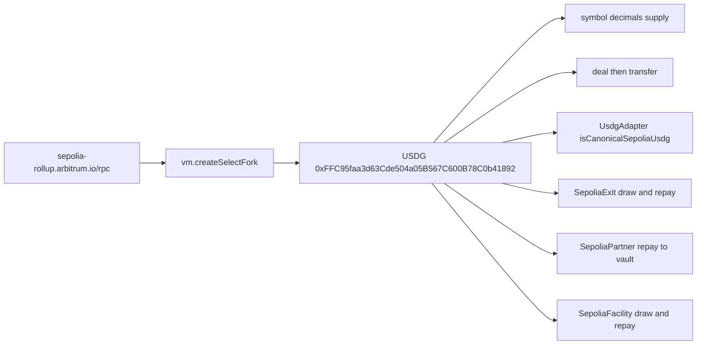

# SUMMARY

Local fork of Arbitrum Sepolia USDG. `UsdgFork` reads the token. `SepoliaExit` draws and repays a stage-1 book. `SepoliaPartner` repays one partner vault. `SepoliaFacility` draws and repays a facility. No broadcast, no mainnet, no spend.

# PROGRESS

- 2026-10-02: `FOUNDRY_TEST=test/fork forge test --offline` passed 9 tests and failed 0. `SepoliaPartner`: idle rises by the 100e6 fee, outstanding principal returns to 0, and Lockgate's balance stays 0. `SepoliaFacility`: a senior deposit of 100e6, a draw of 40e6, and a repay of 40e6. A stranger cannot draw. Cash returns to 100e6. The draw and the repay do not change total supply. The facility's book is a local stand-in.
- 2026-10-02: `FOUNDRY_TEST=test/fork forge test --match-contract SepoliaExit --offline` passed 2 tests and failed 0. Chain id 421614. A 600-second quote is 99 bps. The investor's balance rises by 9,901e6. Repay leaves that balance in place, outstanding returns to 0, and earned fees are 99e6. The draw does not change total supply. The repay, after `deal`, does not either. A gate and a stranger withdrawal move no cash. That run was the new contract only. The directory run above is the later one.
- 2026-10-02: the stage 1–3 map is `sim/COVERAGE.md`. At that point this fork read USDG and did not run an exit.
- 2026-10-02: this file now records the fork command, why the historical pin is skipped, and which address is read.
- 2026-10-02: `FOUNDRY_TEST=test/fork forge test` from `contracts/`. 5 tests passed.

# Run

From `lockgate/repo/contracts`. The suite needs the public Arbitrum Sepolia endpoint. `--offline` still allows that RPC. It does not start Anvil and it does not broadcast.

```
FOUNDRY_TEST=test/fork forge test --offline
FOUNDRY_TEST=test/fork forge test --match-contract UsdgFork
FOUNDRY_TEST=test/fork forge test --match-contract SepoliaExit --offline
FOUNDRY_TEST=test/fork forge test --match-contract SepoliaPartner --offline
FOUNDRY_TEST=test/fork forge test --match-contract SepoliaFacility --offline
```

# What the fork touches



# Design

The fork is whatever block the endpoint serves now. Chain id is 421614. The token is USDG on Arbitrum Sepolia, 6 decimals ([Arbiscan](https://sepolia.arbiscan.io/token/0xFFC95faa3d63Cde504a05B567C600B78C0b41892)). A `deal` of 1,000e6 plus a 250e6 transfer conserves supply. A transfer of 101e6 from a 100e6 balance reverts and moves nothing. `UsdgAdapter` binds that address with `isMock = false` and `isCanonicalSepoliaUsdg = true`. Marking that same address as a mock reverts `CanonicalCannotBeMock`.

`SepoliaExit` deploys `UsdgAdapter`, `PricingEngine`, `PlatformReserve`, and `LockgateCreditLine` on the same fork and funds them with `deal`. The adapter is not a mock. A 10,000e6 draw at a 600-second window quotes 99 bps. The investor's balance rises by the principal, 9,901e6. Repay pulls the platform, leaves the investor's balance where it is, and leaves the fee on the line. A gated source cannot draw. A stranger cannot withdraw capital. No transaction is broadcast.

`SepoliaPartner` deploys a partner vault against the same token. The partner deposits 200,000e6. The platform posts a 500e6 reserve, which is 5% of a 10,000e6 advance. Lockgate's `withdraw` reverts `Unauthorized` and leaves idle unchanged. The partner executes a 100 bps advance. The platform receives 9,900e6. After the platform's balance is set to the 10,000e6 still owed, `repay` pulls that amount. Idle is then the deposit plus the 100e6 fee. Outstanding principal is 0. The vault's token balance is that idle plus the reserve. Lockgate's balance stays 0. The execute and the repay do not change total supply.

`SepoliaFacility` deploys `CreditFacility` against the same token. The receivables book is `MockBook`, not a credit line. A senior lender deposits 100e6. A stranger's draw reverts `Unauthorized`. The borrower draws 40e6 and repays 40e6. Cash and the facility's token balance return to 100e6. Drawn returns to 0. The facility stays solvent. The draw and the repay do not change total supply. This test does not write senior down.

The 2026-10-01 pin, block 314719112, supply 2111011000100, is not served. The endpoint returns `historical state ... is not available` for the sequencer precompile, and that cheatcode error is not a Solidity revert, so the suite does not try the pin. Foundry's `block.number` on this fork is the parent-chain block, not the L2 block. The other 6-decimal token `0xB8981C1E85f5Acfbf1760Cb4DB3933526d8a269e` is not used.
