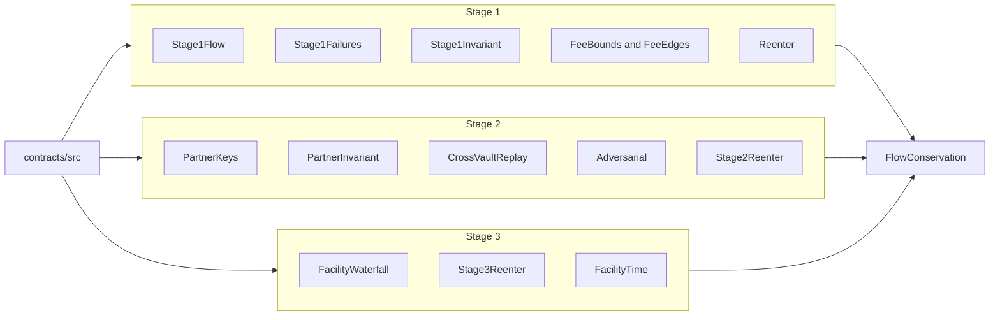

# SUMMARY

Stage-1 solvency, repay-first, fee bounds, partner key separation, and the stage-3 junior-before-senior waterfall. The subjects are the contracts in `src/`. There is no parallel reference copy.

# PROGRESS

- 2026-10-02: `FOUNDRY_TEST=test/invariant forge test --match-contract FacilityTime --offline` passed 3 tests and failed 0. A 40,000e6 senior draw at 800 bps for 365 days owes 3,200e6. Repaying principal plus that interest leaves `seniorInterestCash` at 3,200e6, drawn at 0, and `solvent()` true. A further year with nothing drawn adds 0. Price 98,999,999 against a floor of 99,000,000 stops the next draw, supply stays put, and recovery remains after the price returns to 1e8. An oracle age of 1 day still allows a draw. One second later `availableDraw` is 0. Lockgate's balance stays 0. The full invariant suite was not re-run.
- 2026-10-02: `FOUNDRY_TEST=test/invariant forge test --match-contract FlowConservation --offline` passed 1 test and failed 0. The natspec on `invariant_fundsAreConserved` sets 32 runs and depth 20. That run made 640 calls and 0 reverts. One `MockUSDG` is shared by the credit line, the partner vault, and the facility. Supply matched the thirteen tracked balances. Stage-1 accounted assets matched accounted equity. Reserve token balance matched total balances. Vault balance matched idle plus reserve cash. Lockgate's balance stayed 0. Facility token balance matched accounting cash and `solvent()` stayed true. Facility APR is 0 and the handler does not warp. The full invariant suite was not re-run.
- 2026-10-02: `FOUNDRY_TEST=test/invariant forge test --match-contract "Stage2Reenter|Stage3Reenter" --offline` passed 3 tests and failed 0. An execute callback cannot withdraw or execute again. Idle falls by that one payout and Lockgate's balance stays 0. An owner withdrawal of 1,000e6 to a callback pays that slice once. A facility draw of 40e6 pays once, cash left is 60e6, and the second draw is `ReentrancyGuardReentrantCall`. The full invariant suite was not re-run.
- 2026-10-02: the stage 1–3 map, including this suite, is `sim/COVERAGE.md`.
- 2026-10-02: `Adversarial` isolated match, `FOUNDRY_TEST=test/invariant forge test --match-contract Adversarial --offline`. 3 passed, 0 failed. Index 0 repays the grief vault 100_000_000. Honest outstanding principal stays 990_000_000. The platform ends at 989_000_000. The router and Lockgate stay at 0. Mandate abuse and a pinned nonce move no cash. The full suite was not re-run. The partner-area report is `contracts/test/partner/G9-ADVERSARIAL.md`.
- 2026-10-02: `CrossVaultReplay` is part of this suite. A signature for one vault reverts `BadEngineSig` on the other, leaves idle unchanged, and nonce 1 on the second vault still funds. The isolated match passed after that test was added. The 38-test count below is the run from before that file.
- 2026-10-02: `FOUNDRY_TEST=test/invariant forge test` from `contracts/`. 38 tests passed, 0 failed. Fee fuzz is 1024 runs. The draw-or-revert fuzz is 512 runs. Both invariants are 64 runs, depth 40, `fail_on_revert = false`. The stage-1 handler and the partner handler each recorded 2560 calls and 0 reverts. Handler draws refresh the window to 120–800 seconds because a 7-day window at `timeScale` 4320 is above `maxFeeBps` and the chain refuses it.

# Run

From `lockgate/repo/contracts`. `foundry.toml` sets solc 0.8.28, optimizer 200, `via_ir`, Cancun. The profile default is 256 fuzz runs and 40 invariant runs at depth 25. A `forge-config` comment directly above a function overrides that for one test. Do not edit `foundry.toml` from this suite.

```
FOUNDRY_TEST=test/invariant forge test --offline
FOUNDRY_TEST=test/invariant forge test --match-contract CrossVaultReplay --offline
FOUNDRY_TEST=test/invariant forge test --match-contract Adversarial --offline
FOUNDRY_TEST=test/invariant forge test --match-contract "Stage2Reenter|Stage3Reenter" --offline
FOUNDRY_TEST=test/invariant forge test --match-contract FlowConservation --offline
FOUNDRY_TEST=test/invariant forge test --match-contract FacilityTime --offline
```

`FOUNDRY_TEST=test/invariant` keeps this run off `test/partner` and `test/facility`. `--offline` uses the cached libraries. The subjects are the contracts in `src/`. There is no parallel reference copy. This suite does not start Anvil and does not broadcast.

# Map



# Design

Handlers set `fail_on_revert = false` and count reverts themselves. A reverted draw is a refused quote, which the handler expects. The invariant then checks the sheet. Depth and run count live in the natspec line above `invariant_cashStaysWithThePartner` and the stage-1 invariant, both 64 runs and depth 40.

`CrossVaultReplay` signs `hashTypedProposal` on vault A and calls `execute` on vault B. The domain name is `LockgateAdvance`, version `1`, and the verifying contract is the vault that was signed. The owner may pass an empty partner signature. The second signature is built into a local variable before `vm.prank`. A prank that wraps the call which computes the signature is consumed by that call, and `execute` then runs as the test contract.

Fee fuzz is 1024 runs. The draw-or-revert fuzz is 512 runs. Handler draws refresh the window to 120–800 seconds because a 7-day window at `timeScale` 4320 is above `maxFeeBps` and the chain refuses it.

# What is checked

- `accountedAssets() == accountedEquity()` when the handler does not donate tokens. Unpaid principal matches `outstanding`. Remaining nav matches `totalExposure`. Investor balances match what draws paid them.
- A 600-second, zero-utilization quote is 99 bps. A 7-day quote is unavailable with reason `fee above max`, not clamped.
- Repay pulls the platform, not the investor. A gated or paused source cannot draw. A stranger cannot withdraw capital.
- Lockgate cannot withdraw, change the mandate, or upgrade a partner vault. A bad engine signature and a replay do not move funds. An unapproved platform does not move funds. Repayment returns to that vault. The router ends at a 0 balance.
- Fee edges: gated beats every other input. NAV age of exactly 7 days is not stale; one second later is `stale nav`. Tenor of exactly 366 days is priced, and one second later is `tenor`. A 7-day wait is `fee above max` at 1500 bps, not clamped. `feeFromBps` rounds up. A zero address and an 18-decimal token are rejected.
- Stage-1 refusals leave capital in place: zero, window due, unregistered, a future NAV time, the stale boundary, tenor, fee above max, over limit, a 1-unit fee that consumes the advance, reserve, utilization, concentration, capital, and pause. A second repay and an unknown id revert. Marking late one second early reverts; at `due + grace` an uncovered advance moves the whole nav into `lateOutstanding`. A callback during payout cannot draw again. A transfer that arrives one unit short does not repay.
- Partner vault invariant: token balance equals idle plus reserve cash, outstanding principal matches the open advances, and the platform's balance equals what it was paid. Lockgate cannot withdraw, skim, change the mandate, pause, or upgrade. An unapproved platform and a Lockgate recipient move nothing. A donation stays in the vault until the partner skims it. The router ends at 0.
- `CrossVaultReplay`: Harbour's signature on Keppel reverts `BadEngineSig`, idle and `advanceCount` stay put, and Keppel's own signature at the same nonce still funds. The failed replay does not burn that nonce.
- `Adversarial`: two vaults fund `keccak256("same-exit")`. `relayRepay` of index 0 repays the grief vault 100_000_000 and leaves honest outstanding principal at 990_000_000. A second call of that index reverts `Empty`. An unapproved platform, a fee of 2_499_999, a swapped digest, and Lockgate with an empty partner signature move no cash. A stranger can gift the indexed repayment. The router ends at 0.
- Facility: the governor is not the borrower, and the governor cannot draw. A draw above the borrowing base reverts. A stranger cannot draw. On a breach, junior cash pays senior drawn before `recognizeLoss` writes down senior principal.
- `Stage2Reenter`: a token callback during `execute` cannot withdraw or execute again. The sink receives one payout, idle falls by that payout, and Lockgate's balance stays 0. An owner `withdraw` of 1,000e6 to a callback pays that slice once. `Stage3Reenter`: a borrower callback during `draw` cannot draw again. 40e6 arrives once, cash left is 60e6, and the facility stays solvent.
- `FlowConservation`: random sequences of stage-1 draw and repay, stage-2 fund, repay, and withdraw, and stage-3 draw, repay, and redeem. The isolated match is 32 runs, depth 20, 640 calls, 0 reverts, 1 passed, 0 failed. Supply equals the thirteen tracked balances. Each book's cash identity holds, and Lockgate's balance stays 0. That handler's facility APR is 0.
- `FacilityTime`: 40,000e6 drawn against senior at 800 bps accrues 3,200e6 in 365 days. The repayment puts that interest in `seniorInterestCash` and leaves the cash identity and `solvent()` holding. The next year adds 0. A price one unit under the floor, and an oracle one second past its maximum age, each revert the next draw and leave supply unchanged. Recovery stays after the peg returns.

`CreditLineBook` reads `eligibleOutstanding` and `lateOutstanding` on the stage-1 line. After a 10,000e6 draw those are the nav and 0, and they sum to `totalExposure`. The facility waterfall tests still use `mocks/ReceivablesBook.sol` so a partner vault is not the book.

Run this suite with `FOUNDRY_TEST=test/invariant forge test` from `contracts/`. That command does not execute `test/partner` or `test/facility`.
