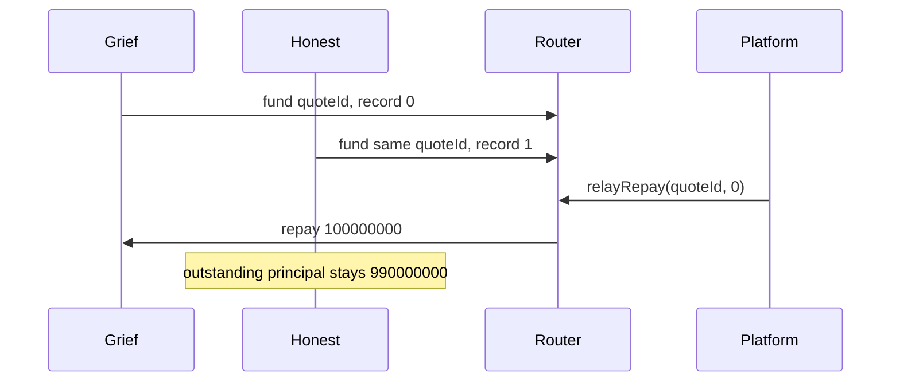

# SUMMARY

G9 reproduction against the current router. One `relayRepay` on a shared `quoteId` repays the vault at the caller's index. The other vault that funded that quote stays open. No file that already lived in this directory was changed. No partner, facility, or core source was edited.

`docs/SECURITY-NOTES-partner.md` already records the same shape: `quoteId` omits the nonce and the vault, and `relayRepay` selects the record index. The numbers below are from the isolated Foundry match on 2026-10-02.

Shared idle and mandate abuse did not fund an advance the rails refuse. A stranger who holds the owed amount can close the indexed advance. The router balance stays 0, and Lockgate's balance stays 0.

# Front-run



From `lockgate/repo/contracts`:

```
FOUNDRY_TEST=test/invariant forge test --match-contract Adversarial --offline
```

That match was 3 passed, 0 failed.

| Test | Result |
|---|---|
| `test_frontRunRecordLeavesTheHonestVaultOpen` | pass, gas 1323060 |
| `test_mandateAbuseAndAPinnedNonceMoveNoCash` | pass, gas 244318 |
| `test_strangerCanRepayTheIndexedAdvance` | pass, gas 712320 |

## Minimal case

Both vaults use the same partner, the same proposer, and the same platform. `quoteId` is `keccak256("same-exit")`. Each vault uses nonce 1. Each deposits `5_000e6`. The mandate floor is 25 bps, concentration is 10_000, the platform limit is `100_000e6`, and reserve bps is 0.

| Step | Vault | nav | fee | payout to platform |
|---|---|---|---|---|
| 1. `execute` | grief | 100_000_000 | 1_000_000 | 99_000_000 |
| 2. `execute` | honest | 1_000_000_000 | 10_000_000 | 990_000_000 |

`recordsOf(quoteId)` has length 2. Index 0 is the grief vault. `grief.owedOf(1)` is 100_000_000. The platform approves the router and calls `relayRepay(quoteId, 0)`.

| After index 0 | Amount |
|---|---|
| grief outstanding principal | 0 |
| honest outstanding principal | 990_000_000 |
| router balance | 0 |
| Lockgate balance | 0 |
| platform balance | 989_000_000 |

The platform was paid 99_000_000 and then 990_000_000, then repaid the grief nav of 100_000_000, and holds 989_000_000. A second `relayRepay(quoteId, 0)` reverts `PartnerRouter.Empty`. The honest advance stays open.

The executable copy is `contracts/test/invariant/Adversarial.t.sol`. The simulator copy, in the same micro-USDG units, is `sim/src/actors.ts` (`front-run-repay`) and `sim/ADVERSARIAL.md`: index 0 pays 100000000 to grief, and honest stays open.

# Held

Shared idle, in the simulator: 10_000 deposited. The attacker draws 9_900 principal and is accepted. Idle left is 100. The next platform's principal of 200 is `capital-short`. The attacker's next unit is `over-limit`.

Mandate, on the honest vault: an unapproved recipient reverts `MandateRejected(Platform)`. Fee 2_499_999, one unit under `floor(1_000_000_000 * 25 / 10000)`, reverts `MandateRejected(Fee)`. A different digest on a submitted nonce reverts `NotSubmitted`. Lockgate executing the filed digest with an empty partner signature reverts `NotApproved`. Idle, `advanceCount` (still 0), and the platform and Lockgate balances are unchanged.

A stranger who mints 1_000_000_000 and calls `relayRepay` on the single honest record closes it. The platform's later call reverts `Empty`. The router balance is 0.
