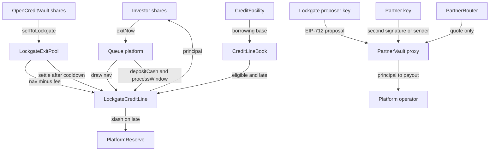

# Architecture

## SUMMARY

Lockgate is exit infrastructure for tokenized credit. Stage 1 lends Lockgate's own test USDG to a sandbox platform. Stage 2 lets a licensed partner fund an exit from a vault only that partner can move. Stage 3 is a senior/junior facility against Lockgate's own book. The harness deploys the contracts in `contracts/` onto local Anvil. It is not the product and not an offer.

## Three stages

Stage 1 cash sits in `LockgateCreditLine` and `PlatformReserve`. The investor's early exit calls `exitNow` on the platform. The platform is the only caller of `draw`. Repayment pulls USDG from the platform contract, so the harness deposits cash and then calls `processWindow`. A short cash balance does not repay and does not roll the window. `contracts/src/core/PlatformBase.sol`.

Door 2 uses the same line. `OpenCreditVault` accrues about 9% APR only when the asset is MockUSDG. A real token is constructed with `mintYield` false. `LockgateExitPool` is registered at reserve bps 0. `sellToLockgate` pays the seller nav minus the stage-1 fee and queues the vault withdrawal. A gated pool reverts `Gated`. `settle` before the cooldown reverts `NotReady`. After it, `settle` claims the withdrawal and repays that same nav. The partner vault is not on this path. The 5-minute cooldown prices at 49 bps. `PricingMath` is unchanged.

Stage 2 is one vault per partner, behind an ERC-1967 proxy the partner transaction deploys. OpenZeppelin UUPS: https://docs.openzeppelin.com/contracts/5.x/api/proxy#UUPSUpgradeable. Lockgate may be the proposer. `execute` still requires the partner signature. The other path is `submitProposal`, which stores the digest, then the partner's `approve`, which pays. Lockgate calling `approve` reverts `NotApproved` and leaves idle cash where it was. The router stores no custody except the tokens it pulls and forwards inside `relayRepay`.

Stage 3 lends to Lockgate, the borrower. The facility constructor reverts when the governor and the borrower are the same address. On local Anvil the governor is the published development account 7 and the borrower is account 0. The governor calls `approveLender`. The borrower calls `draw`. Senior interest is paid before senior principal, then junior. `recognizeLoss` takes no amount. Junior principal is written down first. `FacilityMath.subordinate` can also move junior cash onto senior drawn when recovery starts. Positions do not transfer.

## What is deployed

`harness/src/deploy.ts` CREATE2-deploys, from a fresh Anvil nonce 0: MockUSDG, UsdgAdapter, PricingEngine, PlatformReserve, LockgateCreditLine, PartnerRouter, the vault implementation, CreditLineBook, CreditFacility, two vault proxies, three locked platform implementations, FundFactory, OpenCreditVault, and LockgateExitPool. Each locked implementation is constructed with a zero-token config, which locks `initialize` on that copy. The factory clones one of them in `createPlatform`. The credit line records the factory as a registrar. On the mock path the factory and the open vault are minters. The weekly short-cash platform is still ordinary CREATE: a clone starts with zero shares, and that check needs unbacked shares. The epoch platform in the stage-3 demo is a factory clone.

The old embedded factory measured 49873 init bytes and 49258 deployed bytes on 2 Oct 2026, over both caps. EIP-3860 stops init code above 49152 bytes. https://eips.ethereum.org/EIPS/eip-3860. EIP-170 stops deployed bytecode above 24576 bytes. https://eips.ethereum.org/EIPS/eip-170. The contracts tree replaced it with the clone factory. G6 measured that factory with `FOUNDRY_PROFILE=core forge inspect` (solc 0.8.28, optimizer 200, via IR): init code 5763 bytes, deployed runtime 4729. Those figures are recorded in `contracts/INTERFACE-REQUESTS.md`. G10 did not re-measure them.

The facility's book is `CreditLineBook`, which reads `eligibleOutstanding` and `lateOutstanding` on the stage-1 line. A late advance is not eligible. `harness/fixture/src/HarnessBook.sol` is not deployed.

PricingEngine constructor values are the on-chain defaults in `contracts/src/core/PricingEngine.sol`: base APR 1200 bps, time scale 4320, minimum fee 25 bps, kink 6667. A 600-second demo window prices at 99 bps on that curve. The 600, 1800, and 3600 second windows are harness clocks, not product tenors. Facility advance rate 8000 bps and senior/junior APR 800/1500 bps are harness choices inside the contract's 0–10000 range, not market rates.

## Signatures

`PartnerVault.execute` verifies `AdvanceHash`, which calls `AdvanceProposalLib`. Domain name `LockgateAdvance`, version `1`, verifying contract = the vault. The vault address is not a field of the struct. EIP-712: https://eips.ethereum.org/EIPS/eip-712. The signed fields are platform, recipient, requestId, navValue, fee, payout, feeBps, dueAt, expiresAt, nonce, and quoteId. `quoteId` is what the vault stores as the advance `exitRef`, and it is the id the router repays. The harness signs that digest.

## Chains

Harness writes run only on chain 31337. https://book.getfoundry.sh/anvil/. Arbitrum One, chain 42161, is refused. The Sepolia script sends only when chain 421614, `LOCKGATE_ALLOW_SEPOLIA_DEPLOY=1`, and `DEPLOYER_PRIVATE_KEY` are all present. G10 ran that script against a local Anvil reporting 421614, not against the public Arbitrum Sepolia endpoint. Paxos USDG on Arbitrum Sepolia is `0xFFC95faa3d63Cde504a05B567C600B78C0b41892`, 6 decimals. https://docs.paxos.com/guides/stablecoin/usdg/testnet. The Arbitrum One token is a different address and is not used. https://docs.paxos.com/guides/stablecoin/usdg/mainnet.

## Legal shape, not advice

This is not a legal opinion. The structure the contracts implement is the one described in the 1 Oct 2026 research note: Lockgate lends its own USDG to corporations, and a partner moves the partner's own tokens. Moneylenders Act excluded-moneylender limb: https://sso.agc.gov.sg/Act/MA2008. Securities and Futures Act: https://sso.agc.gov.sg/Act/SFA2001. Payment Services Act: https://sso.agc.gov.sg/Act/PSA2019. FSMA digital-token service section 137: https://sso.agc.gov.sg/Act/FSMA2022. MAS stated on 6 Jun 2025 that it will generally not license digital token service providers. https://www.mas.gov.sg/news/media-releases/2025/mas-clarifies-regulatory-regime-for-digital-token-service-providers. Counsel has not signed off. [U] whether a court would treat a proposal-only engine as "arranging" remains counsel's question, not a finding of this repo.
