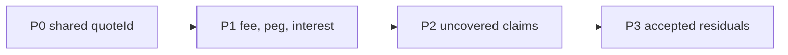
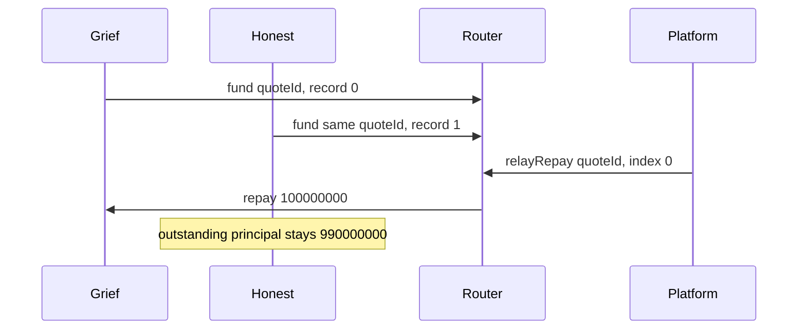

# SUMMARY

The last full `npm run verify` exited 1. Forge passed 369 tests and failed 1. Engine passed 187 and skipped 1. Sim passed 79. Offline e2e passed 8. Anvil printed ok. Compare passed 1. The next three-run check exited 1 with 12 outcome differences. Two `LossSymmetry` tests were pass, fail, pass. Sim stayed 79, offline e2e stayed 8, Anvil passed, and compare passed 1. The shared Anvil on `127.0.0.1:8545` (chain 31337, PID 53114) was not reset, warped, or stopped. `npm run sim` was not run.

Rank follows the cash effect. P0 leaves an honest advance open. P1 is a price or interest figure the funded path recorded with 0 integration breaks. P2 is a claim the suite does not assert. P3 is a residual the owning security note already accepted. A passing P0 test means the break still reproduces.



# Last full verify

The repo has no git remote. HEAD is `9665484`. The run used the working tree. Command: `cd lockgate/repo/e2e && npm run verify`. Logs stayed at `/var/folders/vn/tl96vjs57z9cw273hk8q56hm0000gn/T/lockgate-g9-verify-77803` because forge failed.

| area | check | result | time | detail |
|---|---|---|---|---|
| contracts | forge test | fail | 161s | 369 tests passed, 1 failed |
| engine | npm test | pass | 8s | 187 passed, 1 skipped (188) |
| sim | npm test | pass | 2s | 79 tests, 0 failed |
| e2e | npm test | pass | 2s | 8 tests, 0 failed |
| e2e | anvil | pass | 250s | ok |
| e2e | compare | pass | 64s | 1 tests, 0 failed |

LossSymmetry re-run (2026-10-02): the recorded counterexample now passes and is pinned as `test_recordedCounterexampleHolds` in `contracts/test/facility/LossSymmetry.t.sol`. All facility fuzz suites pass at `--fuzz-runs 5000`. The earlier failure coincided with the test file being edited mid-run. The record below is as found.

The forge failure is `test/facility/LossSymmetry.t.sol:LossSymmetryTest` `testFuzz_unpaidDrawBecomesDeficitAndRepayRestoresSeniorFirst`. The log line is `[FAIL: assertion failed: 32728340926 != 32729340929]`. It stopped at run 6. Counterexample args `[3, 79228162514264337593543950332, 486443499876322530418866, 59944674909726747, 2588]`. Fuzz seed `0xac60779458821b7d1e165eb2402b4ca8a239716756372c66132d9ab0b23af13e`. The suite rollup was 89 suites, 369 passed, 1 failed, 0 skipped, 370 total. The engine skip is `test/anvil/g10-deploy.test.ts`. `test_tinyRepaysDoNotBlockAnotherLender` passed on this compile.

```
cd lockgate/repo/contracts
FOUNDRY_TEST=test/facility forge test --match-test testFuzz_unpaidDrawBecomesDeficitAndRepayRestoresSeniorFirst --offline
```

Do not start that while another forge is writing `contracts/out`. This verify's compare wrote `DIVERGENCE.md` at block 1665, `now` 1790905382. The four fee rows were sim 98 / engine 101 / chain 99, rounding 9901 / half-up 9900 / 9901, full utilization 598 / 150 / 148, idle 80098000000 / 80101000000. 4 divergences. 0 integration breaks.

# Three-run check

`npm run flaky` runs forge, engine, sim, offline e2e, Anvil e2e, and compare three times. It keeps each test's pass, fail, or skip. Logs: `/var/folders/vn/tl96vjs57z9cw273hk8q56hm0000gn/T/lockgate-g9-flaky-20012`. The command exited 1. One earlier attempt exited 2 after run 1 because a fuzz counterexample contains `]`. That log is `lockgate-g9-flaky-47150`. The parser now takes the last `]`. The table is the rerun.

| Run | Wall | Forge | Engine | Sim | E2e offline | Anvil | Compare |
|---|---|---|---|---|---|---|---|
| 1 | 491s | 372 passed, 0 failed | 192 passed, 1 skipped, exit 0 | 79 passed | 8 passed | pass | 1 passed |
| 2 | 494s | 370 passed, 2 failed | 193 passed, 2 failed, 1 skipped, exit 1 | 79 passed | 8 passed | pass | 1 passed |
| 3 | 498s | 376 passed, 0 failed | 196 passed, 1 skipped, exit 0 | 79 passed | 8 passed | pass | 1 passed |

`testFuzz_unpaidDrawBecomesDeficitAndRepayRestoresSeniorFirst` passed on all three of these compiles, 256 runs each. The aborted run had failed it with `203747519898 != 203771081592`.

The fee rows in the three `DIVERGENCE.md` copies were the same. The file left on disk is the third compare: block 1965, `now` 1790907499. Block and `now` moved. The bps and fee amounts did not.

Two tests were in every forge run and changed status. Run 2 logged `400000000 != 500000000` and `399999999 != 499999999`. The file now expects `400e6` and `400e6 - 1`. `FacilityCash.sol` and `FacilityMath.sol` were saved at 07:31:56. That forge log closed at 07:34:58. `LossSymmetry.t.sol` was saved at 07:38:03. Run 3's forge log closed at 07:43:20.

| Test | Run 1 | Run 2 | Run 3 |
|---|---|---|---|
| test_drawAboveSeniorRecognizesTheUnpaidDrawOnce | pass | fail | pass |
| test_repayWhileDrawExceedsSeniorPullsOnlyThatPayment | pass | fail | pass |

Ten other name differences are tests that were not on disk for every run. Four contract tests were absent, then absent, then pass. Three of them are in `RepayOrderFuzz.t.sol`, saved at 07:40:18. Six `examples.test.ts` names moved during the runs. Two existed only in run 2 and failed on the sample file list. That test file was saved at 07:42:43. `g10-deploy.test.ts` skipped in all three engine runs.

```
cd lockgate/repo/e2e
npm run flaky
```

# P0 — one quoteId, two vaults

FIXED 2026-10-02. `PartnerRouter` is now `Ownable2Step` (owner Lockgate). `register(vault)` needs the vault's own `owner()` and Lockgate's `approveVault`, else `NotApproved`, so an unvetted grief contract cannot list itself, record the `quoteId` first, and soak up `relayRepay(exitRef, 0)`. Records stay per (exitRef, vault, advanceId) once and `relayRepay` pays the vault that recorded it. Strict one record per exitRef was not adopted, because pro-rata splits record one exitRef from several vaults. Regression: `contracts/test/partner/RouterGrief.t.sol`. The text below is the original repro.



| | |
|---|---|
| Components | Partner router, simulator, invariant tests. Engine and partner notes record the same id shape. |
| Still open | Index 0 pays the grief record. The honest vault stays open. Partner source was not changed. |
| Measured | Grief outstanding principal 0. Honest outstanding principal 990000000. Platform balance 989000000. Router balance 0. Lockgate balance 0. A second `relayRepay(quoteId, 0)` reverts `PartnerRouter.Empty`. |
| Why the suite is green | `front-run-repay` is an expected-open row. `broke` stays true. The single-vault repayment test still passes. |
| Sources | `contracts/test/partner/G9-ADVERSARIAL.md`, `docs/SECURITY-NOTES-testing.md`, `docs/SECURITY-NOTES-partner.md`, `docs/SECURITY-NOTES-engine.md`. `engine/MODEL.md`: `exitRef` is not a signed field, and `PartnerVault._fund` stores `quoteId` in that field. |

Grief nav is 100000000 (fee 1000000, payout 99000000). Honest nav is 1000000000 (fee 10000000, payout 990000000). `quoteId` is `keccak256("same-exit")`. The isolated Foundry match in `G9-ADVERSARIAL.md` was 3 passed, 0 failed. Front-run gas on that run was 1323060.

```
cd lockgate/repo/sim
npm test
```

That is the 73-passed run. The rows are `test/actors.test.ts` ("a front-run record keeps the honest vault unpaid", "the actor set names one break") and the `front-run-repay` library row.

```
cd lockgate/repo/contracts
FOUNDRY_TEST=test/invariant forge test --match-contract Adversarial --offline
```

Do not start that while another forge is writing `contracts/out`.

# P1 — three fee clocks

FIXED 2026-10-02. The on-chain `PricingEngine`/`PricingMath` quote is the source of truth. Engine `DEFAULT_PARAMS` now equal the `PricingEngine` constructor (kink APR 1200, concentration cap 10000, concentration premium 0). The engine fee rounds up and the engine refuses (block `max-fee`) above `maxFeeBps` instead of clamping. `sim/src/pricing.ts` is an exact BigInt port of `PricingMath.quoteCode`, and sim `riskBps` is a 0..10000 platform risk score. The compare feeds all three legs the same NAV age and risk score. Live compare on own Anvil: sim, engine, chain 100 bps, fee 100000000 each. Full utilization 149/149/149. Rounding nav 1000001 at 100 bps is 10001 everywhere. 0 divergences, 0 breaks. The tables below are the original measurements.

`DIVERGENCE.md` on disk is the third flaky compare: chain 31337, block 1529, `now` 1790902519. The verify compare was block 1304, `now` 1790900969. 4 divergences. 0 integration breaks. The fee rows match. The vault stored the signed engine fee 101000000 and principal 9899000000. Idle went 80000000000, then 70101000000, then 80101000000. Lockgate's balance stayed 0. The chain was not reset and was not warped.

| id | Sim | Engine | Chain |
|---|---|---|---|
| fee-bps-600s | 98 bps, fee 98000000, raw 98 | 101 bps, fee 101000000, pricedSeconds 2592000, apr 1225, risk 276 | 99 bps, fee 99000000 |
| fee-rounding | 9901 on nav 1000001 | half-up 9900, ceil 9901 | 9901 |
| fee-bps-full-util | 598 | 150 | 148 |
| idle-versus-sim | 80098000000 | 80101000000 | stage 2 does not charge the credit-line curve |

`fee-bps-full-util` is a quote and was not funded. Inputs for the 600-second rows: nav 10000000000, seconds 600, timeScale 4320. Sim `riskBps` is 10000 and nav age is 0. Chain `feeBps` passes platform risk 0. Engine uses `navUpdatedAt = now - 3600`.

Offline classify, last print 8 passed, 0 failed, `duration_ms` 640.625667. `test/diverge.test.ts` pins 98 / 101 / 99, and `fee-bps-600s` is absent when all three bps are 99.

```
cd lockgate/repo/e2e
npm test
```

The command that wrote `DIVERGENCE.md` rewrites that file and uses the shared Anvil. Do not reset or warp it. `compare/live.test.ts` was edited after that compare and has not been executed since.

```
cd lockgate/repo/e2e
npm run compare
```

# P1 — window-cash factor and the facility peg

The named `depeg` scenario multiplies window cash by 0.92 on days 120–150, and the mixed book does the same on days 360–420. That factor is unchanged. `sim/ORACLE.md` is a separate shock.

Seed 20261001, 360 days, from `ORACLE.md` and `test/oracle.test.ts` in the 73-passed run:

| Path | Stage 1 coverage | Stage 2 coverage | Stage 3 coverage |
|---|---|---|---|
| default | 2239 | 652 | 2287 |
| default plus USDC shock | 2239 | 652 | 2287 |
| default plus stale price | 2239 | 652 | 2287 |

USDC price inside days 120–150 is 98999999. The floor is 99000000. That price is the floor minus one unit. It is not a market print. The token at [0xFFC95faa3d63Cde504a05B567C600B78C0b41892](https://sepolia.arbiscan.io/token/0xFFC95faa3d63Cde504a05B567C600B78C0b41892) is Arbitrum Sepolia USDG, chain 421614. `IPegOracle` prices USDG/USD, with 1e8 = $1. The engine reports a price under the floor as "USDG is below the peg floor". This sim does not call `latest()`. A stale print is reported before the price check. Stale cash stays at par. Peg or stale refusals on that book are 293. Stage 2 posted reserve has 6 distinct values. Stage 1 and stage 3 posted reserve stay 405000000000.

```
cd lockgate/repo/sim
npm test
```

Rows: `test/oracle.test.ts` "reserve coverage on seed 20261001", and `test/depeg.test.ts` for the 0.92 factor.

On-chain peg assertions live in `contracts/test/invariant/FacilityTime.t.sol`. The last forge that ran them is the verify row, 330 passed, 0 failed. This pass did not print a fresh isolated `FacilityTime` count.

```
cd lockgate/repo/contracts
FOUNDRY_TEST=test/invariant forge test --match-contract FacilityTime --offline
```

`test_priceOneUnitUnderTheFloorStopsTheDraw` draws at 99000000, then sets 98999999. `availableDraw` is 0 and `draw(1)` reverts `Covenant`. Recovery stays after the price returns to 1e8. `test_oracleAgeOfOneDayIsFreshAndOneSecondLaterStopsTheDraw` still has `availableDraw` above 0 at 1 day, and 0 one second later. Do not start this while another forge owns `contracts/out`.

# P1 — daily interest floor and the one-shot year

A 40000000000 senior draw at 800 bps. The sim adds `floor(debt * aprBps / 10000 / 365)` once per day: one day is 8767123, and 365 days sum to 3199999895. `FacilityTime` `YEAR_INTEREST` is 3200000000. The gap is 105. The sim keeps the daily floor. `solvent()` stays true on the one-shot path. Source: `sim/COVERAGE.md` and `test/bounds.test.ts` in the 73-passed run.

```
cd lockgate/repo/sim
npm test
```

Row: "stage-3 interest is a daily floor, and a year of floors is short of the one-shot year". The on-chain year is `test_oneYearOfSeniorInterestStaysInTheCashIdentity` in the `FacilityTime` command above.

# P2 — claims the suites do not assert

| Id | What stays uncovered | Record | Repro |
|---|---|---|---|
| legal | The excluded-moneylender line and the MAS custody line are legal sentences. | `sim/COVERAGE.md` Open | No test asserts them. |
| mock-book | `SepoliaFacility` draws and repays through `MockBook`. Supply is unchanged. Senior deposit 100e6, draw and repay 40e6. | `contracts/test/fork/SepoliaFacility.t.sol`, `sim/COVERAGE.md` | `cd lockgate/repo/contracts && FOUNDRY_TEST=test/fork forge test --match-contract SepoliaFacility --offline`. The fork directory's last isolated run, recorded in `sim/README.md`, passed 9 and failed 0. The fork reads the public Arbitrum Sepolia RPC and does not broadcast. Do not overlap another forge. |
| conservation | `FlowConservation` passed 1, failed 0: 32 runs, depth 20, 640 calls, 0 reverts. Facility APR is 0. The handler does not warp. | `sim/COVERAGE.md` Conservation | `cd lockgate/repo/contracts && FOUNDRY_TEST=test/invariant forge test --match-contract FlowConservation --offline` |
| door-2 | Removed: door 2 is not deployed and superseded. The row stays as history. | `e2e/README.md` | The verify `npm run e2e` printed ok in 256s. Do not warp the shared Anvil. Time jumps in this tree are the `FacilityTime` command. |
| mtime-cache | `solidityTreeMtime` is cached for the process. A source edited after the first deploy in that process is not rebuilt. | `docs/SECURITY-NOTES-testing.md` Residual | `cd lockgate/repo/e2e && npm test`. "freshness follows a nested source, not only the contract file" stamps one directory once. |
| revert-text | A `BaseError` whose message contains "reverted" counts as a revert. | Same residual. `e2e/test/security.test.ts` | Same e2e `npm test`. "a transport error is not counted as a revert" expects `BaseError("execution reverted")` to count. |
| utilization | Simulator utilization is cash advanced over cash advanced plus idle. Caps use owed nav. A line at the owed cap can print utilization 5000 while that platform's exposure is 10000. | `docs/SECURITY-NOTES-testing.md` Residual. `sim/test/utilization.test.ts` | `cd lockgate/repo/sim && npm test` |
| time-scale | The long-horizon book uses time scale 1. The 600-second demo scale is a separate quote, pinned at 98 bps. | Same residual | Sim `npm test`, `test/pricing.test.ts`. |
| senior-zero | `RESULTS.md` shows senior impaired on 0 of 150 paths. That is the output of these scenario sizes. | `sim/README.md` SUMMARY, `docs/SECURITY-NOTES-testing.md` Residual | Leave `npm run sim` unrun. It rewrites `RESULTS.md`, `HORIZON.md`, and the charts. |

# P3 — accepted residuals in the other notes

This pass did not edit those notes. The verify forge row is 369 passed, 1 failed. The verify engine row is 187 passed and 1 skipped. Slither's other 116 results are recorded in `docs/SECURITY-NOTES-contracts.md` as false positives or accepted timing checks.

| What remains | Source | Command already named there |
|---|---|---|
| `withdrawCapital` can take idle cash while the fee is still unearned. `test_ownerWithdrawsIdleWhileTheFeeIsUnrealized`: fee 990000, `earnedFees` 0, outstanding 99010000, until repay. | `docs/SECURITY-NOTES-contracts.md` Reviewed | `cd lockgate/repo/contracts && FOUNDRY_TEST=test/core forge test --match-test test_ownerWithdrawsIdleWhileTheFeeIsUnrealized --offline` |
| `createPlatform` is now `onlyOwner` (Lockgate), so limit and reserve bps are Lockgate-set (`contracts/test/core/FactoryDrain.t.sol`). The issuer can still set NAV on its own platform, bounded by that limit and reserve. The line does not compare reported NAV with cash. | Same file, Residual | The residual paragraph. This pass did not re-run a dedicated match. |
| The address stored as `autoModule` may call `execute` with an empty partner signature. Bounds live inside `AutoApproveModule`. | `docs/SECURITY-NOTES-partner.md` Residual | The residual paragraph. |
| `quote` skips a vault that needs more than 2500000 gas inside `maxNav`. The partner can still fund it directly. | Same residual | The residual paragraph. |
| `submitProposal` stores the digest before `preview`. A rejected nonce stays occupied until the owner cancels. | Partner Reviewed, and `docs/SECURITY-NOTES-engine.md` Residual | The residual paragraphs. |
| Reserve cash posted against a platform can be withdrawn by that platform. | Partner Residual | The residual paragraph. |
| Without `--rpc`, a lied snapshot can still be signed. The vault re-checks at `approve` and `execute`. | Engine Residual | The residual paragraph. |
| A scan longer than 256 entries is refused. `MAX_QUEUE_SCAN` is 256 in `engine/src/adapters/reader.ts`. | Engine Residual. Test "caps a queue scan and does not walk a million ids". | `cd lockgate/repo/engine && npm test` is the verify engine row, 187 passed and 1 skipped. |
| `broadcastOwnBook` can send `repay` and `markLate` on the named credit line. | Engine Residual. Test "sends only repay or markLate to the named credit line". | Same engine suite. |
| The harness console on `127.0.0.1:18910` has no authentication. Any local process can move the Anvil test funds. | `docs/SECURITY-NOTES-harness.md` Residual, `harness/README.md` | This pass did not run the harness suite. |
| `LOCKGATE_ALLOW_SEPOLIA_DEPLOY=1` still allows a broadcast to chain 421614. This pass did not set that flag. | Harness Residual. Test "sepolia broadcast stays off without the allow flag" expects `SEPOLIA_BLOCKED`. | `cd lockgate/repo/harness && npm test` was not run here. |
| Published Anvil keys must stay off a public network. `preview` and `submitProposal` are one block apart, and a passing submit still stores the digest until the owner cancels. | Harness Residual | The residual paragraphs. |

# Closed in the notes

Omitted above: T-1 through T-8, P-1, F-1 through F-3, C-2, C-3, C-4, C-7, E-6, E-7, E-12, H-2, H-4.

# Command cautions

One forge at a time. Forge shares `contracts/out`. `npm run compare` rewrites `DIVERGENCE.md` and uses the shared Anvil. `npm run sim` rewrites `RESULTS.md`, `HORIZON.md`, and the charts. `npm test` in `e2e` stays offline.
