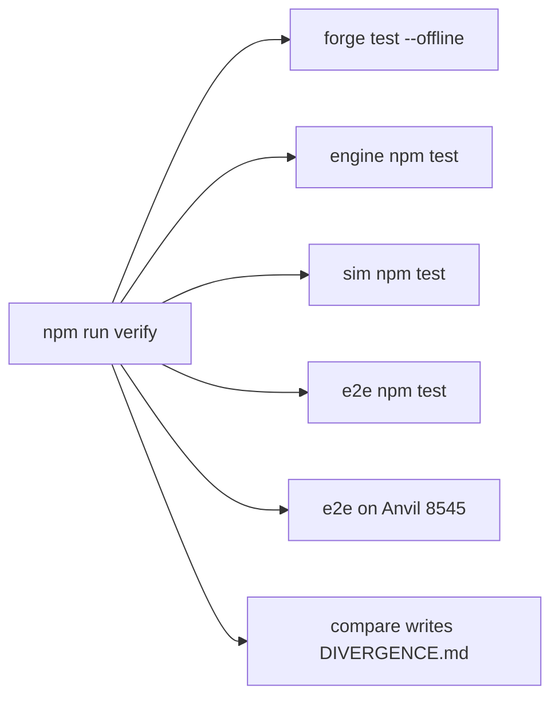

# SUMMARY

G9 handoff for 2026-10-02. One command runs contracts, engine, sim, and e2e. The last `npm run verify` exited 1. The last `npm run flaky` exited 1. Both counts are below. The detail is `FINDINGS.md`. The stage map is `sim/COVERAGE.md`. This is not a pentest and not a legal opinion.



# Run

Anvil must already be listening on `127.0.0.1:8545`, chain 31337. The command does not start, reset, warp, or stop it. One forge at a time. Forge and the engine share `contracts/out`.

```
cd lockgate/repo/e2e
npm run verify
```

That runs `forge test --offline`, `engine` `npm test`, `sim` `npm test`, this directory's `npm test`, `npm run e2e`, and `npm run compare`. It exits 1 if any row fails. It does not run `sim` `npm run sim`, which rewrites `RESULTS.md`, `HORIZON.md`, and the charts. `npm run compare` rewrites `DIVERGENCE.md`. `npm run flaky` repeats the same six checks three times and prints any test whose pass, fail, or skip changes.

Last verify, HEAD `9665484`, working tree, no git remote. Logs: `/var/folders/vn/tl96vjs57z9cw273hk8q56hm0000gn/T/lockgate-g9-verify-77803`.

| Area | Result | Time | Detail |
|---|---|---|---|
| Contracts | fail | 161s | 369 passed, 1 failed |
| Engine | pass | 8s | 187 passed, 1 skipped (188) |
| Sim | pass | 2s | 79 passed, 0 failed |
| E2e offline | pass | 2s | 8 passed, 0 failed |
| Anvil e2e | pass | 250s | ok |
| Compare | pass | 64s | 1 passed, 0 failed |

The forge failure is `LossSymmetryTest` `testFuzz_unpaidDrawBecomesDeficitAndRepayRestoresSeniorFirst`. Assertion `32728340926 != 32729340929`. It stopped at run 6. Seed `0xac60779458821b7d1e165eb2402b4ca8a239716756372c66132d9ab0b23af13e`. Rollup: 89 suites, 370 tests. The engine skip is `g10-deploy.test.ts`. `test_tinyRepaysDoNotBlockAnotherLender` passed.

That compare wrote `DIVERGENCE.md` at block 1665, `now` 1790905382. Fee rows: sim 98 / engine 101 / chain 99 bps. Full utilization, unfunded: 598 / 150 / 148. Nav 1000001: 9901 / half-up 9900 / 9901. Idle: 80098000000 / 80101000000 / the chain does not charge that curve. 4 divergences. 0 integration breaks.

# Flaky check

`cd lockgate/repo/e2e && npm run flaky` exited 1. Logs: `/var/folders/vn/tl96vjs57z9cw273hk8q56hm0000gn/T/lockgate-g9-flaky-20012`. The script does not reset, warp, or stop Anvil, and it does not run `npm run sim`. An earlier attempt exited 2 after run 1: a fuzz counterexample contains `]`, and the parser counted 369 names against 370. That log is `lockgate-g9-flaky-47150`. The same fuzz failed there with `203747519898 != 203771081592`. The parser now takes the last `]`. The table is the rerun.

| Run | Wall | Forge | Engine | Sim | E2e offline | Anvil | Compare |
|---|---|---|---|---|---|---|---|
| 1 | 491s | 372 passed, 0 failed | 192 passed, 1 skipped, exit 0 | 79 passed, 0 failed | 8 passed, 0 failed | pass | 1 passed, 0 failed |
| 2 | 494s | 370 passed, 2 failed | 193 passed, 2 failed, 1 skipped, exit 1 | 79 passed, 0 failed | 8 passed, 0 failed | pass | 1 passed, 0 failed |
| 3 | 498s | 376 passed, 0 failed | 196 passed, 1 skipped, exit 0 | 79 passed, 0 failed | 8 passed, 0 failed | pass | 1 passed, 0 failed |

12 outcomes differed. Two tests were in every forge run and changed status. Run 2 logged `400000000 != 500000000` and `399999999 != 499999999`. The file on disk now expects `400e6` and `400e6 - 1`. `FacilityCash.sol` and `FacilityMath.sol` were saved at 07:31:56, before that forge log closed at 07:34:58. `LossSymmetry.t.sol` was saved at 07:38:03. Run 3's forge log closed at 07:43:20.

| Test | Run 1 | Run 2 | Run 3 |
|---|---|---|---|
| test_drawAboveSeniorRecognizesTheUnpaidDrawOnce | pass | fail | pass |
| test_repayWhileDrawExceedsSeniorPullsOnlyThatPayment | pass | fail | pass |

The verify fuzz passed all three of these compiles, 256 runs each. `g10-deploy.test.ts` skipped in every engine run. The other 10 names were not on disk for every run. Four contract tests were absent, then absent, then pass, including three in `RepayOrderFuzz.t.sol` (saved 07:40:18). Six `examples.test.ts` names moved during the runs. Two existed only in run 2 and failed: the sample list did not equal `epoch.json` plus `legacy.json`, and did not equal `epoch.json` plus `weekly.json`. That test file was saved at 07:42:43. Fee rows matched. The file left on disk is the third compare: block 1965, `now` 1790907499. Anvil PID 53114 was still listening and was not reset or stopped.

# Covered

| Surface | What the suites exercise |
|---|---|
| Stage 1 | Own-book draw, investor paid from the advance, platform repay, 5–10% reserve, solvency and repay-first. `Stage1Flow`, `Stage1Invariant`, `e2e/src/stage1.ts`, sim stage 1. |
| Stage 2 | One vault per partner. Lockgate proposes. The partner signs. Repayment returns to the funding vault. Lockgate's balance stays 0. `e2e/src/stage2.ts`, `SepoliaPartner`, `PartnerKeys`. |
| Stage 3 | Senior and junior facility, borrower draw and repay, loss order. `e2e/src/stage3.ts`, `FacilityTime`, `SepoliaFacility`. |
| Fork | Local fork of Arbitrum Sepolia USDG at [0xFFC95faa3d63Cde504a05B567C600B78C0b41892](https://sepolia.arbiscan.io/token/0xFFC95faa3d63Cde504a05B567C600B78C0b41892), chain 421614. No broadcast. |
| Risks | Permissions, boundaries, failure paths, reentrancy, rounding, time windows, gating, defaults, and a peg check. Sim library: 3 happy paths and 10 failure paths. Three named platforms gate together in `sim/CONCURRENT.md`. |
| Prices | Sim, engine, and chain fees are compared and left different. Oracle shocks and a 0.92 window-cash depeg are separate scenarios. |

# Not covered

| Gap | Why it is open |
|---|---|
| Excluded-moneylender and MAS custody sentences | Legal statements. No test asserts them. |
| Door 2 on the shared Anvil | Settle needs a time jump. `npm run e2e` leaves it out. Time jumps are in `FacilityTime`. |
| `SepoliaFacility` book | The book is `MockBook`, not the credit line. |
| `FlowConservation` | Passed 1 test: 32 runs, depth 20, 640 calls, 0 reverts. Facility APR is 0. The handler does not warp. |
| Named sim `depeg` | Window cash times 0.92. It does not call `latest()`. Default-path coverage on seed 20261001 stays 2239 / 652 / 2287 under the separate USDC shock at 98999999. That price is the floor minus one, not a market print. |
| Two interest clocks | 365 sim daily floors on a 40000000000 draw at 800 bps sum to 3199999895. `FacilityTime` accrues 3200000000. The gap is 105. |
| Runner limits | `solidityTreeMtime` is cached for the process. A `BaseError` whose message contains "reverted" counts as a revert. Sim utilization is cash advanced over advanced plus idle. `sim/test/utilization.test.ts` pins 5000 against exposure 10000. The long-horizon book uses time scale 1. Senior impaired on 0 of 150 paths is the size of that book. |
| Harness click-through | `docs/TESTING.md` and `harness/`. That doc's forge and engine counts are older than this table. |

# Open findings

A passing P0 test means the break still reproduces. Full repro text is `FINDINGS.md`.

| Rank | Finding | Repro |
|---|---|---|
| P0 | Two vaults can fund one `quoteId`. `relayRepay` of index 0 pays grief 100000000. Honest principal stays 990000000. Platform ends at 989000000. Router and Lockgate stay 0. A second call reverts `Empty`. | `cd lockgate/repo/sim && npm test`. `cd lockgate/repo/contracts && FOUNDRY_TEST=test/invariant forge test --match-contract Adversarial --offline` |
| P1 | 600-second window: sim 98 bps, engine 101, chain 99. Full utilization, unfunded: 598 / 150 / 148. Nav 1000001: sim 9901, engine half-up 9900, chain 9901. Compare recorded 4 divergences and 0 integration breaks. The vault stored the engine fee. | `cd lockgate/repo/e2e && npm test` stays offline. `npm run compare` rewrites `DIVERGENCE.md` and uses the shared Anvil. |
| P1 | The 0.92 cash factor and the facility peg are different checks. The USDC shock does not move default-path coverage bps. | `cd lockgate/repo/sim && npm test`. `FOUNDRY_TEST=test/invariant forge test --match-contract FacilityTime --offline` |
| P1 | Sim daily interest floor versus the facility one-shot year. Gap 105 on the draw above. | Same two commands. |
| Verify | `testFuzz_unpaidDrawBecomesDeficitAndRepayRestoresSeniorFirst` failed once: `32728340926 != 32729340929`, run 6 of the fuzz. The three completed compiles passed it for 256 runs. `test_tinyRepaysDoNotBlockAnotherLender` passed on the verify compile. | `cd lockgate/repo/contracts && FOUNDRY_TEST=test/facility forge test --match-test testFuzz_unpaidDrawBecomesDeficitAndRepayRestoresSeniorFirst --offline` |
| Flaky | Exit 1. 12 outcomes differed. Sim was 79, offline e2e was 8, Anvil passed, and compare passed 1. Two `LossSymmetry` tests were pass, fail, pass. The other 10 names were files saved during the runs. Fee rows matched. | `cd lockgate/repo/e2e && npm run flaky` |

Accepted residuals in the other security notes stay in those files: unrealized fee cash can be withdrawn, `createPlatform` after `setRegistrar`, an `autoModule` with an empty partner signature, a quote skip above 2500000 gas, a digest stored before preview, a lied snapshot without `--rpc`, the 256-entry scan cap, the unauthenticated harness console on `127.0.0.1:18910`, and `LOCKGATE_ALLOW_SEPOLIA_DEPLOY=1`. Slither's other 116 results are recorded in `docs/SECURITY-NOTES-contracts.md` as false positives or accepted timing checks.

T-1 through T-8 are fixed. Partner source was not changed for the shared `quoteId`.
