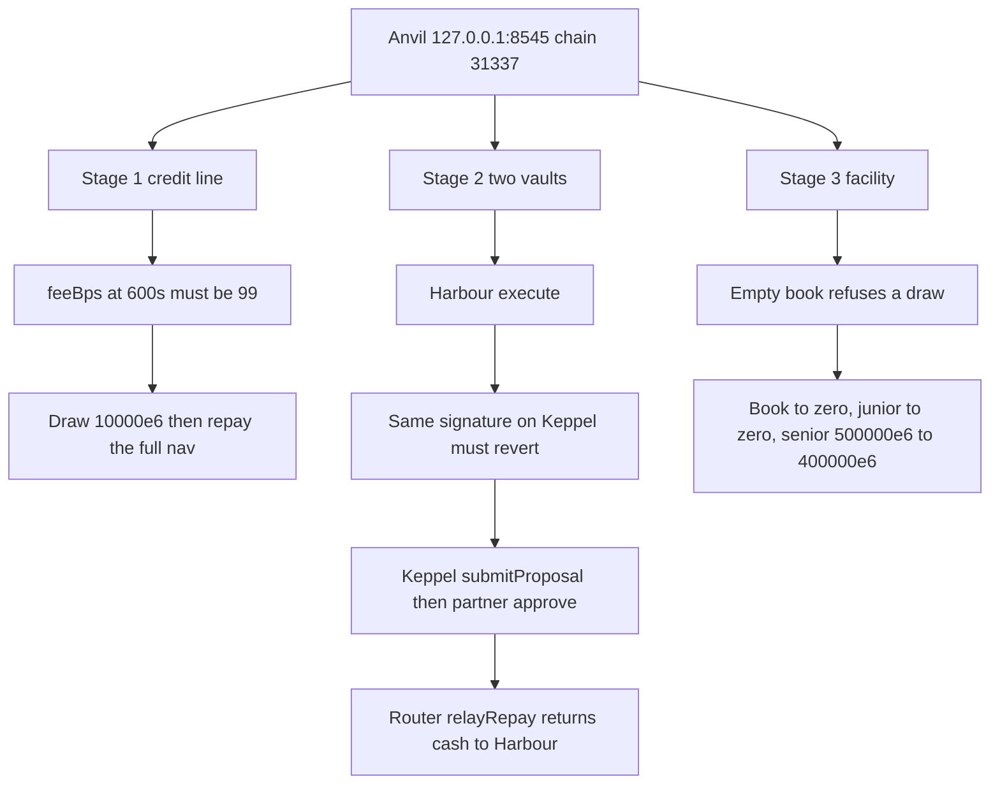

# SUMMARY

Local Anvil only (chain 31337, `http://127.0.0.1:8545`). Deploys stage 1, two partner vaults, and the stage-3 facility, and drives quotes and proposals through `engine/src/cli.ts`. The last run is `output.json`. The handoff is `HANDOFF.md`.

# PROGRESS

- 2026-10-02: `NEXT-TESTS.md` lists ten tests that are not in the tree, with file targets. No test was added. No verify, flaky, compare, forge, or `npm run sim` was run.
- 2026-10-02: `npm run verify` exited 1. Forge passed 369 and failed 1 in 161s. Engine passed 187 and skipped 1 in 8s. Sim passed 79 in 2s. This directory's `npm test` passed 8 in 2s. `npm run e2e` printed ok in 250s. `npm run compare` passed 1 in 64s. `npm run flaky` then exited 1: walls 491s, 494s, and 498s, with 12 outcome differences. The record is `HANDOFF.md`.
- 2026-10-02: The utilization row in `FINDINGS.md` now names `sim/test/utilization.test.ts`. Isolated `cd lockgate/repo/sim && npm test` passed 79 and failed 0. `duration_ms` 1542.057291. No new verify, flaky, compare, or forge run.
- 2026-10-02: `HANDOFF.md` is the testing handoff: coverage, gaps, `npm run verify`, and the open findings. The counts are the verify that exited 1 and the three-run check.
- 2026-10-02: `npm run flaky` ran the verify suites three times and exited 1. Forge was 342 passed and 0 failed on each run. Sim was 73, offline e2e was 8, Anvil passed, and compare passed. Fee rows matched. `flows.test.ts` was pass, then skip, then pass. The other name differences are files added during the runs. The record is `FINDINGS.md`.
- 2026-10-02: `npm run verify` exited 1. Forge passed 341 and failed 1 in 149s (`test_tinyRepaysDoNotBlockAnotherLender`). Engine passed 170 in 8s. Sim passed 73 in 2s. This directory's `npm test` passed 8 in 2s. `npm run e2e` printed ok in 256s. `npm run compare` passed 1 in 61s and rewrote `DIVERGENCE.md` at block 1304. The shared Anvil was not reset or stopped. The record is `FINDINGS.md`.
- 2026-10-02: `FINDINGS.md` now ranks the open residuals. The verify table is unchanged: forge 330 passed, engine 160 passed, sim 67 passed, this directory's `npm test` 8 passed, anvil ok, compare 1 passed. No new verify, compare, sim book, or forge run. The shared Anvil was not reset or stopped.
- 2026-10-02: `npm test` passed 8 tests and failed 0. `duration_ms` 640.625667. Gated and stale quotes are checked against an open quote at 101 bps. A JSON number is refused, including a safe integer, and the rounded decimal is a different amount from the original string. Freshness equals the nested Solidity mtime. `npm run compare` was not run.
- 2026-10-02: `npm run verify` exited 0 against the working tree. `forge test --offline` passed 330 tests and failed 0 (141s). Engine `npm test` passed 160 (7s). Sim `npm test` passed 67 and failed 0 (1s). This directory's `npm test` passed 8 and failed 0 (1s). `npm run e2e` printed ok (256s). `npm run compare` passed 1 and failed 0 (62s). No area failed. The record is `FINDINGS.md`. Contract and engine source were not edited. The shared Anvil was not reset or stopped.
- 2026-10-02: `npm run verify` exited 0 against the working tree. `forge test --offline` passed 312 tests and failed 0 (126s). Engine `npm test` passed 135 (15s). Sim `npm test` passed 47 and failed 0 (2s). This directory's `npm test` passed 8 and failed 0 (2s). `npm run e2e` printed ok (257s). `npm run compare` passed 1 and failed 0 (61s). No area failed. The record is `FINDINGS.md`. Contract and engine source were not edited. The shared Anvil was not reset or stopped.
- 2026-10-02: `npm run verify` exited 0. `forge test --offline` passed 306 tests and failed 0 (126s). Engine `npm test` passed 128 (7s). Sim `npm test` passed 44 and failed 0 (1s). This directory's `npm test` passed 8 and failed 0 (1s). `npm run e2e` printed ok (257s). `npm run compare` passed 1 and failed 0 (61s). The shared Anvil was not reset or stopped.
- 2026-10-02: `npm run compare` passed. One engine proposal was funded on Anvil. The vault stored fee 101000000 and principal 9899000000. Idle after repay was 80101000000. Lockgate's balance stayed 0. The same 600-second window is sim 98 bps, chain 99 bps, engine 101 bps. At full utilization the quotes are sim 598, chain 148, engine 150, and that row was not funded. The report is `DIVERGENCE.md`. `npm test` is 8 tests and does not dial Anvil.
- 2026-10-02: the stage 1–3 map, including `src/stage1.ts`, `src/stage2.ts`, and `src/stage3.ts`, is `sim/COVERAGE.md`.
- 2026-10-02: this file now records how the runner is wired, which account does what, and why the three fee numbers differ.
- 2026-10-02: security pass. `npm test` is 6 tests. `npm run e2e` exited 0. `chainFeeBps` was 99 and the draw fee was 98e6, same as the previous green run. Cross-vault execute of the Harbour signature reverted and Keppel idle did not move.
- 2026-10-02: `npm test` (3 tests) and `npm run e2e` both exited 0 against the shared Anvil (chain 31337). `PricingEngine.feeBps` at exactly 600 seconds returned 99 bps, and that is the credit-line quote recorded as `chainFeeBps`. The draw charged the fee for `dueAt - drawnAt`: fee 98e6 on 10,000e6, investor paid 9,902e6, outstanding 0, earned fees 98e6. The engine quote on that clock was 101 bps. Stage 2 calls `propose --rpc`, which reads the vault and will not sign a mandate that disagrees with it. Harbour executed the signature. Keppel used `submitProposal` (no cash moved) and then `approve`. Lockgate's `approve` reverted. Harbour idle after repay was 80,101e6. Keppel's advance stayed open at 9,899e6. Router balance 0. Lockgate balance 0. A gated propose with `--sign-env` returns `signature: null`. The facility governor is not the borrower. Available draw 600,000e6, then senior principal went from 500,000e6 to 400,000e6 after junior was exhausted. `CreditLineBook` matched the repaid stage-1 line.
- 2026-10-02: Anvil key #5 in `src/chain.ts` corrected to the published `...872092edffba` key, and the RPC can be overridden with `E2E_RPC`. Stage 2 has Lockgate approve each vault on the router before the partner registers. Door 2 is removed (not deployed, superseded).

# Run

Anvil must already be the shared process on port 8545, or set `E2E_RPC` to another loopback node. This script does not start, reset, or kill it.

```
cd lockgate/repo/e2e
npm install
npm test
npm run e2e
npm run compare
npm run verify
```

`npm run verify` runs `contracts` `forge test --offline`, `engine` `npm test`, `sim` `npm test`, then this directory's `npm test`, `npm run e2e`, and `npm run compare`. It prints a pass/fail table and exits 1 if any row fails. It does not start, reset, warp, or stop the shared Anvil. It does not run `sim` `npm run sim`, which rewrites `RESULTS.md`.

`npm test` does not need Anvil. `npm run e2e` deploys onto the chain that is already listening, writes `output.json`, and prints `{ "ok": true, "file" }`. `npm run compare` deploys one vault, funds one engine proposal, and writes `DIVERGENCE.md`. It does not reset or warp Anvil. A failure writes `{ "error", "code" }` to stderr and exits 1. The script refuses any chain id other than 31337. It does not warp, reset, or stop Anvil. Door 2 settlement needs a time jump, so it is not in this run.

# Accounts

Anvil's published development keys, in order. They are not secrets. Account 3 is `LOCKGATE_PROPOSER_KEY`.

| Index | Role | What it does in this run |
|---|---|---|
| 0 | deployer | Deploys, mints the mock token, deposits facility senior and junior |
| 1 | harbour | Owns the first partner vault and executes the engine signature |
| 2 | keppel | Owns the second vault, files through `submitProposal`, then `approve` |
| 3 | lockgate | Proposes. Owns the router and approves each vault (`approveVault`) before the partner registers. Creates platforms (`createPlatform` is `onlyOwner`). `approve` and `withdraw` on a partner vault must revert |
| 4 | platform | Receives the advance and repays Harbour through the router |
| 5 | investor | Receives nav minus fee on the stage-1 draw |

# Stages



The last green `output.json` recorded `chainFeeBps` 99, engine fee 101, draw fee `98000000`, investor paid `9902000000`, Harbour idle after repay `80101000000`, Keppel still open at `9899000000`, router and Lockgate balances 0, available draw `600000000000`, senior after loss `400000000000`. Block number and the credit-line address change every run.

# Design

Contracts under `src/` are read from a private `forge inspect` in `/tmp/lockgate-g9/forge-out`. `contracts/out/MockUSDG.sol` is also the partner test mock, so a shared artifact would deploy the wrong token. The private artifact is rebuilt when any `.sol` file under `contracts/src` or `contracts/lib` is newer. Test stand-ins such as `CreditActor` and `ReceivablesBook` still come from `contracts/out`. The stamp is cached for the process.

`reverts` calls `publicClient.simulateContract` with the caller's account. Only a contract revert counts. A transport error fails the run with `rpc`. Amounts parsed from the engine are a bigint or a decimal string. A JSON number is rejected because `JSON.parse` rounds integers past 2^53.

Three fee figures appear on purpose. `PricingEngine.feeBps` at 600 seconds, zero utilization, is 99, and that view is `chainFeeBps`. The draw charges `ceil(nav * bps / 10000)` for `dueAt - drawnAt`, which was 98e6 on 10,000e6. The engine adds a risk score with half-up rounding, so its bps on that clock was 101. The simulator's 98 bps clamp is a third figure and is not what this runner asserts. `npm run compare` funds that engine fee on a vault and writes the four measured gaps to `DIVERGENCE.md`. Update 2026-10-02: the three clocks now agree. The engine curve and ceil rounding equal `PricingEngine`/`PricingMath`, the sim is an exact BigInt port, and the compare feeds all three legs the same NAV age and risk score: sim, engine, chain 100 bps, fee 100000000, 0 divergences, 0 breaks. The 99/101/98 figures above are the earlier record.
