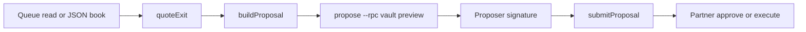
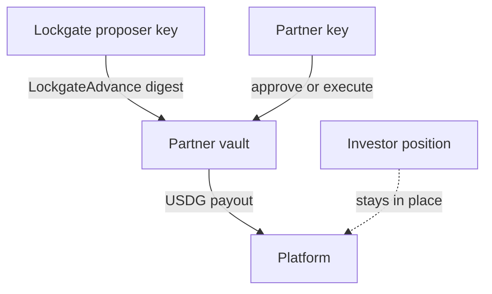

# Lockgate engine

You can price an exit, build the `AdvanceProposal` the partner vault verifies, and file `submitProposal` without moving USDG. After the quick start you can run a quote, see why a quote is refused, and sign only when the vault would accept the terms.

The engine does not hold a partner key, does not send `execute` or `approve`, and does not deploy. Fee math, queue clocks, and the worked examples live in [MODEL.md](MODEL.md). The CRE stand-in lives in [cre/CRE.md](cre/CRE.md). Setup, environment names, and recovery for each exit code live in [Operator runbook](docs/operator-runbook.md). What you can rely on at version `0.1.0` lives in [API stability](docs/api-stability.md). Findings from the signing review live in [../docs/SECURITY-NOTES-engine.md](../docs/SECURITY-NOTES-engine.md).

## Progress

- 2026-10-01. Pricing, risk, four queues, Kasu / Maple / USD.AI readers, proposals, router, sweeper, alerts, backtest, CRE tick, CLI.
- 2026-10-02. Peg stop, stage-3 facility sizing, one `LockgateAdvance` digest, Anvil stages 1–3 on a port from 8546.
- 2026-10-02. Chain allowlist, vault snapshot checks, proposer check, `propose --rpc` preview, in-process replay guard, sweep clock bound.
- 2026-10-02. CLI `respond` and CRE `creEntry` zod-check their inputs and return `{ error, code }` with no stack.
- 2026-10-02. Usage section for every command, with inputs in `fixtures/sepolia/` (chain 421614, no public RPC).
- 2026-10-02: engine curve and rounding now equal PricingEngine/PricingMath. Defaults match the constructor (kink APR 1,200, concentration cap 10,000, premium 0), the fee amount rounds up, and a raw fee above `maxFeeBps` is refused (`max-fee`) instead of clamped. The 30-day epoch is 101 bps. Earlier dated lines below that say 109 or half-up are history.
- 2026-10-02. Recorded queue regression locks `submitProposal` bytes. A later epoch on the same platform is priced above the clean 109 bps epoch once a slash is in history. A 90-day gate prices above a busy 30-day epoch. The weekly and covered FIFO rows stay on the 25 bps floor. A second platform keeps the clean epoch fee.
- 2026-10-02. Recorded sweep regression locks `repay` and `markLate` calldata. Cash equal to face is repay. One second inside grace is repay. The grace instant is mark-late. Partner rows are not sendable.
- 2026-10-02. Removed unused `digestOf`. The demo quote reads `DEMO_TIME_SCALE`. No source file calls `console`. Every TypeScript file is at or under 300 lines.
- 2026-10-02. Stage-3 adapter fixtures replay Kasu, Maple, and sUSDai. A stale Kasu epoch is kept and one failed tranche drops the queue price. Maple still prices shares when `totalAssets` fails. A past sUSDai timestamp rolls forward and cash is still reported.
- 2026-10-02. Those fixtures are positional. sUSDai `pending` is index 3. Maple `shares` is index 1. A Kasu deposit NFT is skipped, and a failed Maple request aborts the scan. An unpriced Kasu tranche quotes as illiquid. Maple quotes the 30-day unknown-cash wait. A past sUSDai timestamp is not the due time. A zero redemption balance does not keep the caller's cash per epoch. A CRE tick applies one of those reads and skips the exit when the quote is illiquid.
- 2026-10-02. Logs are JSON lines at `debug`, `info`, `warn`, and `error`. `LOCKGATE_LOG_LEVEL` defaults to `info`. Secret field names and 32-byte hex values are `[redacted]`. Each sweep writes one report file.
- 2026-10-02. A clean contract build matches the engine digest, quote id, and `submitProposal` calldata. `repay` and `markLate` match the credit line. `IPartnerVault` does not declare `payoutTo`; the vault implementation does, and the engine reads that selector.
- 2026-10-02. Config and mandate documents are version 2. JSON Schema ids are `lockgate://schema/config/2` and `lockgate://schema/mandate/2`. A version 1 mandate names the tenor `maxTenor`; the loader copies it to `maxTenorSeconds`.
- 2026-10-02. The published schemas reject `maxTenor` and an amount that is not a decimal string or a safe integer. `canonicalMandate` and `canonicalConfig` are the documents those schemas accept. A sweep report lists `late`, `cash-short`, and `partner-repay` alerts beside the action list.
- 2026-10-02. `--dry-run` on every command returns `{ dryRun, command, sent: false, actions }`. It does not sign, dial an RPC, write a sweep report, or send. `submitProposal`, `repay`, and `markLate` throw `refused` while it is on.
- 2026-10-02. Operator runbook: setup, `LOCKGATE_LOG_LEVEL`, the `--sign-env` name, every command, and recovery for `usage`, `param`, `amount`, `mainnet-forbidden`, and `internal`. The commands were run locally on `fixtures/sepolia/`.
- 2026-10-02. Kasu `readKasu` calls tranche `asset()` and then that token's `decimals()`. It prices `convertToAssets` only when decimals is 6 and sets `poolDecimals` to 6. A caller decimal count is not an input. Any other decimals, or a failed read, leaves `poolDecimals` null and the quote illiquid. `applyKasuRead` does the same for a CRE payload. A 6-decimal pool token does not show that the underlying payment token is USDC.
- 2026-10-02. Clean install with `npm ci` on Node v24.14.0 (70 packages). `npm run typecheck` exited 0. `npm run lint` passed 1 test in 1 file (04:01:27, 200ms). `npm test` passed 128 tests in 32 files (04:01:27, 13.67s, 0 failed). That run did not include `forge test` or the harness suite.
- 2026-10-02. A successful decision command appends one sha256-linked line to `audit/decisions.jsonl` or `--audit`. The line keeps the redacted result. `example` and a thrown command do not append. `npm run typecheck` exited 0. `npm run lint` passed 1 test in 1 file (04:17:51, 192ms). `npm test` passed 132 tests in 33 files (04:17:52, 13.91s, 0 failed). That run did not include `forge test` or the harness suite.
- 2026-10-02. `backtest --report <dir>` writes `backtest-report.md` and `backtest-report.json` for the six recorded scenarios. Each row is `synthetic` or `sourced`. The catalog is synthetic. A sourced row needs an http(s) URL. `npm run typecheck` exited 0. `npm run lint` passed 1 test in 1 file (04:24:51, 220ms). `npm test` passed 135 tests in 34 files (04:24:52, 14.18s, 0 failed). That run did not include `forge test` or the harness suite.
- 2026-10-02. API stability note: the package is private at `0.1.0`. The CLI, the `{ error, code }` object, `LockgateAdvance` version `1`, and the schema ids are the stable surface. The `src/index.ts` barrel is not a published contract.
- 2026-10-02. A failure from the CLI or CRE entry is `{ error, code }` with no stack. A transport failure is code `rpc` and the message `rpc request failed`. The URL and the response body are not included. `npm run typecheck` exited 0. `npm run lint` passed 1 test in 1 file (04:50:02, 281ms). `npm test` passed 153 tests in 35 files (04:50:03, 5.84s, 0 failed). That run did not include `forge test` or the harness suite.
- 2026-10-02. Each Kasu, Maple, and sUSDai read paces its own calls. The first 32 calls start at once. A later call waits 100 ms. A transport failure or HTTP 429 is tried up to 3 times, waiting 100 ms and then 200 ms. A decode error is tried once. When the tries are spent, the public error is still code `rpc` and the message `rpc request failed`, with no URL or body. `npm run typecheck` exited 0. `npm run lint` passed 1 test in 1 file (05:03:34, 243ms). `npm test` passed 160 tests in 36 files (05:03:35, 14.45s, 0 failed). That run did not include `forge test` or the harness suite.
- 2026-10-02. Final check. Every `src` and `test` TypeScript file is at or under 300 lines. The longest is `test/errors.test.ts` at 286 lines. No source file calls `console`. `npm run typecheck` exited 0. `npm run lint` passed 1 test in 1 file (05:07:26, 204ms). `npm test` passed 160 tests in 36 files (05:07:27, 13.78s, 0 failed). That run did not include `forge test` or the harness suite.
- 2026-10-02. A fuzz of 100 random queue states signs only when the advance stays inside the mandate. A signable proposal stays within the platform limit, the tenor, the concentration cap, idle cash, and the vault asset cap. Tightening any one of those refuses the proposal. `npm run typecheck` exited 0. `npm run lint` passed 1 test in 1 file (05:13:50, 248ms). `npm test` passed 161 tests in 37 files (05:13:50, 14.71s, 0 failed). That run did not include `forge test` or the harness suite.
- 2026-10-02. Property checks no longer skip a quote that fails to sign. Every generated pricing and proposal case is available, and the fee, the half-up rule, and the facility draw are exact. The epoch CLI quote is pinned at 109 bps. `npm run typecheck` exited 0. `npm run lint` passed 1 test in 1 file (05:22:03, 232ms). `npm test` passed 161 tests in 37 files (05:22:03, 14.28s, 0 failed). That run did not include `forge test` or the harness suite.
- 2026-10-02. The same inputs and seed build the same proposal. `guardProposal` fixes the clock check from the seed and builds twice. A changed fingerprint throws. A different seed moves only the one-day clock gate. `npm run typecheck` exited 0. `npm run lint` passed 1 test in 1 file (05:28:14, 228ms). `npm test` passed 164 tests in 38 files (05:28:15, 14.26s, 0 failed). That run did not include `forge test` or the harness suite.
- 2026-10-02. Full suite after that guard. The known gaps below are unchanged. `npm run typecheck` exited 0. `npm run lint` passed 1 test in 1 file (05:33:49, 199ms). `npm test` passed 164 tests in 38 files (05:33:49, 13.89s, 0 failed). That run did not include `forge test` or the harness suite.
- 2026-10-02. A missing command or `--file`, an extra word, a flag the command does not accept, a malformed value, a repeated flag, and `--dry-run` with a value each return `{ error, code }`. The known gaps below are unchanged. `npm run typecheck` exited 0. `npm run lint` passed 1 test in 1 file (05:42:49, 213ms). `npm test` passed 169 tests in 39 files (05:42:49, 14.11s, 0 failed). That run did not include `forge test` or the harness suite.
- 2026-10-02. Replaying `fixtures/regression/queue-scenario.json` hashed and encoded each proposal twice. The filing is hashed once. The recorded proposal bytes are unchanged. Before, `replayRecordedQueue` took 1686.6 µs and `buildProposal` took 184.6 µs. After, those times are 1113.8 µs and 118.1 µs. The known gaps below are unchanged. `npm run typecheck` exited 0. `npm run lint` passed 1 test in 1 file (05:48:58, 242ms). `npm test` passed 170 tests in 39 files (05:48:59, 14.23s, 0 failed). That run did not include `forge test` or the harness suite.
- 2026-10-02. Direct dependencies are pinned to the versions already installed. No package was unused. `viem` is 2.57.2, `zod` is 4.6.5, `@types/node` is 24.19.0, `fast-check` is 4.10.2, `typescript` is 5.9.3, and `vitest` is 3.2.7. `npm audit --omit=dev` reports no vulnerabilities. The dev advisory below is unchanged, and `npm audit fix --force` was not run. `npm run typecheck` exited 0. `npm run lint` passed 1 test in 1 file (05:53:26, 259ms). `npm test` passed 170 tests in 39 files (05:54:52, 14.25s, 0 failed). That run did not include `forge test` or the harness suite.
- 2026-10-02. The default queue scan is 100 entries, and a larger request is cut to 256. A longer Maple queue is not read, and its value stays unset. A longer Kasu queue prices only the scanned prefix, and that prefix is not signed. `quoteId` still leaves out the nonce, the recipient, and the vault. Sweep routes `repay` by advance id, and a partner vault stays unsent. `npm run typecheck` exited 0. `npm run lint` passed 1 test in 1 file (06:08:07, 210ms). `npm test` passed 178 tests in 41 files (06:08:07, 8.12s, 0 failed). That run did not include `forge test` or the harness suite.
- 2026-10-02. `test/anvil/g10-deploy.test.ts` reads `harness/deployments/31337.json` and files `submitProposal` on that vault when the node is up. It skips when `127.0.0.1:8546` is down, the chain id is not 31337, or `PartnerVaultA` has no code. A proof run against a fresh local deploy, using a temporary manifest rather than the committed file, filed the proposal and left balances unchanged. The partner then approved. That approval paid the payout, set `nonceUsed`, and set `owed` to the NAV. The engine did not send the approval. This suite skipped that test because the committed vault address had no code on the local node. `npm run typecheck` exited 0. `npm run lint` passed 1 test in 1 file (06:24:54, 196ms). `npm test` passed 178 tests and skipped 1, 179 tests in 42 files (06:24:54, 14.18s, 0 failed). That run did not include `forge test` or the harness suite.
- 2026-10-02. Full suite after that integration test. The known gaps below are unchanged. The G10 test skipped because `127.0.0.1:8546` was down. `npm run typecheck` exited 0. `npm run lint` passed 1 test in 1 file (06:29:59, 201ms). `npm test` passed 178 tests and skipped 1, 179 tests in 42 files (06:30:00, 6.27s, 0 failed). That run did not include `forge test` or the harness suite.
- 2026-10-02. `check --file` reads a config and writes `{ ok, findings }`. Each finding names `mandate`, `adapter`, or `limit`. A valid file has `ok` true. An invalid file still exits 0 with `ok` false. `fixtures/sepolia/cre.json` is valid and has no adapter read. The G10 test skipped because `127.0.0.1:8546` was down. `npm run typecheck` exited 0. `npm run lint` passed 1 test in 1 file (06:38:51, 228ms). `npm test` passed 182 tests and skipped 1, 183 tests in 43 files (06:38:52, 17.67s, 0 failed). That run did not include `forge test` or the harness suite.
- 2026-10-02. Full suite after that config check. The known gaps below are unchanged. The G10 test skipped because `127.0.0.1:8546` was down. `npm run typecheck` exited 0. `npm run lint` passed 1 test in 1 file (06:42:07, 213ms). `npm test` passed 182 tests and skipped 1, 183 tests in 43 files (06:42:08, 5.68s, 0 failed). That run did not include `forge test` or the harness suite.
- 2026-10-02. `check` prices each request the way `cre-tick` does. `ok` is true only when the routed vault would sign. A gated book, a stale NAV, idle cash under the payout, a missing request id, a paused vault the router picks, vault cash under the NAV, and a quote more than a day ahead of this machine each set `ok` false. A quote clock one day ahead still signs, and that slack stays a known gap. The G10 test skipped because `127.0.0.1:8546` was down. `npm run typecheck` exited 0. `npm run lint` passed 1 test in 1 file (06:56:07, 208ms). `npm test` passed 187 tests and skipped 1, 188 tests in 44 files (06:56:08, 6.68s, 0 failed). That run did not include `forge test` or the harness suite.
- 2026-10-02. Final check after a clean install. `npm ci` on Node v24.14.0 added 70 packages and audited 71. `npm audit --omit=dev` reports no vulnerabilities. The dev audit lists GHSA-82fw-gwwq-j7x9 on `vitest` and `@vitest/mocker`. `npm audit fix --force` was not run. Every `src` and `test` TypeScript file is at or under 300 lines. The longest is `test/check.test.ts` at 288 lines. No source file calls `console`. The secret scan found no `.env` file and no private key under `src`, `docs`, or `fixtures`. Tests use the public Anvil keys. The G10 test skipped because `127.0.0.1:8546` was down. `npm run typecheck` exited 0. `npm run lint` passed 1 test in 1 file (07:00:58, 230ms). `npm test` passed 187 tests and skipped 1, 188 tests in 44 files (07:00:59, 6.99s, 0 failed). That run did not include `forge test` or the harness suite.
- 2026-10-02. Fixture stubs cover the G4 redemption shapes that do not already have a reader. Kasu, Maple, and sUSDai stay the live weekly, FIFO, and epoch readers. ACRED's 1 Oct 2026 notice and 30 Oct 2026 request deadline set a quarterly window, and neither 5% sentence becomes the fee. A 7-day Pareto cycle sets one epoch when a start is already present. Re, GAIB, 3Jane, HYBOND, Fullerton, and TradeFlow do not receive an invented clock. The stubs do not dial, and `cre-tick` does not read them. The G10 test skipped because `127.0.0.1:8546` was down. `npm run typecheck` exited 0. `npm run lint` passed 1 test in 1 file (07:09:41, 221ms). `npm test` passed 192 tests and skipped 1, 193 tests in 45 files (07:09:41, 6.79s, 0 failed). That run did not include `forge test` or the harness suite.
- 2026-10-02. Final cleanup. The usage section says a sweep writes its JSON report only when the command is not a dry run. `check` on a JSON array exits 1 with code `param` and message `config must be an object`. No production file contains a TODO. `src` and `test` are 106 TypeScript files, all at or under 300 lines. The longest is `test/check.test.ts` at 288 lines. No source file calls `console`. The G10 test skipped. After the run, `127.0.0.1:8546` had no listener. `npm run typecheck` exited 0. `npm run lint` passed 1 test in 1 file (07:19:03, 316ms). `npm test` passed 192 tests and skipped 1, 193 tests in 45 files (07:19:03, 15.64s, 0 failed). That run did not include `forge test` or the harness suite.
- 2026-10-02. `examples/` holds a version 2 epoch mandate, a version 1 mandate that names `maxTenor`, and two propose bodies. `test/examples.test.ts` parses them with the mandate and propose zod schemas. The version 1 file does not match the version 2 schema. Each propose body keeps the matching sample mandate and `DEFAULT_PARAMS`. The G10 test skipped. After the run, `127.0.0.1:8546` had no listener. `npm run typecheck` exited 0. `npm run lint` passed 1 test in 1 file (07:27:26, 345ms). `npm test` passed 195 tests and skipped 1, 196 tests in 46 files (07:27:26, 16.51s, 0 failed). That run did not include `forge test` or the harness suite.
- 2026-10-02. `examples/` adds a quarterly mandate and a fifo mandate, plus the matching propose bodies. `advanceMessageSchema` checks the built `AdvanceProposal`: a uint16 fee, uint64 timestamps, a 32-byte quote id, and payout plus fee equal to nav. Each sample builds with the quote clock as the wall and is submittable. The epoch fee is 109 bps. The weekly wait is 432,000 seconds and the fifo wait is 86,400 seconds, both at 25 bps. The quarterly wait is 7,776,000 seconds at 328 bps. The epoch limit key stays lowercase while the signed platform is checksummed. The G10 test skipped. After the run, `127.0.0.1:8546` had no listener. `npm run typecheck` exited 0. `npm run lint` passed 1 test in 1 file (07:42:55, 251ms). `npm test` passed 196 tests and skipped 1, 197 tests in 46 files (07:42:56, 7.05s, 0 failed). That run did not include `forge test` or the harness suite.
- 2026-10-02. `cre-sweep` is the offline CRE simulation for a sweep. The input is the sweep book plus a cron `schedule`. A 6-field cron closer than 30 seconds is refused. The result sets `onReportCalled` false and `broadcast` false. Chain 421614 records the directory mock forwarder `0xd41263567ddfead91504199b8c6c87371e83ca5d`. Chain 11155111 records `0x15fC6ae953E024d975e77382eEeC56A9101f9F88`. Chain 31337 leaves the forwarder address empty. A partner repay stays unsendable. The G10 test skipped. After the run, `127.0.0.1:8546` had no listener. `npm run typecheck` exited 0. `npm run lint` passed 1 test in 1 file (07:52:36, 208ms). `npm test` passed 201 tests and skipped 1, 202 tests in 47 files (07:52:37, 14.51s, 0 failed). That run did not include `forge test` or the harness suite.

## Quick start

Node 22 or newer. From this directory:

```bash
npm install
npm test
npm run typecheck
npx vite-node src/cli.ts example --name epoch > /tmp/lockgate-epoch.json
npx vite-node src/cli.ts quote --file /tmp/lockgate-epoch.json
```

`npm test` needs `forge` on `PATH`. It starts an Anvil on the first free port from 8546 and stops that process. Leave the shared Anvil on 8545 alone.

The epoch quote reports `feeBps` 101 and `available` true. That is 101 USDG on a 10,000 USDG face, at a 12% APR and a 30-day wait. `tsx` is not a dependency. Node's type stripper does not rewrite the `.js` import specifiers, so the CLI entry is `npx vite-node src/cli.ts`.

## Path from quote to file



`quote`, `score`, `alerts`, and `backtest` stop at the quote. `propose` builds the digest. Add `--rpc` before you sign against a deployed vault. `sweep` plans `repay` and `markLate` for the stage-1 credit line. `facility` sizes a stage-3 draw and does not send it.

## Usage

Run the commands below from this directory. Each one writes one JSON object to stdout and a JSON log line to stderr. Amounts are decimal strings of 6-decimal USDG units. A refused quote is a successful result: exit 0, `available: false`, and `blocks`. Bad input writes `{ "error", "code" }` to stderr and exits 1. The stack is not included. Recovery for each code is in the [operator runbook](docs/operator-runbook.md).

The files in [fixtures/sepolia/](fixtures/sepolia/) are the inputs for the file commands. `propose.json`, `sweep.json`, and `cre.json` set `chainId` to 421614 (Arbitrum Sepolia). Nothing in this section calls the public Sepolia RPC or sends a transaction.

### Inputs

`quote`, `score`, and `alerts` read the same file. `example` and `backtest` take a flag instead of a file.

| File | Commands | What the file holds |
|---|---|---|
| `fixtures/sepolia/quote.json` | `quote`, `score`, `alerts` | `{ input, params }` for the epoch example. `input.kind` is `epoch`. `params.timeScale` is 1. |
| `fixtures/sepolia/propose.json` | `propose` | The quote file plus `platform`, `recipient`, `chainId` 421614, `nonce`, and `mandate` (`vault`, `signer`, `approvedPlatforms`, `platformLimits`, `minFeeBps`, `maxTenorSeconds`, `concentrationCapBps`, `expiresAt`, `payoutTo`, `idle`, `totalAssets`). |
| `fixtures/sepolia/sweep.json` | `sweep` | `chainId`, `now`, `graceSeconds`, and `advances` (`id`, `vault`, `platform`, `navValue`, `dueAt`, `status`, `cash`, `vaultKind`). |
| `fixtures/sepolia/facility.json` | `facility` | Cash, drawn, senior and junior principal, APR and advance-rate bps, late and junior bands, `recovery`, book totals, and `payout`. No chain id. This command does not transact. |
| `fixtures/sepolia/cre.json` | `cre-tick`, `check` | `chainId` 421614, `now`, `params`, `policy`, `vaults`, and `requests`. Same shape as [cre/config.json](cre/config.json), which stays on chain 31337. |
| `fixtures/sepolia/cre-sweep.json` | `cre-sweep` | Sweep book plus `schedule`. Chain 421614. The local twin is [cre/sweep-config.json](cre/sweep-config.json) on chain 31337. |

`example --name` accepts `weekly`, `epoch`, `quarterly`, `fifo`, or `demo`. `backtest --scenario` accepts `epoch-repay`, `kasu-repay-slash`, `gated-refuse`, `stale-refuse`, `busy-book`, or `reserve-short`.

### Commands

Copy this block from `engine/`. The paragraph under it is the stdout those files produce.

```bash
npx vite-node src/cli.ts example --name epoch
npx vite-node src/cli.ts quote --file fixtures/sepolia/quote.json
npx vite-node src/cli.ts score --file fixtures/sepolia/quote.json
npx vite-node src/cli.ts alerts --file fixtures/sepolia/quote.json
npx vite-node src/cli.ts propose --file fixtures/sepolia/propose.json
npx vite-node src/cli.ts propose --file fixtures/sepolia/propose.json --sign-env LOCKGATE_PROPOSER_KEY
npx vite-node src/cli.ts sweep --file fixtures/sepolia/sweep.json
npx vite-node src/cli.ts facility --file fixtures/sepolia/facility.json
npx vite-node src/cli.ts backtest --scenario epoch-repay
npx vite-node src/cli.ts cre-tick --file fixtures/sepolia/cre.json
npx vite-node src/cli.ts cre-sweep --file fixtures/sepolia/cre-sweep.json
npx vite-node src/cli.ts check --file fixtures/sepolia/cre.json
```

`check` writes `{ ok, findings }`. Each finding names `mandate`, `adapter`, or `limit`, plus `path`, `ok`, `code`, and `message`. It prices each request the way `cre-tick` does, and `ok` is true only when the routed vault would sign. On `fixtures/sepolia/cre.json`, `ok` is true. That file has no adapter read, so the adapter finding is `none`. An invalid config still exits 0, and `ok` is false. A file that is not a JSON object exits 1 with `{ "error": "config must be an object", "code": "param" }`.

A successful `quote`, `score`, `alerts`, `propose`, `sweep`, `facility`, `backtest`, `cre-tick`, `cre-sweep`, or `check` also appends one line to `audit/decisions.jsonl`, or to the file passed as `--audit`. `example` does not append. A thrown command does not append. The line stores the redacted result and whether the command was a dry run. A signature is `[redacted]`. `digest`, `calldata`, `quoteId`, and `hash` stay. The directory is gitignored. `replayAudit` reads the file and throws `tamper` when a line's hash, sequence, or previous link does not match.

On these files the epoch quote is `available: true`, `feeBps` 101, `fee` `101000000`, and `payout` `9899000000`. `score` returns a `bps` value with `repayment`, `queue`, `gating`, `nav`, and `concentration`. `alerts` returns `[]`. `propose` returns `submittable: true`, `domain.chainId` 421614, and `signature: null` until you pass `--sign-env`. `sweep` returns one `repay` action with `sendable: true` and does not broadcast it. `--dry-run` on any command returns `sent: false` and one action per intended step. Each action has `send: false`. A dry-run propose does not sign and does not call `--rpc`. A dry-run sweep does not write a report. A sweep that is not a dry run writes one JSON report for that run under `reports/`, or under the directory passed as `--report`. The report repeats the plan and adds a count for each action kind. Stdout stays the action list. Log lines on stderr are JSON with `ts`, `level`, and `event`. `LOCKGATE_LOG_LEVEL` accepts `debug`, `info`, `warn`, or `error`. The default is `info`. A field whose name matches a key or secret, and a bare 32-byte hex value, is written as `[redacted]`. `digest`, `calldata`, `quoteId`, and `hash` are left as written. `facility` returns `solvent: true`, `availableDraw` `700000`, and `canFund: true`. `backtest --scenario epoch-repay` returns `feeEarned` `101000000`, `loss` `0`, and `refused` 0. `--report <dir>` also writes `backtest-report.md` and `backtest-report.json` for every recorded scenario. Each row is `synthetic` or `sourced`. A sourced row names an http(s) URL. The recorded catalog is synthetic. A dry run does not write those files. Stdout stays the one scenario. `cre-tick` returns one submittable proposal on chain 421614 and does not broadcast. `cre-sweep` returns a simulation with `onReportCalled` false, `broadcast` false, and one `repay` action. On chain 421614 the forwarder is the directory mock. It does not broadcast.

`--sign-env` names an environment variable that holds a hex key. The process does not print that key. Do not write a key into a file you will commit. Add `--rpc http://127.0.0.1:8546` only when that URL is a vault you deployed locally and its chain id matches the file. These fixtures do not include a deployed vault. A URL the process cannot reach exits 1 with code `rpc` and the message `rpc request failed`. It does not sign, and it does not print the URL or the response body.

### Error codes

The process writes one of these codes when it exits 1. A quote the model refuses still exits 0.

| Code | When the process exits 1 |
|---|---|
| `usage` | Unknown command, unexpected argument or flag, a flag with no value, a missing `--file`, a missing file, or a name outside the example or scenario lists. |
| `param` | Invalid JSON, a number outside the safe integer range, a body that fails the command schema, a `--rpc` value that is not an `http` or `https` URL, or a `--sign-env` name or value that is missing or not hex. |
| `amount` | `navValue` is below 1 USDG or above 1e12 USDG. |
| `mainnet-forbidden` | `propose`, `sweep`, `cre-tick`, or `cre-sweep` is asked to use a chain id other than 31337, 421614, or 11155111. Chain 42161 is refused. |
| `rpc` | `propose --rpc` could not complete the call. The message is `rpc request failed`. The URL, the body, and the stack are not included. |
| `internal` | The process caught an unexpected error, including an audit log or a sweep report it could not write. The message is one line. The stack is not included. |
| `tamper` | The audit file's hash chain does not match. The process does not append another line. |

## Design decisions

These are the choices that change a call. The arithmetic is in [MODEL.md](MODEL.md).



| Decision | What you do because of it |
|---|---|
| One digest | Sign `LockgateAdvance` version `1`, verifying contract = the vault. There is no second type string. |
| Audit log | A successful decision command appends one redacted line. Replay checks that sha256 chain. This is separate from the in-process filing replay set. |
| Advance, not a purchase | The vault pays the platform `nav − fee`. The investor token does not move. |
| Fee band | Protocol fee is 25 to 1,500 bps. A 30-day epoch at 12% APR is 101 bps before a busier book. |
| Reserve band | `reserveBps` outside 500–1,000 refuses the quote. The posted reserve is still checked on the vault. |
| Stage-2 technology fee | Not inside this quote. This model prices the advance only. |
| Allowlist | Signing and broadcasting allow 31337, 421614, and 11155111. Every other chain id is refused. Reads of public contracts are still allowed. |
| No partner send | Calldata is `submitProposal` only. `broadcastOwnBook` sends `repay` or `markLate` to the named credit line. |
| Vault before signature | `submitProposal` stores the digest and does not preview. `--rpc` will not sign a file that disagrees with the vault, a nonce the vault already holds, or a `preview` other than `None`. |
| Replay | A file whose send returned is not sent again in this process. A send that throws can be retried. |
| Rounding | Queued token amounts round up. Cash and NAV round down. The advance fee amount rounds up (ceil, like `PricingMath.feeFromBps`), which stays at least the vault's floored minimum. |
| Partial scans | The default scan is 100 entries and the ceiling is 256. A proposal never signs a truncated scan. `allowPartialScan` does not lift that refusal. |
| Clock | A quote more than one day ahead of this machine is not signed. |

`timeScale` is 1 for production. The demo example uses 4,320 so a 600-second window prices as 30 days. Tenor checks still use wall-clock seconds.

## Layout

`src/quote.ts` prices. `src/pricing/` is the curve, the peg check, and defaults. `src/risk/score.ts` scores. `src/adapters/` waits and reads Kasu, Maple, and USD.AI. `src/adapters/stubs.ts` decodes fixture clocks for the other G4 redemption shapes and does not dial. `src/proposal/` builds the digest, files `submitProposal`, routes a vault, signs, and reads the vault. `src/facility/` sizes the stage-3 book. `src/sweep/` plans repayment. `src/backtest/` replays named scenarios and writes the recorded report. `src/cre/tick.ts` is the cron stand-in. `src/alert/` records alerts. `src/audit/` appends the hash-chained decision log. `examples/` holds sample mandate documents and propose bodies for each queue kind. `test/examples.test.ts` parses them with the zod schemas and builds a submittable `AdvanceProposal` from each body. `test/anvil/` deploys the current contracts and runs stages 1–3. It loads bytecode with `forge inspect` on a source path, because `MockUSDG.sol` is also the name of a test mock.

The edit surface for this package is `engine/**`. Reads of public contracts are allowed. Sends on a chain outside the allowlist are not.

## Known gaps

The latest run above is the engine suite: 201 passed and 1 skipped, 202 tests in 47 files, start 07:52:37, duration 14.51s, 0 failed. Typecheck exited 0. Lint passed 1 test in 1 file (07:52:36, 208ms). It does not include `forge test` or the harness suite.

- A Kasu tranche whose pool token reports 6 decimals is priced in 6-decimal units. That does not prove the underlying payment token is Circle USDC. `_underlyingAsset` has no public getter, and the DefiLlama adapter lists Base USDC, Plume pUSD, and XDC AUDD. The payment token on a live pool stays [U] until a public view shows it. https://github.com/Kasu-Finance/kasu-contracts/blob/master/src/core/lendingPool/LendingPool.sol https://github.com/Kasu-Finance/kasu-contracts/blob/master/src/core/AssetFunctionsBase.sol https://github.com/DefiLlama/dimension-adapters/blob/master/fees/kasu.ts
- You supply utilization, cash, and platform NAV. `propose` without `--rpc` can sign a snapshot the vault rejects later. With `--rpc`, the engine refuses a disagreeing vault field, a used nonce, or a preview other than `None`.
- `quoteId` leaves out the nonce, the recipient, and the vault. Two advances can share it. Sweep routes `repay` and `markLate` by advance id, and a partner vault stays unsent.
- The replay set lives in this process. A new process does not see it. The vault keeps that nonce until the owner cancels it.
- The signer accepts a quote clock up to one day ahead of this machine, so NAV age or oracle age can be understated by that day. A quote at that one-day mark still signs. One second past it is `clock`. `check` uses the same machine clock.
- The default queue scan is 100 entries. A requested scan above 256 is cut to 256. A longer Maple queue is not read, and its value stays unset. A longer Kasu queue prices only the scanned prefix. Applying that read keeps the tail out of the quote, and the proposal is not signed. `allowPartialScan` does not lift that refusal.
- The audit log records CLI decisions only. `example`, a thrown command, and a direct library call are not rows. Deleting a suffix of the file still replays, because that prefix still links to the genesis hash. A changed body, a swapped row, a removed middle row, or a replaced hash does not.
- The recorded backtest catalog is synthetic. It is not a live platform tape. A sourced row is accepted only when the caller supplies an http(s) URL.
- Category stubs for a quarterly repurchase, a two-cycle vault, a buffer-or-window, a calendar cohort, a lock-then-cooldown, and a capped FIFO do not dial and are not `cre-tick` reads. A page that does not print a clock does not get one.
- `npm audit --omit=dev` reports no vulnerabilities. `npm audit` lists one moderate advisory, GHSA-82fw-gwwq-j7x9 (CVE-2026-84373), on both `vitest` and `@vitest/mocker`. Vitest is pinned at 3.2.7 in `package.json` and the lockfile. Patched releases are 4.1.11 and 5.0.0; the 3.x line has no planned fix. `npm audit fix --force` was not run. https://github.com/advisories/GHSA-82fw-gwwq-j7x9
