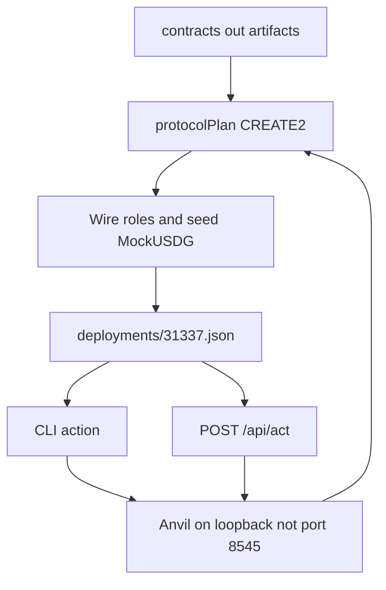

# Harness

You can deploy the Lockgate contracts onto a local Anvil, then drive stage 1, door 2, stage 2, and stage 3 from the CLI or the loopback test console. After the quick start you can run the suite, print every action, and point a command at a manifest you just wrote.

The stage map, the CREATE2 set, and the signature domain are in [../docs/ARCHITECTURE.md](../docs/ARCHITECTURE.md). How the suites are run is in [../docs/TESTING.md](../docs/TESTING.md). The review findings are in [../docs/SECURITY-NOTES-harness.md](../docs/SECURITY-NOTES-harness.md). This page is not the product and not an offer.

## Quick start

Foundry and Node 22 or newer. From this directory:

```bash
npm install
npm test
npm run cli -- help
```

`npm test` builds `contracts/` with `forge build --skip test`, builds `harness/fixture`, and runs `harness/test`. It starts an Anvil on a free loopback port other than 8545 and stops that process. Leave the shared Anvil on 8545 alone.

`help` writes one block per action to stdout. A flag line is the field name and the default the console uses. `stage2.repay` has `--exitRef` and no default.

```text
stage1.quote - Quote an exit on the credit line
  --navUsdg 1000
  --platform WeeklyQueuePlatform
```

## Drive one local chain

Run this in `lockgate/repo/harness` after `npm install`. `npm run anvil` listens on `127.0.0.1:8546` and writes `harness/.anvil.pid`. Port 8545 is refused.

```bash
npm run anvil
HARNESS_RPC=http://127.0.0.1:8546 npm run deploy:local
HARNESS_RPC=http://127.0.0.1:8546 npm run cli -- read.status
HARNESS_RPC=http://127.0.0.1:8546 npm run serve
```

`deploy:local` prints one JSON object: `mode`, `chainId` 31337, the CREATE2 factory, and the contract map. It writes `harness/deployments/31337.json` only after the seed mint. A deploy that stops earlier, including `NOT_FRESH` when the Lockgate nonce is not 0, leaves that file as it was. Start the next attempt from a fresh Anvil.

`read.status` prints balances, the credit line, the vaults, and the facility. Amounts you pass on the CLI are decimal strings with at most 6 places, such as `--navUsdg 1000`.

`serve` binds `127.0.0.1` and defaults to port 18910. Open `http://127.0.0.1:18910/`. The page title is "Lockgate test console". `GET /api/surface` lists the same actions as `help`. `POST /api/act` takes `{ "action", "input" }` where every input value is a string. A number, a boolean, or a body over 8 KiB returns 400 `VALIDATION` and does not call the chain. An unknown action returns 422. A failed command or HTTP call returns `{ "error", "code" }` and does not print a stack or a private key.

```bash
npm run cli -- stage1.quote --navUsdg 1000 --platform WeeklyQueuePlatform
npm run cli -- demo.all
```

`demo.all` runs stage 1, door 2, stage 2, and stage 3 on the chain the manifest names. It needs the fresh deploy above. The 600, 1800, and 3600 second windows are harness clocks.

## Path from Anvil to a call



The Sepolia script is a separate path. It does not use this manifest and it does not call `assertLocalRpc`.

## Design decisions

- The deploy uses the bytecode in `contracts/out`. `harness/fixture/src` is not the protocol. The fixture contracts the harness still deploys are `Create2Factory`, `ERC1967Proxy`, and, only inside the failure test, `PegOracle`.
- The CREATE2 salt is `lockgate.protocol.<logical>.v1`. The same factory and init code produce the same address on every fresh Anvil. Constructors still run in plan order because later contracts store earlier addresses.
- A locked platform implementation is constructed with a zero token, so `initialize` on that copy reverts. `FundFactory.createPlatform` clones one of those copies and starts at zero shares. The weekly short-cash demo uses a direct CREATE with unbacked shares, because a clone cannot mint that first balance without taking USDG.
- The facility governor is Anvil account 7. The borrower is account 0. The facility constructor reverts when those two addresses match. Lender approval is sent as the governor. `draw` is sent as the borrower.
- Stage-1 fees use ceiling division in `feeFromBps`. A partner fee stays on the router slice, which is half-up. The local curve does not clamp at 1500 bps. The chain rejects a quote above that cap.
- `quoteId` on the signed proposal is the exit ref `relayRepay` reads. The EIP-712 verifying contract is the vault. The vault address is not a field of the struct. Domain name `LockgateAdvance`, version `1`. See [../docs/ARCHITECTURE.md](../docs/ARCHITECTURE.md).
- A draft checks the payout, the nonce, and `preview` of that struct before it returns. The failure test still submits a proposal the vault will reject, by calling `submitProposal` directly, so that path stays visible.
- Writes from this package require chain 31337 and an `http` or `https` URL on `127.0.0.1`, `localhost`, or `::1`, with an explicit port other than 8545. The published Anvil keys in `src/roles.ts` are the Foundry development keys. Do not fund them on a public network. https://book.getfoundry.sh/anvil/
- The console has no login. Anything that can open `127.0.0.1` can move the test USDG. Acts on `POST /api/act` run one at a time. The lock is not inside `send`, so `demo.all` can call several actions without waiting on itself.
- `npm run deploy:sepolia` returns `SEPOLIA_BLOCKED` until `LOCKGATE_ALLOW_SEPOLIA_DEPLOY=1`. It then requires a node that reports chain 421614 and `DEPLOYER_PRIVATE_KEY` as a 32-byte hex string from the environment. Chain 42161 is `MAINNET_REFUSED` before a transaction. Do not point that command at a public RPC with an Anvil key.

## Layout

| Path | Role |
|---|---|
| `src/deploy.ts` | Predicts addresses, deploys, wires, seeds, then writes the manifest |
| `src/sepolia.ts` | Gated broadcaster for chain 421614 |
| `src/actions/` | One function per CLI and console action |
| `src/server.ts` | Loopback console and `/api/act` |
| `web/` | Throwaway HTML page. Not the product UI |
| `../scripts/` | `start-anvil.ts`, `deploy-local.ts`, `deploy-sepolia.ts` |
| `../.github/workflows/ci.yml` | `forge test`, engine `npm test`, harness `npm test` |

CI has not run on a remote. The repo had no git remote when the workflow was added. [U] until a remote exists and a run is green.
