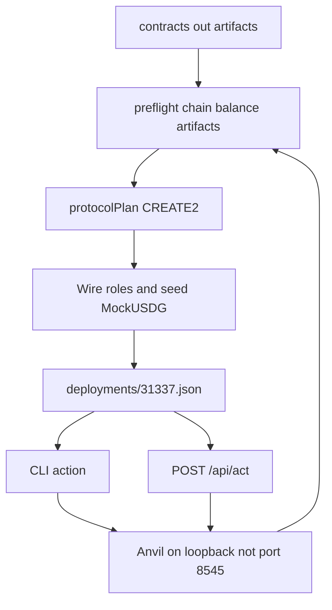

# Harness

You can deploy the Lockgate contracts onto a local Anvil, then drive stage 1, door 2, stage 2, and stage 3 from the CLI or the loopback test console. After the quick start you can run the suite, print every action, and point a command at a manifest you just wrote.

The stage map, the CREATE2 set, and the signature domain are in [../docs/ARCHITECTURE.md](../docs/ARCHITECTURE.md). How the suites are run is in [../docs/TESTING.md](../docs/TESTING.md). The review findings are in [../docs/SECURITY-NOTES-harness.md](../docs/SECURITY-NOTES-harness.md). Setup, environment names, and the click-through outputs are in [docs/how-to/run-on-anvil.md](docs/how-to/run-on-anvil.md). The offline reproduction of the Sepolia fork checks is in [docs/how-to/sepolia-fork-offline.md](docs/how-to/sepolia-fork-offline.md). A clean-checkout rehearsal of install, build, deploy, and every action is in [docs/how-to/clean-checkout.md](docs/how-to/clean-checkout.md). A rebuild against the current G6, G7, and G8 sources is in [docs/how-to/g6-g7-g8.md](docs/how-to/g6-g7-g8.md). The final check of this working tree is in [docs/how-to/current-tree.md](docs/how-to/current-tree.md). This page is not the product and not an offer.

## Quick start

Foundry and Node 22 or newer. From this directory:

```bash
npm install
npm test
npm run cli -- help
```

`npm test` runs `pretest` (`forge build --skip test --root ../contracts && forge build --root fixture`) and then `node --import tsx --test --test-concurrency=1 test/*.test.ts`. It starts an Anvil on a free loopback port other than 8545 and stops that process. Leave the shared Anvil on 8545 alone.

`help` writes one block per action to stdout. A flag line is the field name and the default the console uses. `stage2.repay` has `--exitRef` and no default.

```text
stage1.quote - Quote an exit on the credit line
  --navUsdg 1000
  --platform WeeklyQueuePlatform
```

## Drive one local chain

Run this in `lockgate/repo/harness` after `npm install`. `npm run anvil` listens on `127.0.0.1:8546` and writes `harness/.anvil.pid`. Port 8545 is refused.

```bash
npm run anvil
HARNESS_RPC=http://127.0.0.1:8546 npm run preflight
HARNESS_RPC=http://127.0.0.1:8546 npm run deploy:local
HARNESS_RPC=http://127.0.0.1:8546 npm run cli -- read.status
HARNESS_RPC=http://127.0.0.1:8546 npm run serve
```

`npm run preflight` checks the loopback RPC, chain 31337, the Anvil deployer balance, and the compiled artifacts. It prints one JSON object and does not send a transaction. A failure prints `{ "error", "code" }` on stderr and exits 1. `RPC` means the node did not answer or the request timed out. `CHAIN_REFUSED` means the chain is not 31337. `UNFUNDED` means the deployer holds less than 0.001 ETH. That figure is a dust gate, not a measured gas quote. `NOT_BUILT` means an artifact is missing or has no bytecode. `deploy:local` runs the same checks before the first transaction.

`deploy:local` prints one JSON object: `mode`, `chainId` 31337, the CREATE2 factory, and the contract map. It writes `harness/deployments/31337.json` only after the seed mint, by renaming a temp file over the previous one. A deploy that stops earlier, including `NOT_FRESH` when the Lockgate nonce is not 0, leaves that file as it was. A failed write removes the temp file. Start the next attempt from a fresh Anvil.

`npm run bytecode` reads that manifest and compares each deployed contract with the current artifact. A mismatch exits 1 with `STALE`. Compiler immutable spans are ignored, so a difference only in those values still matches. A recompiled runtime, including its metadata tail, is stale. `PartnerVaultA` and `PartnerVaultB` are compared with `ERC1967Proxy` bytecode, because those addresses hold the proxy. The command stays on loopback and refuses a public host and port 8545 before it dials.

`npm run cleanup` resets the local Anvil with `anvil_reset` and no fork parameters, then removes `deployments/31337.json`, `31337.demo.json`, `31337.deployment.json`, and a manifest named by `HARNESS_MANIFEST` when that file is inside `deployments/`. A failed reset leaves those files in place. A public host, port 8545, chain 42161, a symlink, and the Sepolia manifest are refused before the reset. https://www.getfoundry.sh/anvil/rpc-methods

`npm run checksum` hashes each generated Foundry artifact, the `Contract.sol/Contract.json` files under `contracts/out` and `harness/fixture/out`, and writes `harness/checksums/artifacts.json`. `HARNESS_CHECKSUM` chooses another seal file. `npm run checksum:verify` recomputes those hashes. An edited, added, or deleted artifact exits 1 with `STALE`. A missing build is `NOT_BUILT`. A symlink is `VALIDATION` and is not followed. The seal stays outside those `out` directories. After an intentional rebuild, run `checksum` again.

`npm run report` prints one screen from the local Anvil: deployed contracts, USDG balances, partner-vault mandates, and the latest events. It reads the manifest, stays on loopback, refuses port 8545 and chain 42161, and does not send a transaction. A zero-expiry mandate prints `none`. A 32-byte event field is omitted. A failure prints `{ "error", "code" }` on stderr.

`read.status` prints balances, the credit line, the vaults, and the facility. Amounts you pass on the CLI are decimal strings with at most 6 places, such as `--navUsdg 1000`. The CLI and the console add `timing` to each action result. `elapsedMs` is how long that action took. `gasUsed` is the sum of receipt gas for the transactions it sent, as a decimal string. A read reports `0`. A failure stays `{ "error", "code" }`.

`serve` binds `127.0.0.1` and defaults to port 18910. Open `http://127.0.0.1:18910/`. The page title is "Lockgate test console". `GET /api/surface` lists the same actions as `help`. `POST /api/act` takes `{ "action", "input" }` where every input value is a string. A number, a boolean, or a body over 8 KiB returns 400 `VALIDATION` and does not call the chain. An unknown action returns 422. A failed command or HTTP call returns `{ "error", "code" }` and does not print a stack or a private key. `npm test` includes `test/hygiene.test.ts` and `test/writes.test.ts`. The first scans command stdout, stderr, and the repo. The second scans the manifest, the demo cursor, the deployment receipt, the checksum seal, the console responses, and the logs of deploy, bytecode, preflight, checksum, and cleanup. A private key or an RPC token fails the suite. The report names the file, the line, and the kind. It does not print the secret. `npm test` also includes `test/inject.test.ts`. An RPC timeout, a reverted call, and a nonce the account has already used each return `{ error, code }` and leave the manifest bytes unchanged.

`npm test` includes `test/smoke.test.ts`. That test deploys to a private Anvil, posts every `stage1.*`, `door2.cycle`, `stage2.*`, and `stage3.*` action to `/api/act`, and reads the final chain. It does not open a browser and it does not leave that Anvil running. Port 8545 is not used.

On that chain:

```bash
HARNESS_RPC=http://127.0.0.1:8546 npm run cli -- demo.stage1
HARNESS_RPC=http://127.0.0.1:8546 npm run cli -- demo.stage2
HARNESS_RPC=http://127.0.0.1:8546 npm run cli -- demo.stage3
HARNESS_RPC=http://127.0.0.1:8546 npm run cli -- demo.all
```

`npm run demo` is `demo.all`. `demo.stage1`, `demo.stage2`, `demo.stage3`, and `demo.all` are the resumable script. `demo.stage2` does not include door 2. `demo.all` runs stage 1, door 2, stage 2, and stage 3. Run any of them again on the same chain and a finished step returns the saved result without sending a transaction.

The cursor is `harness/deployments/31337.demo.json`, beside the manifest. Both are gitignored. A step is written only after it succeeds, with the chain id, the factory, and the block hash. A hash that is not on this chain drops that step and every later step. A file that does not parse is ignored, and the script reads the contracts. A live chain does not need the file: a finished stage is recognized from the contracts and is not repeated.

Stopping Anvil during a demo leaves the cursor file in place. The next call exits 1 with `{"error":"RPC is unreachable","code":"RPC"}`. A new Anvil on that port is an empty chain, so the same call exits 1 with `{"error":"Manifest contracts are not on this chain","code":"NOT_DEPLOYED"}` and does not print the saved step. Deploy again, then run the demo. It starts on the new chain. The next call returns that result and does not send a transaction. The check is [docs/how-to/anvil-restart.md](docs/how-to/anvil-restart.md).

`door2.cycle` is not that script. It starts another open-vault sale. The other action ids stay one-shot.

```bash
npm run cli -- stage1.quote --navUsdg 1000 --platform WeeklyQueuePlatform
```

The 600, 1800, and 3600 second windows are harness clocks.

## Path from Anvil to a call



The Sepolia script is a separate path. It does not use this manifest and it does not call `assertLocalRpc`.

## Design decisions

- The deploy uses the bytecode in `contracts/out`. `harness/fixture/src` is not the protocol. The fixture contracts the harness still deploys are `Create2Factory`, `ERC1967Proxy`, and, only inside the failure test, `PegOracle`.
- The CREATE2 salt is `lockgate.protocol.<logical>.v1`. The same factory and init code produce the same address on every fresh Anvil. Constructors still run in plan order because later contracts store earlier addresses.
- A locked platform implementation is constructed with a zero token, so `initialize` on that copy reverts. `FundFactory.createPlatform` clones one of those copies and starts at zero shares. The weekly short-cash demo uses a direct CREATE with unbacked shares, because a clone cannot mint that first balance without taking USDG.
- The facility governor is Anvil account 7. The borrower is account 0. The facility constructor reverts when those two addresses match. Lender approval is sent as the governor. `draw` is sent as the borrower.
- Stage-1 fees use ceiling division in `feeFromBps`. A partner fee stays on the router slice, which is half-up. The local curve does not clamp at 1500 bps. The chain rejects a quote above that cap.
- `quoteId` on the signed proposal is the exit ref `relayRepay` reads. The EIP-712 verifying contract is the vault. The vault address is not a field of the struct. Domain name `LockgateAdvance`, version `1`. See [../docs/ARCHITECTURE.md](../docs/ARCHITECTURE.md).
- A draft checks the payout, the nonce, and `preview` of that struct before it returns. The failure test still submits a proposal the vault will reject, by calling `submitProposal` directly, so that path stays visible.
- Writes from this package require chain 31337 and an `http` or `https` URL on `127.0.0.1`, `localhost`, or `::1`, with an explicit port other than 8545. The published Anvil keys in `src/roles.ts` are the Foundry development keys. Do not fund them on a public network. https://book.getfoundry.sh/anvil/
- The console has no login. Anything that can open `127.0.0.1` can move the test USDG. Acts on `POST /api/act` run one at a time. The lock is not inside `send`, so `demo.all` can call several actions without waiting on itself.
- `npm run deploy:sepolia` returns `SEPOLIA_BLOCKED` until `LOCKGATE_ALLOW_SEPOLIA_DEPLOY=1`. It then requires a node that reports chain 421614 and `DEPLOYER_PRIVATE_KEY` as a 32-byte hex string from the environment. Chain 42161 is `MAINNET_REFUSED` before a transaction. The deployer balance must be at least 0.001 ETH or the script returns `UNFUNDED` before a transaction. Do not point that command at a public RPC with an Anvil key. `npm run preflight:sepolia` uses the same flag and key, and it requires `SEPOLIA_RPC`. It does not fall back to the public Arbitrum Sepolia URL.

`npm run manifest` prints a dry-run deployment manifest for Arbitrum Sepolia. Pass `DEPLOYER_ADDRESS`, `GOVERNOR_ADDRESS`, `PARTNER_A_ADDRESS`, and `PARTNER_B_ADDRESS`. It does not read a private key and it does not dial an RPC. The same deployer, nonce, and owners always produce the same addresses and constructor args. `USE_PAXOS_USDG=1` pins the token to `0xFFC95faa3d63Cde504a05B567C600B78C0b41892` and does not deploy it. `FACTORY_NONCE` defaults to 0. `npm run manifest:local` deploys that plan on loopback chain 31337, on a port other than 8545, and writes `harness/deployments/31337.deployment.json` with a transaction hash and a block number for each contract. `npm run manifest -- broadcast` returns `SEPOLIA_BLOCKED`. The G10 brief does not approve a Sepolia broadcast.

## Layout

| Path | Role |
|---|---|
| `src/preflight.ts` | RPC, chain id, deployer balance, and artifact checks |
| `src/bytecode.ts` | Diffs deployed runtime code against the current artifacts |
| `src/checksum.ts` | Checksums generated artifacts and verifies that seal |
| `src/cleanup.ts` | Resets local Anvil and removes generated manifests |
| `src/report.ts` | One-screen Anvil report of contracts, balances, mandates, and events |
| `src/deploy.ts` | Predicts addresses, deploys, wires, seeds, then writes the manifest |
| `src/deployment-manifest.ts` | Dry-run Sepolia manifest and the local receipt record |
| `src/hygiene.ts` | Scans command output, written files, and the repo for a private key or an RPC token |
| `src/sepolia.ts` | Gated broadcaster for chain 421614 |
| `src/actions/` | One function per CLI and console action |
| `src/server.ts` | Loopback console and `/api/act` |
| `web/` | Throwaway HTML page. Not the product UI |
| `../scripts/` | `start-anvil.ts`, `preflight.ts`, `deploy-local.ts`, `deploy-sepolia.ts`, `deployment-manifest.ts`, `bytecode.ts`, `checksum.ts`, `cleanup.ts`, `report.ts` |
| `../.github/workflows/ci.yml` | `forge test`, engine `npm test`, harness `npm test` |

CI has not run on a remote. The repo had no git remote when the workflow was added. [U] until a remote exists and a run is green. The 2 Oct 2026 final pass, and the limits it left open, are in `docs/how-to/run-on-anvil.md`. The same day's clean-checkout rehearsal is in `docs/how-to/clean-checkout.md`. The check against the current G6, G7, and G8 sources is in `docs/how-to/g6-g7-g8.md`. Restarting Anvil during a demo is in `docs/how-to/anvil-restart.md`. The final check of this working tree, and the limits it left open, is in `docs/how-to/current-tree.md`.
