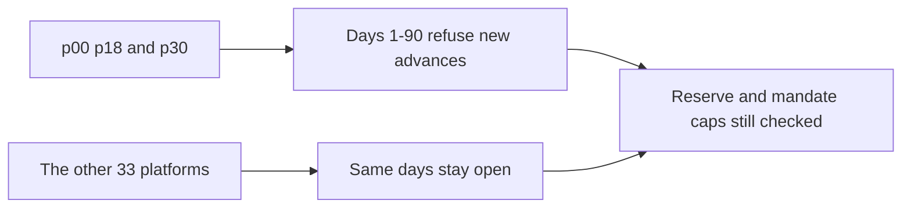

# SUMMARY

Three platforms gate together on seed 20261001, 360 days, stages 1–3. p00 is weekly, p18 is epoch, and p30 is quarterly. The shared window is days 1–90. No other platform is on that list. Gate mode is none, so the scheduled rule does not also close every epoch and quarterly platform. A weekly platform is closed here. The scheduled scenario leaves weekly platforms open. The five-name scenario set is unchanged. The 0.92 window-cash factor is not applied.

Every listed book records 1 day in the 90-day window when p00, p18, and p30 each received a gated refusal: day 27.

A gated day refuses a new advance and still runs that platform's window. Coverage is floor(reserve absorbed × 10000 / credit loss). A path with no credit loss is no loss. Posted reserve is cash still reserved plus cash the reserve already absorbed. The day loop throws if booked owed nav crosses a platform cap or, on stage 2, a vault mandate cap. Concentration is a pre-trade check. A later gap means assets shrank after a draw that was inside the cap. It is not a new advance.

| Cap | Platform owed nav | Harbour mandate | Keppel mandate | Marina mandate |
|---|---|---|---|---|
| Micro-USDG | 150000000000 | 80000000000 | 100000000000 | 120000000000 |

| Book | Stage | Advances | Gated | p00 | p18 | p30 | Other gated | Mandate-limit refusals | Concentration refusals | Over-limit refusals | Credit loss | Reserve absorbed | Reserve posted | Coverage bps | Platform peak | Harbour / Keppel / Marina | Concentration gaps | Largest gap |
|---|---|---|---|---|---|---|---|---|---|---|---|---|---|---|---|---|---|---|
| baseline | stage1 | 3457 | 47 | 26 | 16 | 5 | 0 | 0 | 0 | 70 | 0 | 0 | 405000000000 | no loss | 149338000000 | 0 / 0 / 0 | 0 | 0 |
| default | stage1 | 2946 | 47 | 26 | 16 | 5 | 0 | 0 | 0 | 70 | 239841176300 | 37505576100 | 405000000000 | 1563 | 149338000000 | 0 / 0 / 0 | 0 | 0 |
| baseline | stage2 | 3441 | 47 | 26 | 16 | 5 | 0 | 71 | 0 | 0 | 0 | 0 | 360023825000 | no loss | 148979000000 | 78942000000 / 99905000000 / 119769000000 | 0 | 0 |
| default | stage2 | 2929 | 47 | 26 | 16 | 5 | 0 | 71 | 0 | 0 | 239105333600 | 14576975000 | 333584500000 | 609 | 148979000000 | 78053000000 / 99905000000 / 119769000000 | 0 | 0 |
| baseline | stage3 | 3457 | 47 | 26 | 16 | 5 | 0 | 0 | 0 | 70 | 0 | 0 | 405000000000 | no loss | 149338000000 | 0 / 0 / 0 | 0 | 0 |
| default | stage3 | 2946 | 47 | 26 | 16 | 5 | 0 | 0 | 0 | 70 | 235628405300 | 37505576100 | 405000000000 | 1591 | 149338000000 | 0 / 0 / 0 | 0 | 0 |

Each of p00, p18, and p30 records a gated refusal. No other platform does. Baseline coverage is no loss. Default coverage is 1563, 609, 1591. Senior loss is 0 on every row. Stage 2 peaks sit under the three mandate caps. Concentration gaps are 0.

Stage 1 and stage 3 have no partner mandate, so Harbour, Keppel, and Marina peaks stay 0. The platform owed-nav cap still applies. Stage 2 checks each vault. The default book still names the first four platforms as defaulters. p00 is both gated and a defaulter there. Once it is dead, a later ask is defaulted rather than gated. Posted reserve equals reserve left plus reserve absorbed.

