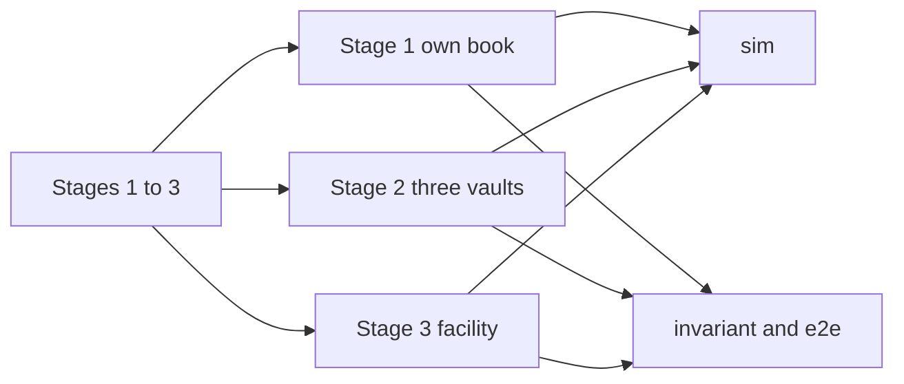

# SUMMARY

Stage 1–3 coverage for the G9 suites. `briefs/grok/ENGINEERING.md` requires every non-UI feature of stages 1–3 to be tested end to end, and it names the risk classes. The stage list is `briefs/grok/PRODUCT.md`, which that file says to read with it. This is not a pentest and not a legal opinion.

Each stage requirement and each risk class is in the tables. `sim/test/coverage.test.ts` pins the 30-platform book, the 5–10% reserve band, the stage shape, and the flat technology fee. `SepoliaExit`, `SepoliaPartner`, and `SepoliaFacility` move canonical Arbitrum Sepolia USDG on a local fork. The facility's book is a local stand-in. `Stage2Reenter` and `Stage3Reenter` each pay once when the token calls back. The open items are the legal sentences and a shared `quoteId` that repays only the indexed vault. The sim depeg is a window-cash factor. The facility peg is a separate on-chain check.

# Stage 1

Lockgate lends its own USDG. The advance is paid to the platform. The investor is paid from that advance. Repayment pulls the platform. The platform posts 5–10% first-loss. The price depends on wait, risk, utilization, and concentration.

| Requirement | Evidence |
|---|---|
| Own USDG, one book, no partner vault and no facility | `sim/test/coverage.test.ts`. Equity is 4,000,000 USDG. `e2e/src/stage1.ts` draws on `LockgateCreditLine`. |
| Platforms receive the advance and the investor is not pulled on repay | `contracts/test/invariant/Stage1Flow.t.sol` `test_repayPullsThePlatformAndLeavesTheInvestor`. `Stage1Invariant` checks each investor balance against what that investor was paid. |
| The same exit against canonical Arbitrum Sepolia USDG | `contracts/test/fork/SepoliaExit.t.sol`. Local fork of [that token](https://sepolia.arbiscan.io/token/0xFFC95faa3d63Cde504a05B567C600B78C0b41892). Chain id 421614. A 600-second quote is 99 bps and the fee is 99e6. The investor's balance rises by 9,901e6. Repay leaves it there. Outstanding returns to 0 and the line keeps the fee. The draw does not change total supply, and the repay after `deal` does not either. A gate and a stranger withdrawal move no cash. Nothing is broadcast. |
| Repay the advance before a waiting investor | `sim/src/regressions.ts` `T-3 repay-first`. `sim/test/queue.test.ts`. `Stage1Invariant` `invariant_solvencyFeeBoundsAndRepayFirst`. |
| First-loss reserve is 5–10% | `sim/test/coverage.test.ts`. Every platform is 500, 750, or 1,000 bps. Stage 1 posts that cash on day 0. |
| Price the wait | `sim/test/pricing.test.ts` floors 30 days at 12% APR to 98 bps. `contracts/test/invariant/FeeBounds.t.sol` quotes 600 seconds at time scale 4320 as 99 bps. `e2e/DIVERGENCE.md` funds the engine's 101 bps on Anvil. The three clocks are different numbers. |
| A gate, a stale NAV, a week-long fee, and a pause do not draw | `Stage1Flow` `test_gateAndPauseBlockDraws`, `test_weekLongWaitIsRefusedNotClamped`. `Stage1Failures.t.sol`. `FeeEdges.t.sol`. |

The excluded-moneylender sentence is a legal characterisation. No test establishes it.

# Stage 2

One vault per partner. The partner holds the keys and sets the mandate. Lockgate proposes. The partner signs. The fee is flat. The router chooses a vault. A repayment returns to the vault that funded the advance.

| Requirement | Evidence |
|---|---|
| One vault per partner, no facility | `sim/test/coverage.test.ts`. Harbour, Keppel, and Marina, 900,000 USDG each. `e2e/src/stage2.ts` deploys two vaults. |
| Lockgate cannot withdraw, pause, set the mandate, or upgrade | `contracts/test/invariant/PartnerKeys.t.sol` `test_lockgateCannotMoveOrGovernFunds`. Idle is unchanged and Lockgate's balance stays 0. |
| Mandate: platform, limit, minimum fee, maximum tenor | `PartnerKeys` `test_outsideMandateMovesNothing`. `Adversarial.t.sol` `test_mandateAbuseAndAPinnedNonceMoveNoCash` rejects an unapproved platform and a fee of 2,499,999. `sim/src/actors.ts` `mandateAbuse` also rejects a tenor one second over the max. |
| A proposer signature alone does not execute | `PartnerKeys` `test_lockgateSignatureAloneDoesNotExecute`. `e2e/src/stage2.ts` expects Lockgate's `approve` to revert. |
| Flat technology fee, not taken from vault tokens | `sim/test/coverage.test.ts`. A 60-day stage-2 path invoices 3 vaults × 2,000 USDG × 2 dates. `lockgateSwept` is 0. Stage 1 and stage 3 invoice 0. |
| Router picks a vault inside the mandate | `sim/test/queue.test.ts` cheapest fee, round-robin cursor, and larger idle. `sim/test/bounds.test.ts` funds quarterly `p30` from Marina only. Harbour and Keppel principal stays 0. Removing that platform from every mandate records `mandate-platform` and leaves each vault balance unchanged. |
| Repayment returns to the funding vault | `PartnerKeys` `test_repaymentReturnsToTheFundingVault` for one vault. The router balance ends at 0. `contracts/test/fork/SepoliaPartner.t.sol` does the same pull on canonical Arbitrum Sepolia USDG: idle rises by the 100e6 fee, outstanding principal returns to 0, and Lockgate's balance stays 0. A Lockgate withdrawal reverts. Nothing is broadcast. |

A second vault can fund the same `quoteId`. `relayRepay` of index 0 pays that record only. `Adversarial.t.sol` `test_frontRunRecordLeavesTheHonestVaultOpen` and `sim/src/regressions.ts` `front-run-repay` keep that repro. Grief is repaid 100,000,000. Honest outstanding principal stays 990,000,000.

# Stage 3

Institutions lend to Lockgate's own book. The book has more than 30 platforms. Junior is exhausted before senior is written down.

| Requirement | Evidence |
|---|---|
| A facility on Lockgate's own book | `sim/test/coverage.test.ts`. Equity 500,000 USDG, senior deposited 1,500,000, junior deposited 400,000, nothing drawn at the start. `e2e/src/stage3.ts`. |
| At least 30 platforms | `sim/test/coverage.test.ts`. Each stage builds 36. |
| Draw, permission, and junior before senior | `contracts/test/invariant/FacilityWaterfall.t.sol`. The governor and a stranger cannot draw. A draw above the base reverts. After the loss, junior principal is 0 and senior principal is 400,000e6. `sim/test/books.test.ts` uses the same order. `sim/test/bounds.test.ts` still draws when junior loss equals half the deposit. One unit over records `covenant` and books nothing. A 1-unit pull with equal cash goes to junior. |
| A facility draw and repay in canonical USDG | `contracts/test/fork/SepoliaFacility.t.sol`. Local fork. Senior deposits 100e6, the borrower draws 40e6 and repays it, and cash returns to 100e6. A stranger cannot draw. The book is `MockBook`, not the credit line. Supply is unchanged by the draw and the repay. |

# Risk classes

`ENGINEERING.md` asks for permissions, boundaries, failure paths, reentrancy, rounding, time windows, gating, defaults, and depeg.

| Class | Stage 1 | Stage 2 | Stage 3 |
|---|---|---|---|
| Permissions | `Stage1Flow` `test_strangerCannotMoveCapital` | `PartnerKeys` | `FacilityWaterfall` governor and stranger |
| Boundaries | `FeeEdges`, `Stage1Failures` | `Adversarial` fee and platform | `test_drawAboveTheBorrowingBaseReverts` |
| Failure paths | `Stage1Failures` | `Adversarial` pinned nonce | facility `Covenant` |
| Reentrancy | `Reenter.t.sol` | `Stage2Reenter` execute and owner withdraw. Each pays once. Lockgate's balance stays 0. | `Stage3Reenter` draw of 40e6. Cash left is 60e6. The second draw is `ReentrancyGuardReentrantCall`. |
| Rounding | `sim/src/regressions.ts` `T-1` | `T-8` concentration base | same book math |
| Time windows | NAV age, tenor, grace in `Stage1Failures` and `FeeEdges`. Sim grace is 2 days: 8 misses one day early stay open, and the grace day writes off 99,000. | mandate tenor in `mandateAbuse` | `HORIZON.md` is 1,080 days. A quarterly window injects at most 40,000 USDG, 5% of the 800,000 USDG book. |
| Gating | `test_gateAndPauseBlockDraws`, `e2e/test/refusals.test.ts` | sim `gating` scenario | same scenarios, all three stages |
| Defaults | `Stage1Failures` `test_graceBoundaryLeavesAnUncoveredLateBook` | sim `default` scenario, four defaulters | same |
| Depeg | sim `depeg` scenario. Days 120–150 multiply window cash by 0.92. Days 119 and 151 stay at 1. `sim/test/depeg.test.ts`. | Mixed days 360–420 use the same 0.92. A named defaulter stays at 0. | `FacilityTime` `test_priceOneUnitUnderTheFloorStopsTheDraw` and `test_oracleAgeOfOneDayIsFreshAndOneSecondLaterStopsTheDraw`. Floor 99,000,000. Price 98,999,999 stops the draw. Age of 1 day still draws. One second later `availableDraw` is 0. Recovery stays after the price returns to 1e8. |

`sim/ORACLE.md` is a separate USDC depeg and stale-price catalog. It is not the 0.92 factor. `npm test` passed 73 tests and failed 0 (`duration_ms` 977.674666). On seed 20261001 and 360 days, clean coverage is no loss and reserve absorbed is 0. Default coverage stays 2239 in stage 1, 652 in stage 2, and 2287 in stage 3 under either shock. Stage 1 and stage 3 posted reserve stays 405000000000. Stage 2 posted reserve changes. The sim does not call `latest()`.

`sim/CONCURRENT.md` gates p00, p18, and p30 together on days 1–90. That run is outside the five-name set. On the same seed and horizon, baseline coverage is no loss. Default coverage is 1563 in stage 1, 609 in stage 2, and 1591 in stage 3. Senior loss is 0. Stage 2 peaks stay under the Harbour, Keppel, and Marina caps. Concentration gaps are 0. The predicate is true for all three names on every day in that window. The 360-day books record one joint refusal day, day 27. A direct call on day 50 refuses those three and still books p01.

`sim/test/sim.test.ts` runs a 60-day baseline on all three stages and checks that a default loses more than the baseline and a bank-run asks for more. `sim/src/scenarios.ts` is the five-shock set. `sim/LIBRARY.md` names one happy path per stage and ten failure paths, and `sim/test/library.test.ts` checks each expected outcome. `sim/test/bounds.test.ts` pins grace, the covenant, the quarterly cap, and the Marina-only mandate. `HORIZON.md` is the 1,080-day mix. `contracts/test/fork/UsdgFork.t.sol` reads Arbitrum Sepolia USDG. `SepoliaExit`, `SepoliaPartner`, and `SepoliaFacility` move that token. The facility book is local. All four are local forks. The last isolated fork-directory run passed 9 tests.

`cd lockgate/repo/e2e && npm run verify` exited 1 against the working tree. Forge failed 1 test. The table is `e2e/FINDINGS.md`.

| area | check | result | time | detail |
|---|---|---|---|---|
| contracts | forge test | fail | 149s | 341 tests passed, 1 failed |
| engine | npm test | pass | 8s | Tests 170 passed (170) |
| sim | npm test | pass | 2s | 73 tests, 0 failed |
| e2e | npm test | pass | 2s | 8 tests, 0 failed |
| e2e | anvil | pass | 256s | ok |
| e2e | compare | pass | 61s | 1 tests, 0 failed |

# Conservation

`contracts/test/invariant/FlowConservation.t.sol` drives one `MockUSDG` through stage 1, stage 2, and stage 3 in a random order. The isolated command is `FOUNDRY_TEST=test/invariant forge test --match-contract FlowConservation --offline` from `contracts/`. That run passed 1 test and failed 0: 32 runs, depth 20, 640 calls, 0 reverts. Supply equals the thirteen tracked balances. Stage-1 accounted assets equal accounted equity. Reserve token balance equals total balances. Vault balance equals idle plus reserve cash. Lockgate's balance is 0. Facility token balance equals accounting cash and `solvent()` stays true. Facility APR is 0 and the handler does not warp. `FacilityTime` warps inside Foundry: 365 days at 800 bps on a 40,000e6 senior draw accrues 3,200e6, the repayment stores it as `seniorInterestCash`, and `solvent()` stays true. The latest full `forge test --offline`, inside `npm run verify`, passed 341 tests and failed 1. The failure is `test_tinyRepaysDoNotBlockAnotherLender` in `test/facility/Grief.t.sol`. The next three `forge test --offline` runs each passed 342 and failed 0. It did not print a separate invariant count.

# Open

- The excluded-moneylender line and the MAS custody line are legal statements. They are not assertions these suites can make.
- Two vaults, one `quoteId`: one `relayRepay` does not repay both. The single-vault repayment test still passes. The two-vault case is recorded, and partner source was not changed.
- The named `depeg` scenario multiplies window cash by 0.92. `coverageFactor` takes a scenario, a platform, a day, and a random stream. `sim/ORACLE.md` prices a USDC shock at 98999999 and leaves a stale price at par. On seed 20261001 that shock does not change default-path coverage bps. The facility peg reads `latest()` and is checked in `FacilityTime.t.sol`. The sim does not call `latest()`.
- Sim facility interest adds the daily floor `debt * aprBps / 10_000 / 365`. On a 40,000e6 senior draw at 800 bps, one day is 8,767,123 and 365 days sum to 3,199,999,895. `FacilityTime` accrues that draw for 365 days in one step as 3,200e6. The difference is 105. The sim keeps the daily floor.
