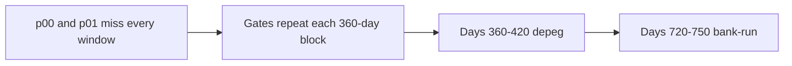

# SUMMARY

30 paths, 1080 days, 10 deterministic seeds, stages 1–3, one mixed-shock calendar. Every completed path kept the accounting identity, repaid advances before waiting investors, stayed inside 25–1500 bps, and moved 0 partner-vault tokens to Lockgate. The runner throws on a breach. This is not a forecast.

Credit loss is reserve absorbed plus junior loss plus equity credit loss plus senior loss. Coverage is `floor(reserve absorbed × 10000 / credit loss)` on paths that lost something. A path with no credit loss is counted on its own. Posted reserve is cash still reserved plus cash the reserve already absorbed.

Stage 1 and stage 3 post each platform's reserve budget on day 0, then the budget is zero. Stage 2 posts reserve only as a draw requires it. The 5–10% first-loss band is the platform reserve rate. The 1080-day length, the dates below, and the two named defaulters are placement assumptions. The depeg factor 0.92, the 12× arrival burst, and the 0.5 coverage factor are the same assumption values as the single-shock book.

## Calendar

| Window | What is on |
|---|---|
| Each 360-day block, year-days 1–90 | Quarterly platforms are gated |
| Each block, year-days 40–70 | Epoch platforms are gated |
| Days 360–420 | Coverage ×0.92. Miss limit 3, except the named defaulters |
| Days 720–750 | Arrivals ×12, coverage ×0.5, run-gated platforms close. Miss limit 2, except the named defaulters |
| Every day | Mild shortfall can inject 75% on a non-quarterly window. The first 2 platforms have miss limit 1 |

Seeds: 20261001, 20261002, 20261003, 20261004, 20261005, 20261006, 20261007, 20261008, 20261009, 20261010.

## Reserve coverage

Median coverage uses only paths with a credit loss. p25 and p75 are nearest rank: `ceil(p/100 × n)`. The median is the same even-count floor average as `RESULTS.md`.

| stage | paths | no loss | reserve only | spilled | senior hit | median posted | median left | median coverage |
|---|---:|---:|---:|---:|---:|---:|---:|---:|
| stage1 | 10 | 0 | 0 | 10 | 0 | $405,000.00 | $318,750.00 | 22.11% |
| stage2 | 10 | 0 | 0 | 10 | 0 | $377,232.31 | $316,907.90 | 18.35% |
| stage3 | 10 | 0 | 0 | 10 | 0 | $405,000.00 | $319,832.11 | 22.33% |

## Loss distribution

Credit loss across seeds:

| stage | min | p25 | median | p75 | max |
|---|---:|---:|---:|---:|---:|
| stage1 | $249,173.30 | $350,728.48 | $365,727.23 | $431,311.51 | $480,392.16 |
| stage2 | $263,631.89 | $274,347.41 | $333,756.47 | $351,196.14 | $424,211.74 |
| stage3 | $246,575.98 | $326,337.59 | $354,274.50 | $414,045.23 | $431,677.90 |

Sum of each tranche across the seeds. The percent is `floor(tranche × 10000 / total)`.

| stage | reserve | junior | equity | senior | total |
|---|---:|---:|---:|---:|---:|
| stage1 | $826,289.23 (21.84%) | $0.00 (0.00%) | $2,956,506.55 (78.15%) | $0.00 (0.00%) | $3,782,795.79 |
| stage2 | $612,803.15 (18.82%) | $0.00 (0.00%) | $2,641,636.32 (81.17%) | $0.00 (0.00%) | $3,254,439.47 |
| stage3 | $791,658.58 (22.28%) | $2,760,860.59 (77.71%) | $0.00 (0.00%) | $0.00 (0.00%) | $3,552,519.18 |

## Each path

| stage | seed | credit loss | reserve | junior | equity | senior | coverage | reserve left |
|---|---:|---:|---:|---:|---:|---:|---:|---:|
| stage1 | 20261001 | $330,165.77 | $79,210.77 | $0.00 | $250,955.00 | $0.00 | 23.99% | $325,789.22 |
| stage1 | 20261002 | $249,173.30 | $67,730.34 | $0.00 | $181,442.96 | $0.00 | 27.18% | $337,269.65 |
| stage1 | 20261003 | $480,392.16 | $86,250.00 | $0.00 | $394,142.16 | $0.00 | 17.95% | $318,750.00 |
| stage1 | 20261004 | $350,728.48 | $86,250.00 | $0.00 | $264,478.48 | $0.00 | 24.59% | $318,750.00 |
| stage1 | 20261005 | $431,311.51 | $86,250.00 | $0.00 | $345,061.51 | $0.00 | 19.99% | $318,750.00 |
| stage1 | 20261006 | $361,615.13 | $77,458.29 | $0.00 | $284,156.83 | $0.00 | 21.42% | $327,541.70 |
| stage1 | 20261007 | $369,839.34 | $84,389.81 | $0.00 | $285,449.53 | $0.00 | 22.81% | $320,610.18 |
| stage1 | 20261008 | $436,549.35 | $86,250.00 | $0.00 | $350,299.35 | $0.00 | 19.75% | $318,750.00 |
| stage1 | 20261009 | $354,961.67 | $86,250.00 | $0.00 | $268,711.67 | $0.00 | 24.29% | $318,750.00 |
| stage1 | 20261010 | $418,059.03 | $86,250.00 | $0.00 | $331,809.03 | $0.00 | 20.63% | $318,750.00 |
| stage2 | 20261001 | $263,631.89 | $60,180.95 | $0.00 | $203,450.94 | $0.00 | 22.82% | $314,963.15 |
| stage2 | 20261002 | $316,996.42 | $58,599.55 | $0.00 | $258,396.87 | $0.00 | 18.48% | $317,174.40 |
| stage2 | 20261003 | $424,211.74 | $68,456.45 | $0.00 | $355,755.29 | $0.00 | 16.13% | $316,953.72 |
| stage2 | 20261004 | $264,747.86 | $59,360.57 | $0.00 | $205,387.29 | $0.00 | 22.42% | $316,318.97 |
| stage2 | 20261005 | $339,955.07 | $61,169.02 | $0.00 | $278,786.05 | $0.00 | 17.99% | $317,740.50 |
| stage2 | 20261006 | $351,196.14 | $64,269.42 | $0.00 | $286,926.72 | $0.00 | 18.30% | $315,956.45 |
| stage2 | 20261007 | $351,839.94 | $61,692.00 | $0.00 | $290,147.94 | $0.00 | 17.53% | $315,223.77 |
| stage2 | 20261008 | $328,326.73 | $60,433.47 | $0.00 | $267,893.26 | $0.00 | 18.40% | $317,609.57 |
| stage2 | 20261009 | $274,347.41 | $57,954.92 | $0.00 | $216,392.48 | $0.00 | 21.12% | $317,963.85 |
| stage2 | 20261010 | $339,186.21 | $60,686.77 | $0.00 | $278,499.44 | $0.00 | 17.89% | $316,862.07 |
| stage3 | 20261001 | $326,337.59 | $79,093.25 | $247,244.33 | $0.00 | $0.00 | 24.23% | $325,906.74 |
| stage3 | 20261002 | $246,575.98 | $67,466.76 | $179,109.22 | $0.00 | $0.00 | 27.36% | $337,533.23 |
| stage3 | 20261003 | $285,172.05 | $52,389.24 | $232,782.81 | $0.00 | $0.00 | 18.37% | $352,610.75 |
| stage3 | 20261004 | $347,658.50 | $86,250.00 | $261,408.50 | $0.00 | $0.00 | 24.80% | $318,750.00 |
| stage3 | 20261005 | $426,777.93 | $86,250.00 | $340,527.93 | $0.00 | $0.00 | 20.20% | $318,750.00 |
| stage3 | 20261006 | $356,998.59 | $77,373.55 | $279,625.04 | $0.00 | $0.00 | 21.67% | $327,626.44 |
| stage3 | 20261007 | $365,724.94 | $84,085.76 | $281,639.18 | $0.00 | $0.00 | 22.99% | $320,914.23 |
| stage3 | 20261008 | $431,677.90 | $86,250.00 | $345,427.90 | $0.00 | $0.00 | 19.98% | $318,750.00 |
| stage3 | 20261009 | $351,550.41 | $86,250.00 | $265,300.41 | $0.00 | $0.00 | 24.53% | $318,750.00 |
| stage3 | 20261010 | $414,045.23 | $86,250.00 | $327,795.23 | $0.00 | $0.00 | 20.83% | $318,750.00 |
