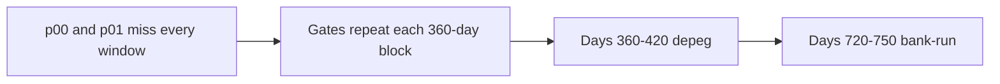

# SUMMARY

30 paths, 1080 days, 10 deterministic seeds, stages 1–3, one mixed-shock calendar. Every completed path kept the accounting identity, repaid advances before waiting investors, stayed inside 25–1500 bps, and moved 0 partner-vault tokens to Lockgate. The runner throws on a breach. This is not a forecast.

Credit loss is reserve absorbed plus junior loss plus equity credit loss plus senior loss. Coverage is `floor(reserve absorbed × 10000 / credit loss)` on paths that lost something. A path with no credit loss is counted on its own. Posted reserve is cash still reserved plus cash the reserve already absorbed.

Stage 1 and stage 3 post each platform's reserve budget on day 0, then the budget is zero. Stage 2 posts reserve only as a draw requires it. The 5–10% first-loss band is the platform reserve rate. The 1080-day length, the dates below, and the two named defaulters are placement assumptions. The depeg factor 0.92, the 12× arrival burst, and the 0.5 coverage factor are the same assumption values as the single-shock book.

## Calendar

| Window | What is on |
|---|---|
| Each 360-day block, year-days 1–90 | Quarterly platforms are gated |
| Each block, year-days 40–70 | Epoch platforms are gated |
| Days 360–420 | Coverage ×0.92. Miss limit 3, except the named defaulters |
| Days 720–750 | Arrivals ×12, coverage ×0.5, run-gated platforms close. Miss limit 2, except the named defaulters |
| Every day | Mild shortfall can inject 75% on a non-quarterly window. The first 2 platforms have miss limit 1 |

Seeds: 20261001, 20261002, 20261003, 20261004, 20261005, 20261006, 20261007, 20261008, 20261009, 20261010.

## Reserve coverage

Median coverage uses only paths with a credit loss. p25 and p75 are nearest rank: `ceil(p/100 × n)`. The median is the same even-count floor average as `RESULTS.md`.

| stage | paths | no loss | reserve only | spilled | senior hit | median posted | median left | median coverage |
|---|---:|---:|---:|---:|---:|---:|---:|---:|
| stage1 | 10 | 0 | 0 | 10 | 0 | $405,000.00 | $318,750.00 | 21.85% |
| stage2 | 10 | 0 | 0 | 10 | 0 | $370,870.00 | $309,443.82 | 17.93% |
| stage3 | 10 | 0 | 0 | 10 | 0 | $405,000.00 | $319,547.12 | 22.08% |

## Loss distribution

Credit loss across seeds:

| stage | min | p25 | median | p75 | max |
|---|---:|---:|---:|---:|---:|
| stage1 | $252,507.02 | $356,167.80 | $371,107.47 | $438,040.96 | $486,883.73 |
| stage2 | $269,322.83 | $281,599.45 | $341,539.45 | $359,404.46 | $432,199.06 |
| stage3 | $224,071.04 | $334,654.17 | $363,642.57 | $423,897.18 | $444,257.01 |

Sum of each tranche across the seeds. The percent is `floor(tranche × 10000 / total)`.

| stage | reserve | junior | equity | senior | total |
|---|---:|---:|---:|---:|---:|
| stage1 | $827,391.72 (21.55%) | $0.00 (0.00%) | $3,011,129.89 (78.44%) | $0.00 (0.00%) | $3,838,521.62 |
| stage2 | $612,803.15 (18.41%) | $0.00 (0.00%) | $2,715,511.01 (81.58%) | $0.00 (0.00%) | $3,328,314.16 |
| stage3 | $759,845.91 (21.29%) | $2,808,047.56 (78.70%) | $0.00 (0.00%) | $0.00 (0.00%) | $3,567,893.48 |

## Each path

| stage | seed | credit loss | reserve | junior | equity | senior | coverage | reserve left |
|---|---:|---:|---:|---:|---:|---:|---:|---:|
| stage1 | 20261001 | $334,949.60 | $79,413.76 | $0.00 | $255,535.84 | $0.00 | 23.70% | $325,586.23 |
| stage1 | 20261002 | $252,507.02 | $68,213.55 | $0.00 | $184,293.47 | $0.00 | 27.01% | $336,786.44 |
| stage1 | 20261003 | $486,883.73 | $86,250.00 | $0.00 | $400,633.73 | $0.00 | 17.71% | $318,750.00 |
| stage1 | 20261004 | $356,167.80 | $86,250.00 | $0.00 | $269,917.80 | $0.00 | 24.21% | $318,750.00 |
| stage1 | 20261005 | $438,040.96 | $86,250.00 | $0.00 | $351,790.96 | $0.00 | 19.68% | $318,750.00 |
| stage1 | 20261006 | $367,232.44 | $77,606.43 | $0.00 | $289,626.01 | $0.00 | 21.13% | $327,393.56 |
| stage1 | 20261007 | $374,982.49 | $84,657.97 | $0.00 | $290,324.51 | $0.00 | 22.57% | $320,342.02 |
| stage1 | 20261008 | $443,267.16 | $86,250.00 | $0.00 | $357,017.16 | $0.00 | 19.45% | $318,750.00 |
| stage1 | 20261009 | $360,454.27 | $86,250.00 | $0.00 | $274,204.27 | $0.00 | 23.92% | $318,750.00 |
| stage1 | 20261010 | $424,036.10 | $86,250.00 | $0.00 | $337,786.10 | $0.00 | 20.34% | $318,750.00 |
| stage2 | 20261001 | $269,322.83 | $60,180.95 | $0.00 | $209,141.88 | $0.00 | 22.34% | $304,801.82 |
| stage2 | 20261002 | $324,837.35 | $58,599.55 | $0.00 | $266,237.80 | $0.00 | 18.03% | $308,713.12 |
| stage2 | 20261003 | $432,199.06 | $68,456.45 | $0.00 | $363,742.61 | $0.00 | 15.83% | $309,666.57 |
| stage2 | 20261004 | $269,689.61 | $59,360.57 | $0.00 | $210,329.04 | $0.00 | 22.01% | $310,472.20 |
| stage2 | 20261005 | $347,074.68 | $61,169.02 | $0.00 | $285,905.66 | $0.00 | 17.62% | $313,144.82 |
| stage2 | 20261006 | $359,404.46 | $64,269.42 | $0.00 | $295,135.04 | $0.00 | 17.88% | $309,221.07 |
| stage2 | 20261007 | $360,787.20 | $61,692.00 | $0.00 | $299,095.20 | $0.00 | 17.09% | $308,737.40 |
| stage2 | 20261008 | $336,004.21 | $60,433.47 | $0.00 | $275,570.74 | $0.00 | 17.98% | $311,102.30 |
| stage2 | 20261009 | $281,599.45 | $57,954.92 | $0.00 | $223,644.52 | $0.00 | 20.58% | $313,355.67 |
| stage2 | 20261010 | $347,395.27 | $60,686.77 | $0.00 | $286,708.49 | $0.00 | 17.46% | $305,215.57 |
| stage3 | 20261001 | $334,654.17 | $79,395.68 | $255,258.49 | $0.00 | $0.00 | 23.72% | $325,604.31 |
| stage3 | 20261002 | $252,221.57 | $68,203.55 | $184,018.01 | $0.00 | $0.00 | 27.04% | $336,796.44 |
| stage3 | 20261003 | $224,071.04 | $18,750.00 | $205,321.04 | $0.00 | $0.00 | 8.36% | $386,250.00 |
| stage3 | 20261004 | $356,043.59 | $86,250.00 | $269,793.59 | $0.00 | $0.00 | 24.22% | $318,750.00 |
| stage3 | 20261005 | $437,916.80 | $86,250.00 | $351,666.80 | $0.00 | $0.00 | 19.69% | $318,750.00 |
| stage3 | 20261006 | $366,999.09 | $77,590.91 | $289,408.18 | $0.00 | $0.00 | 21.14% | $327,409.08 |
| stage3 | 20261007 | $367,546.94 | $84,655.75 | $282,891.18 | $0.00 | $0.00 | 23.03% | $320,344.24 |
| stage3 | 20261008 | $444,257.01 | $86,250.00 | $358,007.01 | $0.00 | $0.00 | 19.41% | $318,750.00 |
| stage3 | 20261009 | $360,286.04 | $86,250.00 | $274,036.04 | $0.00 | $0.00 | 23.93% | $318,750.00 |
| stage3 | 20261010 | $423,897.18 | $86,250.00 | $337,647.18 | $0.00 | $0.00 | 20.34% | $318,750.00 |
