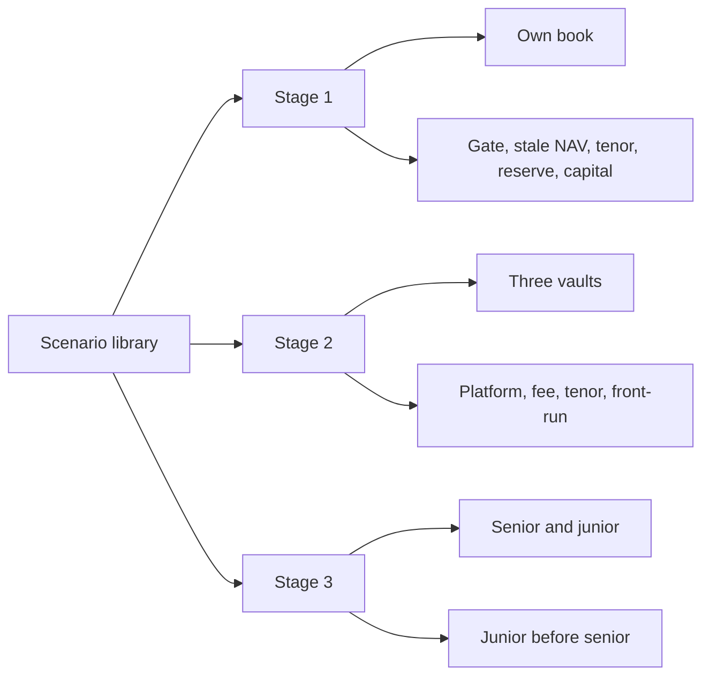

# SUMMARY

13 named scenarios. 3 happy paths, one per stage, use seed 20261001 and a 60-day baseline. 10 failure paths name the refusal or the loss split. `front-run-repay` passes while the break still reproduces. Each expected outcome is what `run()` checks. This page does not execute them.

| Id | Stage | Kind | Expected |
|---|---|---|---|
| stage1-happy | stage1 | happy | Seed 20261001 on the 60-day baseline. One book, equity 4,000,000 USDG, zero vaults, no facility. Advances are booked. Breaches stay 0, Lockgate sweeps 0, and the technology fee stays 0. A returned run has kept the accounting identity. |
| stage2-happy | stage2 | happy | Same seed and baseline. Vaults are Harbour, Keppel, and Marina. The technology fee is 3 vaults times 2,000 USDG times 2 invoices, which is 12,000 USDG. Advances are booked. Breaches stay 0 and Lockgate sweeps 0. |
| stage3-happy | stage3 | happy | Same seed and baseline. Equity is 500,000 USDG. Senior deposited is 1,500,000 USDG and junior deposited is 400,000 USDG. Advances are booked. Breaches stay 0, the technology fee stays 0, and Lockgate sweeps 0. |
| gated | stage1 | failure | A gated quote is unavailable at 0 bps. fundExit on the stage-1 book sets requested to 1, records gated once, and books no advance. |
| stale-nav | stage1 | failure | A quote aged exactly 7 days stays available. One second past that age is stale-nav at 0 bps. fundExit with navAgeDays 8 records stale-nav and books no advance. fundExit with navAgeDays 7 books the advance. |
| tenor | stage1 | failure | A wait of 366 days plus 1 second is tenor at 0 bps. fundExit 367 days out records tenor and books no advance. |
| reserve-short | stage1 | failure | Ceiling reserve on 10,001 at 1 bp is 2. The floored amount is 1. Posting 1 and asking to draw 10,001 against a 100,000 limit is reserve-short, and principal stays 0. |
| capital-short | stage1 | failure | Equity of 20 plus a posted reserve of 80 leaves 20 of idle cash. A principal of 30 at 0 reserve bps against a 1,000 limit is capital-short, and that idle cash stays 20. |
| mandate-platform | stage2 | failure | A platform outside the approved set is mandate-platform. Balance, principal, and reserve stay unchanged. |
| mandate-fee | stage2 | failure | 24 bps on an approved platform is mandate-fee. Balance, principal, and reserve stay unchanged. |
| mandate-tenor | stage2 | failure | A tenor of 86,401 seconds is mandate-tenor. Balance, principal, and reserve stay unchanged. |
| front-run-repay | stage2 | failure | The open break still reproduces. relayRepay of index 0 pays 100,000,000 to the grief vault. A second call on index 0 is empty. The honest vault stays open. |
| junior-before-senior | stage3 | failure | A 180,000 write-off takes 10,000 from that platform reserve, 20,000 of junior cash, 50,000 of junior debt, and 100,000 of equity. Senior loss stays 0. The identity residual stays 0. |

## stage1-happy

Stage 1 baseline books its own cash

Seed 20261001 on the 60-day baseline. One book, equity 4,000,000 USDG, zero vaults, no facility. Advances are booked. Breaches stay 0, Lockgate sweeps 0, and the technology fee stays 0. A returned run has kept the accounting identity.

## stage2-happy

Stage 2 baseline invoices three vaults

Same seed and baseline. Vaults are Harbour, Keppel, and Marina. The technology fee is 3 vaults times 2,000 USDG times 2 invoices, which is 12,000 USDG. Advances are booked. Breaches stay 0 and Lockgate sweeps 0.

## stage3-happy

Stage 3 baseline keeps senior and junior

Same seed and baseline. Equity is 500,000 USDG. Senior deposited is 1,500,000 USDG and junior deposited is 400,000 USDG. Advances are booked. Breaches stay 0, the technology fee stays 0, and Lockgate sweeps 0.

## gated

A gate refuses the quote and the draw

A gated quote is unavailable at 0 bps. fundExit on the stage-1 book sets requested to 1, records gated once, and books no advance.

## stale-nav

NAV age of 7 days is fresh and day 8 is stale

A quote aged exactly 7 days stays available. One second past that age is stale-nav at 0 bps. fundExit with navAgeDays 8 records stale-nav and books no advance. fundExit with navAgeDays 7 books the advance.

## tenor

A wait past 366 days is refused

A wait of 366 days plus 1 second is tenor at 0 bps. fundExit 367 days out records tenor and books no advance.

## reserve-short

Reserve rounds up and a short post blocks the draw

Ceiling reserve on 10,001 at 1 bp is 2. The floored amount is 1. Posting 1 and asking to draw 10,001 against a 100,000 limit is reserve-short, and principal stays 0.

## capital-short

Idle cash outside the reserve cannot fund the principal

Equity of 20 plus a posted reserve of 80 leaves 20 of idle cash. A principal of 30 at 0 reserve bps against a 1,000 limit is capital-short, and that idle cash stays 20.

## mandate-platform

An unapproved platform is refused

A platform outside the approved set is mandate-platform. Balance, principal, and reserve stay unchanged.

## mandate-fee

A fee under the mandate floor is refused

24 bps on an approved platform is mandate-fee. Balance, principal, and reserve stay unchanged.

## mandate-tenor

A tenor past the mandate max is refused

A tenor of 86,401 seconds is mandate-tenor. Balance, principal, and reserve stay unchanged.

## front-run-repay

One repay clears only the front-run record

The open break still reproduces. relayRepay of index 0 pays 100,000,000 to the grief vault. A second call on index 0 is empty. The honest vault stays open.

## junior-before-senior

Junior and equity absorb before senior

A 180,000 write-off takes 10,000 from that platform reserve, 20,000 of junior cash, 50,000 of junior debt, and 100,000 of equity. Senior loss stays 0. The identity residual stays 0.

