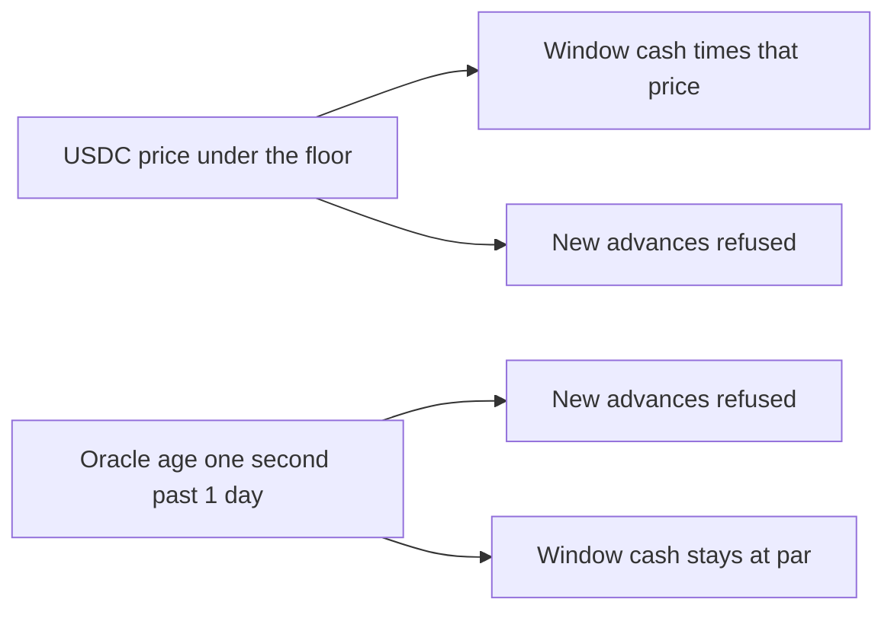

# SUMMARY

Oracle and price shocks on seed 20261001, 360 days, stages 1–3. The USDC depeg shock prices injected window cash at 98999999, one unit under the 99000000 floor, and refuses a new advance with peg. A stale price keeps that cash at par and refuses a new advance with stale-oracle. Days 120–150 are the shock. Days outside it are open. The check order matches engine/src/pricing/peg.ts, so a stale print is not also reported as a peg. IPegOracle is a USDG/USD price, 1e8 = $1, and the engine reports a price under the floor as "USDG is below the peg floor". This sim does not call latest(). 98999999 is the floor minus one unit, not a market print and not a forecast. The 0.92 window-cash depeg is a different scenario and is not applied here.

Coverage is floor(reserve absorbed × 10000 / credit loss). A path with no credit loss is no loss. Posted reserve is cash still reserved plus cash the reserve already absorbed.

| Shock | Stage | Advances | Peg refusals | Stale refusals | Credit loss | Reserve absorbed | Reserve posted | Coverage bps |
|---|---|---|---|---|---|---|---|---|
| baseline | stage1 | 3500 | 0 | 0 | 0 | 0 | 405000000000 | no loss |
| usdc-depeg | stage1 | 3226 | 293 | 0 | 0 | 0 | 405000000000 | no loss |
| stale-price | stage1 | 3226 | 0 | 293 | 0 | 0 | 405000000000 | no loss |
| default | stage1 | 2958 | 0 | 0 | 168792576900 | 37532722500 | 405000000000 | 2223 |
| default-usdc-depeg | stage1 | 2729 | 293 | 0 | 168792576900 | 37532722500 | 405000000000 | 2223 |
| default-stale-price | stage1 | 2729 | 0 | 293 | 168792576900 | 37532722500 | 405000000000 | 2223 |
| baseline | stage2 | 3490 | 0 | 0 | 0 | 0 | 330677075000 | no loss |
| usdc-depeg | stage2 | 3215 | 293 | 0 | 0 | 0 | 327905450000 | no loss |
| stale-price | stage2 | 3215 | 0 | 293 | 0 | 0 | 328060650000 | no loss |
| default | stage2 | 2948 | 0 | 0 | 168505832000 | 10895675000 | 310785400000 | 646 |
| default-usdc-depeg | stage2 | 2718 | 293 | 0 | 168505832000 | 10895675000 | 311022200000 | 646 |
| default-stale-price | stage2 | 2718 | 0 | 293 | 168505832000 | 10895675000 | 311022200000 | 646 |
| baseline | stage3 | 3497 | 0 | 0 | 0 | 0 | 405000000000 | no loss |
| usdc-depeg | stage3 | 3220 | 293 | 0 | 0 | 0 | 405000000000 | no loss |
| stale-price | stage3 | 3220 | 0 | 293 | 0 | 0 | 405000000000 | no loss |
| default | stage3 | 2957 | 0 | 0 | 168791196300 | 37532722500 | 405000000000 | 2223 |
| default-usdc-depeg | stage3 | 2727 | 293 | 0 | 168791196300 | 37532722500 | 405000000000 | 2223 |
| default-stale-price | stage3 | 2727 | 0 | 293 | 168791196300 | 37532722500 | 405000000000 | 2223 |

stage1 clean coverage is no loss (USDC no loss, stale no loss). Default coverage is 2223 and stays the same under both shocks. Posted reserve has 1 distinct value. stage2 clean coverage is no loss (USDC no loss, stale no loss). Default coverage is 646 and stays the same under both shocks. Posted reserve has 5 distinct values. stage3 clean coverage is no loss (USDC no loss, stale no loss). Default coverage is 2223 and stays the same under both shocks. Posted reserve has 1 distinct value. USDC depeg peg refusals are 293 and stale refusals are 0. Stale-price stale refusals are 293 and peg refusals are 0.

A price equal to the floor is still good. One unit under it is peg. An age equal to 1 day is still fresh. One second later is stale-oracle, including when the price is also under the floor.

