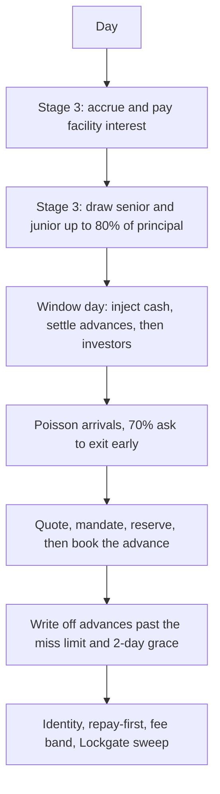
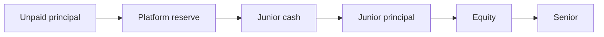
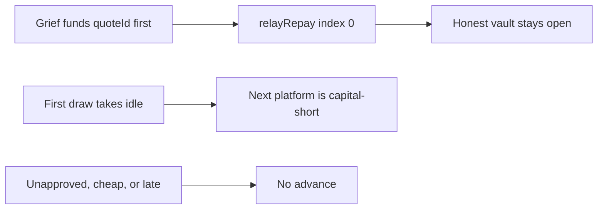

# SUMMARY

150 paths finished (10 seeds × 3 stages × 5 shocks, 360 days). Residual 0, repay-first breaches 0, fees inside 25–1500 bps, and 0 partner tokens moved to Lockgate. Senior was impaired on 0 of 150 paths. Tables are in `RESULTS.md`. Charts are `charts/allocation.png`, `charts/losses.png`, `charts/utilization.png`, and `charts/yield.png`.

Stage 3 fee yield is gross exit fees divided by average equity. That equity is 500,000 USDG, levered by the senior and junior facility. The percentage is not a net return. Facility interest is reported beside it and is not subtracted.

# PROGRESS

- 2026-10-02: `npm test` passed 79 tests and failed 0. `duration_ms` 1542.057291. Days 1–90 keep p00, p18, and p30 gated. All six books record one joint refusal day, day 27. A direct call on day 50 refuses those three and still books p01. Utilization on an owed cap of 150000e6 is 5000 against exposure 10000. The five-name set and the 0.92 factor are unchanged. `RESULTS.md` was not rewritten.
- 2026-10-02: `npm test` passed 77 tests and failed 0. `duration_ms` 1275.040041. Days 1–90 gate p00, p18, and p30 together. No other platform is gated. Baseline coverage is no loss. Default coverage is 1563, 609, and 1591. Stage 2 peaks stay under 80000000000, 100000000000, and 120000000000. Concentration gaps are 0. Senior loss is 0. `CONCURRENT.md` is the catalog. The five-name set and the 0.92 factor are unchanged. `RESULTS.md` was not rewritten.
- 2026-10-02: the testing handoff is `e2e/HANDOFF.md`. This suite's map stays `COVERAGE.md`.
- 2026-10-02: `cd lockgate/repo/e2e && npm run flaky` ran this suite three times. Each run passed 73 and failed 0. `RESULTS.md` was not rewritten.
- 2026-10-02: `cd lockgate/repo/e2e && npm run verify` exited 1. This suite was the sim row: 73 tests, 0 failed, 2s. Forge passed 341 and failed 1. Engine passed 170. The table is `e2e/FINDINGS.md`. `RESULTS.md` was not rewritten.
- 2026-10-02: `npm test` passed 73 tests and failed 0. `duration_ms` 1064.73575. The same tests now pin fee yield at 1727, 3192, and 25548 bps, a bank-run peak of 8553 bps against a baseline of 4076, a depeg factor read from the scenario, and reserve coverage only when the reserve took a real partial loss. `RESULTS.md` was not rewritten.
- 2026-10-02: `npm test` passed 73 tests and failed 0. `duration_ms` 977.674666. `test/oracle.test.ts` locks a USDC depeg and a stale price. On seed 20261001 and 360 days, clean coverage is no loss. Default coverage stays 2239 in stage 1, 652 in stage 2, and 2287 in stage 3. Stage 2 posted reserve changes. `ORACLE.md` is the catalog. The 0.92 window-cash factor is unchanged. `RESULTS.md` was not rewritten.
- 2026-10-02: `cd lockgate/repo/e2e && npm run verify` exited 0. This suite was the sim row: 67 tests, 0 failed, 1s. Forge passed 330 tests and failed 0. Engine passed 160. The table is `e2e/FINDINGS.md`. Contract and engine source were not edited.
- 2026-10-02: `npm test` passed 67 tests and failed 0. `duration_ms` 954.747667. `test/bounds.test.ts` pins the 2-day grace, the junior covenant, a daily interest floor of 8,767,123 on a 40,000e6 draw at 800 bps, a quarterly inject cap of 40,000 USDG, and a stage-2 advance that only Marina funds. `RESULTS.md` was not rewritten.
- 2026-10-02: `npm test` passed 62 tests and failed 0 in 934ms. `src/library.ts` names 3 happy paths and 10 failure paths. `LIBRARY.md` is the catalog. `front-run-repay` still reproduces: index 0 pays 100000000 to grief and leaves the honest vault open. `RESULTS.md` was not rewritten.
- 2026-10-02: `cd lockgate/repo/e2e && npm run verify` exited 0. This suite was the sim row: 47 tests, 0 failed, 2s. The table is `e2e/FINDINGS.md`. Contract and engine source were not edited.
- 2026-10-02: `npm test` passed 47 tests and failed 0. `test/depeg.test.ts` pins the window-cash factor at 0.92 on days 120–150 and on mixed days 360–420, and at 1 on the days outside those windows. A named defaulter stays at 0. The facility peg is `contracts/test/invariant/FacilityTime.t.sol`.
- 2026-10-02: `npm test` passed 45 tests and failed 0. `test/determinism.test.ts` runs seed 20261001 twice. The summary JSON, the results text, the horizon JSON, and the horizon text are byte-identical. Seed 20261002 does not match that summary. The run does not rewrite `RESULTS.md`.
- 2026-10-02: `FOUNDRY_TEST=test/fork forge test --offline` passed 9 tests and failed 0. That run includes `SepoliaExit`, `SepoliaPartner`, and `SepoliaFacility`. The sim suite was not re-run.
- 2026-10-02: `SepoliaExit` passed 2 tests on a local Arbitrum Sepolia fork. `Stage2Reenter` and `Stage3Reenter` passed 3 tests. `COVERAGE.md` maps both. The sim suite was not re-run.
- 2026-10-02: stage 1–3 coverage is `COVERAGE.md`. `npm test` is 44 tests. `sim/test/coverage.test.ts` pins 36 platforms, the 5–10% reserve band, one book versus three vaults versus a facility, and a 60-day stage-2 technology fee of 12,000 USDG with nothing swept.
- 2026-10-02: `npm run regressions` passed 5 scenarios and failed 0. T-1, T-2, T-3, and T-8 are fixed repros. `front-run-repay` is open: index 0 still pays 100000000 to grief and leaves the honest vault open. `npm test` is 41 tests.
- 2026-10-02: the long horizon is 1,080 days and the same 10 seeds, three stages, one mixed calendar. `npm test` is 35 tests. `npm run sim` wrote `HORIZON.md` and left `RESULTS.md` and the four charts unchanged. All 30 paths spilled past the reserve. Median reserve coverage was 22.11% in stage 1, 18.35% in stage 2, and 22.33% in stage 3. Senior was impaired on 0 of 30 paths. Across stage 3, the reserve took 22.28% of credit loss and junior took 77.71%.
- 2026-10-02: adversarial actors live in `src/actors.ts`. `npm test` is 28 tests. One named invariant broke: `front-run-repay`. Shared idle and mandate abuse held. `renderAdversarial()` wrote `ADVERSARIAL.md`. The 150-path book was not re-run, and `RESULTS.md` was not rewritten. The chain reproduction is `contracts/test/invariant/Adversarial.t.sol`. The partner-area report is `contracts/test/partner/G9-ADVERSARIAL.md`. No contract source was edited.
- 2026-10-02: concentration for a partner vault uses idle cash plus outstanding principal. Posted reserve is outside that base, matching `PartnerVault.totalAssets`. `npm test` is 24 tests. `npm run sim` rewrote `RESULTS.md`. Stage-2 median bank-run credit loss is $207,314.62. Senior remains impaired on 0 of 150 paths. Stage 1 and stage 3 median rows are unchanged.
- 2026-10-02: `npm test` from this directory, 23 tests passed. Exposure for limits, concentration, and the reserve is owed nav, and the reserve rounds up. Interest already paid is not equity in a write-off. `npm run sim` was re-run. `RESULTS.md` still shows senior impaired on 0 of 150 paths. The runner throws if the accounting identity, repay-first order, fee band, or Lockgate sweep check fails.

# Run

From `lockgate/repo/sim`, with Node and npm. This directory does not start Anvil and does not read a chain.

```
npm install
npm test
npm run regressions
npm run sim
```

`npm run regressions` runs the named minimal repro for each bug the simulator found: T-1 owed nav and reserve ceiling, T-2 interest already paid, T-3 repay-first, T-8 reserve outside the concentration base, and the open `front-run-repay` break. A passing open scenario means the break still reproduces.

`npm test` also runs `test/library.test.ts`. The stage 1–3 happy paths and the ten failure paths, with the outcome each one checks, are `LIBRARY.md`. `test/oracle.test.ts` checks the USDC depeg and the stale price. Those outcomes are `ORACLE.md`. `test/concurrent.test.ts` gates p00, p18, and p30 on every day from 1 through 90. The books share day 27. Day 50 is a direct call that still books p01. Those outcomes are `CONCURRENT.md`. `test/utilization.test.ts` pins cash utilization at 5000 against owed-nav exposure of 10000.

The stage 1–3 map is `COVERAGE.md`. `npm test` runs `tsx --test test/*.test.ts`. `npm run sim` runs 150 paths (10 seeds × 3 stages × 5 shocks, 360 days), then 30 mixed paths (the same 10 seeds × 3 stages, 1,080 days). It writes `RESULTS.md`, `HORIZON.md`, `ADVERSARIAL.md`, and `out/summary.json`, and calls `chart.py` for the four PNGs under `charts/`. `out/` is a run artifact and is not committed. A finished table means every path kept the accounting identity, repaid advances before waiting investors, stayed inside 25–1500 bps, and moved 0 partner-vault tokens to Lockgate. The runner throws on a breach. `ADVERSARIAL.md` is the three actors in `src/actors.ts`. `HORIZON.md` is reserve coverage and the loss distribution for the mixed calendar. Neither file changes the 150-path table.

# One day



Stage 1 is one sheet, Lockgate's own cash. Stage 2 is three sheets. The router keeps the lowest fee that clears that vault's mandate, and a tie goes to the vault with more idle cash. Stage 3 is one sheet plus a senior and junior facility. The technology invoice in stage 2 is recorded beside the sheet. It is not taken from vault tokens.

# Design

Exposure for a limit, a concentration cap, and the reserve is unpaid owed nav (principal plus the fee still unearned). The reserve requirement is `floor((owed * bps + 9999) / 10000)`, the same ceiling as `MandateLogic`. Concentration uses `floor(assets * capBps / 10000)`. `mandateAssets` is idle cash plus outstanding principal. Cash posted as reserve increases `balance` and `reserve` together, and it stays out of that base. An owed amount equal to the cap passes. One unit above it is `mandate-concentration`.

A write-off takes that platform's reserve, then junior undrawn cash, junior principal, equity, then senior. Equity room is `equity + realizedFees - creditLossEquity - interestExpense`. Interest already paid has left the sheet and does not absorb a later loss.



Utilization in the tables is cash principal over cash principal plus idle. It can sit below owed-nav exposure once fees are unpaid. The long-horizon book calls the curve with time scale 1, so a wait is calendar days. The 10-minute demo scale, 4320, is a separate quote. `src/pricing.ts` floors the zero-risk 600s × 4320 case to 98 bps and clamps to 25–1500. On-chain `PricingMath` half-up of that case is 99 bps and refuses a fee above the max. `test/pricing.test.ts` pins the simulator figure. The two are different numbers.

The identity checked on every line is `balance + principal + creditLossEquity + interestExpense = equity + seniorDebt + juniorDebt + reserve + realizedFees`. Scenario sizes, arrival rates, and the stage-3 coupons are labeled as assumptions in `RESULTS.md`. The published senior-impairment count is the output of those sizes.

The long horizon is not a sixth column on the 360-day book. It is 1,080 days on the same 10 seeds. Gates repeat every 360 days, a depeg occupies days 360–420, and a bank-run occupies days 720–750. `HORIZON.md` reports how much of the credit loss the reserve absorbed, and how the rest split across junior, equity, and senior.

Three actors sit beside the 150 paths. They use the same micro-USDG units as `contracts/test/invariant/Adversarial.t.sol`.


