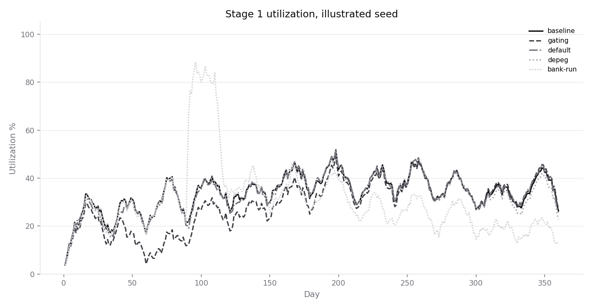
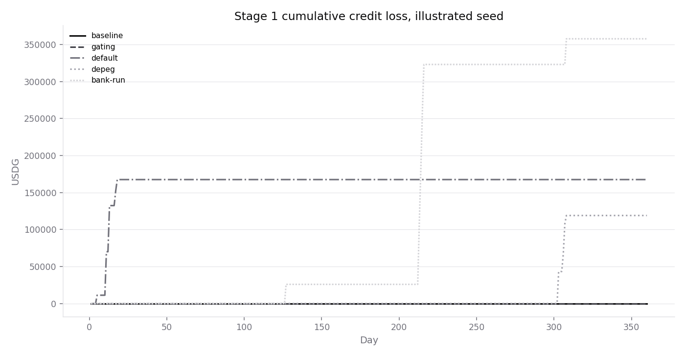
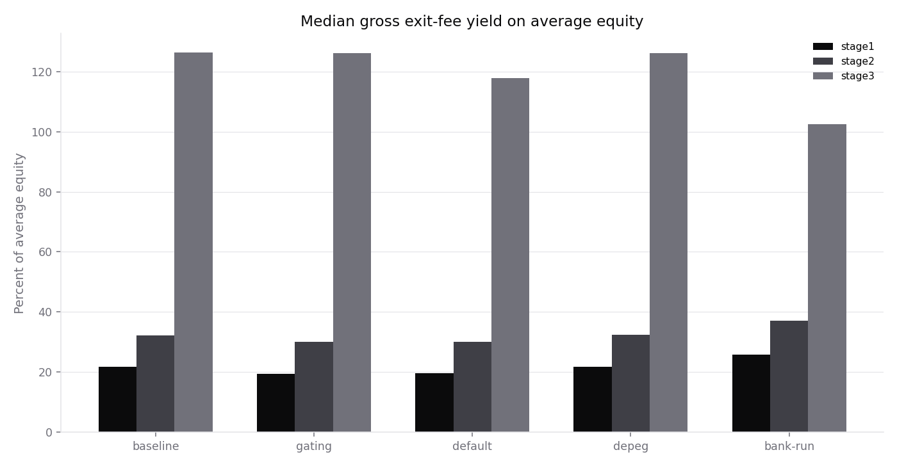
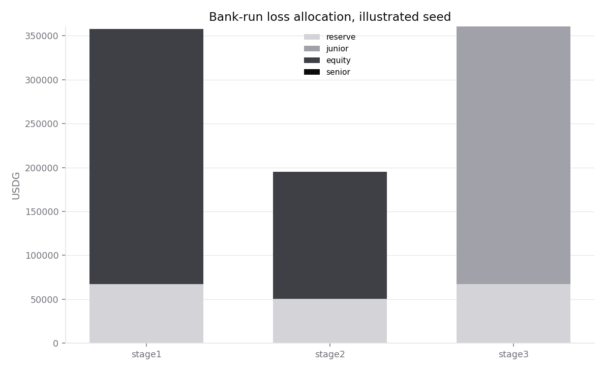

# SUMMARY

Reference book, 360 days, 36 platforms, 10 seeds, stages 1–3, five shocks. Every completed path kept the accounting identity, repaid advances before waiting investors, charged 25–1500 bps, and moved 0 partner-vault tokens to Lockgate. The runner throws on a breach, so a finished table is the check.

Illustrated seed 20261001, stage 1 baseline: 3,508 advances out of 5,140 exit requests, peak utilization 51.66%, annualized exit-fee yield 22.34% on average equity, credit losses $0.00. The same seed's bank-run peaks at 88.38% utilization. Stage 2 baseline invoices $72,000.00 as a flat technology fee and does not sweep it from the vaults. Stage 3 bank-run senior loss on that seed is $0.00; senior was impaired on 0 of 150 paths, and only after junior was exhausted.

Stage 3 fee yield is gross exit fees divided by average equity value. That equity is 500,000 USDG, levered by the senior and junior facility. The percentage is not a net return. Facility interest is reported beside it and is not subtracted.

These are outputs of the assumptions below. They are not a forecast and not a measured market.

## Setup

Platforms follow the queue shapes in the product notes. Eighteen clear weekly, the way Kasu's pending pool pays from excess cash on a weekly cycle. Twelve clear on a 30-day epoch, the cadence of the USD.AI queue write-up. Six are quarterly and can pay at most 5% of an assumed 800,000 USDG book each window, from the internal decision to treat large gated funds as a 5%-a-quarter redemption. Sources are listed at the bottom.

Each day, redemption requests arrive, 70% ask to exit early, and the rest wait. A window injects cash against what is due, pays Lockgate advances FIFO, and only then pays waiting investors. Unpaid advances roll to the next window. They are written off after a miss limit and a 2-day grace: 8 misses in the baseline, 1 for the four named defaulters, 3 in the depeg, 2 in the bank-run. A write-off takes that platform's own reserve first, then junior cash, junior principal, equity, and senior.

Stage 1 is Lockgate's own 4,000,000 USDG. Stage 2 is three partner vaults of 900,000 USDG each (Harbour weekly, Keppel weekly and epoch, Marina all queues). The router takes the lowest fee that clears the mandate. Stage 3 is 500,000 USDG of equity plus a facility (senior 1,500,000 USDG at 8%, junior 400,000 USDG at 15%, advance rate 80% of principal). Coupons, the advance rate, the 2,000 USDG per vault per 30 days technology invoice, and the premium slopes are assumptions. The 12% APR, the 25/1500 bps band, the 5–10% reserve and the flat (not per-deal) fee are from the product documents.

## Median across seeds

Advances funded:

| | baseline | gating | default | depeg | bank-run |
|---|---:|---:|---:|---:|---:|
| stage1 | 3,510 | 3,403 | 2,958 | 3,503 | 3,942 |
| stage2 | 3,497 | 3,393 | 2,949 | 3,493 | 3,907 |
| stage3 | 3,511 | 3,404 | 2,933 | 3,504 | 2,883 |

Peak utilization:

| | baseline | gating | default | depeg | bank-run |
|---|---:|---:|---:|---:|---:|
| stage1 | 49.51% | 47.33% | 50.63% | 49.17% | 92.40% |
| stage2 | 64.79% | 61.75% | 67.29% | 64.88% | 98.05% |
| stage3 | 85.61% | 80.05% | 83.48% | 85.61% | 99.99% |

Annualized exit-fee yield on average equity value. Stage 2 is the partners' yield. Lockgate's stage-2 income is the flat invoice, not this column:

| | baseline | gating | default | depeg | bank-run |
|---|---:|---:|---:|---:|---:|
| stage1 | 21.80% | 19.40% | 19.65% | 21.78% | 25.89% |
| stage2 | 32.28% | 30.08% | 29.98% | 32.38% | 37.15% |
| stage3 | 126.35% | 126.19% | 117.81% | 126.16% | 102.56% |

Credit loss (reserve absorbed + junior + equity credit loss + senior), median:

| | baseline | gating | default | depeg | bank-run |
|---|---:|---:|---:|---:|---:|
| stage1 | $0.00 | $0.00 | $198,973.16 | $51,083.64 | $408,921.82 |
| stage2 | $0.00 | $0.00 | $198,462.29 | $7,682.40 | $222,938.51 |
| stage3 | $0.00 | $0.00 | $195,181.07 | $50,228.75 | $387,248.47 |

Stage 3 also pays facility interest out of equity. Median interest and median senior loss:

| | median interest | median senior loss | paths with senior loss |
|---|---:|---:|---:|
| baseline | $135,688.73 | $0.00 | 0/10 |
| gating | $119,916.87 | $0.00 | 0/10 |
| default | $115,398.45 | $0.00 | 0/10 |
| depeg | $135,262.24 | $0.00 | 0/10 |
| bank-run | $138,276.30 | $0.00 | 0/10 |

## Illustrated seed

| stage | shock | advanced | peak util | fee yield | reserve | junior | equity loss | senior | tech fee |
|---|---|---:|---:|---:|---:|---:|---:|---:|---:|
| stage1 | baseline | 3508 | 51.66% | 22.34% | $0.00 | $0.00 | $0.00 | $0.00 | $0.00 |
| stage1 | gating | 3396 | 49.16% | 19.85% | $0.00 | $0.00 | $0.00 | $0.00 | $0.00 |
| stage1 | default | 2966 | 50.94% | 19.72% | $37,505.57 | $0.00 | $129,996.04 | $0.00 | $0.00 |
| stage1 | depeg | 3503 | 52.31% | 22.29% | $37,443.91 | $0.00 | $81,510.65 | $0.00 | $0.00 |
| stage1 | bank-run | 3813 | 88.38% | 24.49% | $67,500.00 | $0.00 | $290,191.76 | $0.00 | $0.00 |
| stage2 | baseline | 3493 | 66.11% | 32.71% | $0.00 | $0.00 | $0.00 | $0.00 | $72,000.00 |
| stage2 | gating | 3378 | 66.49% | 30.40% | $0.00 | $0.00 | $0.00 | $0.00 | $72,000.00 |
| stage2 | default | 2952 | 66.85% | 29.93% | $10,759.17 | $0.00 | $156,288.56 | $0.00 | $72,000.00 |
| stage2 | depeg | 3491 | 67.00% | 32.82% | $14,978.01 | $0.00 | $15,806.26 | $0.00 | $72,000.00 |
| stage2 | bank-run | 3798 | 97.07% | 36.08% | $50,399.08 | $0.00 | $145,011.24 | $0.00 | $72,000.00 |
| stage3 | baseline | 3509 | 91.02% | 127.27% | $0.00 | $0.00 | $0.00 | $0.00 | $0.00 |
| stage3 | gating | 3396 | 86.80% | 127.54% | $0.00 | $0.00 | $0.00 | $0.00 | $0.00 |
| stage3 | default | 2967 | 87.49% | 120.38% | $37,505.57 | $126,478.56 | $0.00 | $0.00 | $0.00 |
| stage3 | depeg | 3504 | 91.02% | 126.50% | $37,260.83 | $80,072.95 | $0.00 | $0.00 | $0.00 |
| stage3 | bank-run | 2454 | 99.99% | 94.99% | $67,500.00 | $293,044.37 | $0.00 | $0.00 | $0.00 |

Stage 1 baseline rejections on the illustrated seed:

- over-limit: 67

## Charts









## Reproduce

```
cd lockgate/repo/sim && npm test && npm run sim
```

## Sources

- 12% APR, 25 bps floor, 1500 bps cap, demo time scale 4320, repay-first window, 7.5% reserve seed, USDG address: `lockgate/SPEC.md`.
- About 1% per month and the 5%-a-quarter gated-fund decision: `lockgate/ideation/DECISIONS.md` (28 Sep and 27 Sep 2026).
- Stages, 5–10% first-loss reserve, flat technology fee, Lockgate holds no partner keys: `briefs/grok/PRODUCT.md`.
- Kasu weekly cycle, positions not transferable: [PendingPool.sol](https://github.com/Kasu-Finance/kasu-contracts/blob/master/src/core/lendingPool/PendingPool.sol), discussed in `research/lockgate-exit-precedents.md`.
- USD.AI monthly queue (QEV still described as not implemented): [queue-extractable-value](https://docs.usd.ai/depositor/susdai/queue-extractable-value.md).
- Global Dollar (USDG) on Arbitrum Sepolia, 6 decimals, proxy at `0xFFC95faa3d63Cde504a05B567C600B78C0b41892`: [Arbiscan](https://sepolia.arbiscan.io/token/0xFFC95faa3d63Cde504a05B567C600B78C0b41892). On 2026-10-01, `cast` against `https://sepolia-rollup.arbitrum.io/rpc` at block 314719112 returned symbol USDG, decimals 6, totalSupply 2111011000100 (2,111,011.0001 USDG), chain id 421614.
